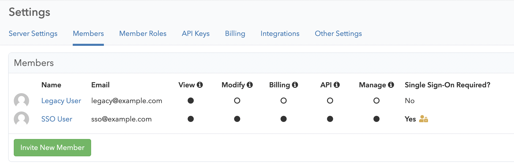
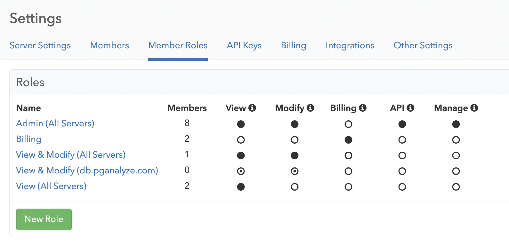
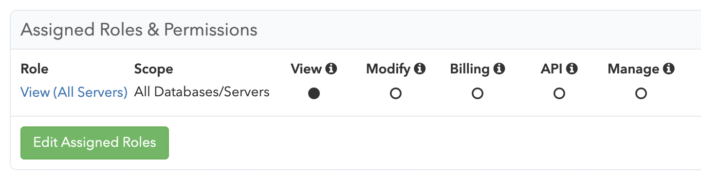

## Getting started

When you first set up your pganalyze account, you will need to follow the [installation instructions](/docs/install) to integrate your database server.

For improved access control and security, you can set up [Single Sign-On (SSO)](/docs/accounts/sso).

## Account structure

Accounts in pganalyze are structured into two concepts:

* **Users**: identified by their email address or Single Sign-On identity
* **Organizations** identified by their name and URL (e.g. `/organizations/[org-short-name]`)

Furthermore, the following relationships exist between Users and Organizations:

* Users are assigned a role in an organization
* Users can be members of multiple organizations, unless they are linked to an SSO provider
* Each role has one or more [permissions](/docs/accounts/permissions) that may be restricted to a database/server
* Access to organizations is granted through invites (sent by email or shared through another channel), or by utilizing an SSO provider
* You cannot remove the last user with the [manage permission](/docs/accounts/permissions) from an organization

The following sign in methods are supported by pganalyze:

* Username / password
* Google Auth (Personal and Google Workspace accounts)
* [SAML 2.0](/docs/accounts/sso) (Okta, Azure AD & more)
* LDAP (pganalyze Enterprise Server only)

## Managing members and their roles

You can manage which users have access to your organization through the **Members** settings page:

The roles that can be assigned to users are configured through the **Member Roles** settings page:

You can then assign roles to each member by clicking on their name in the members list:

## Deleting users and organizations

You can remove members from your organization by going to the **Members** settings page.

To delete an organization, or to delete your user, please reach out to [pganalyze Support](mailto:support@pganalyze.com).
