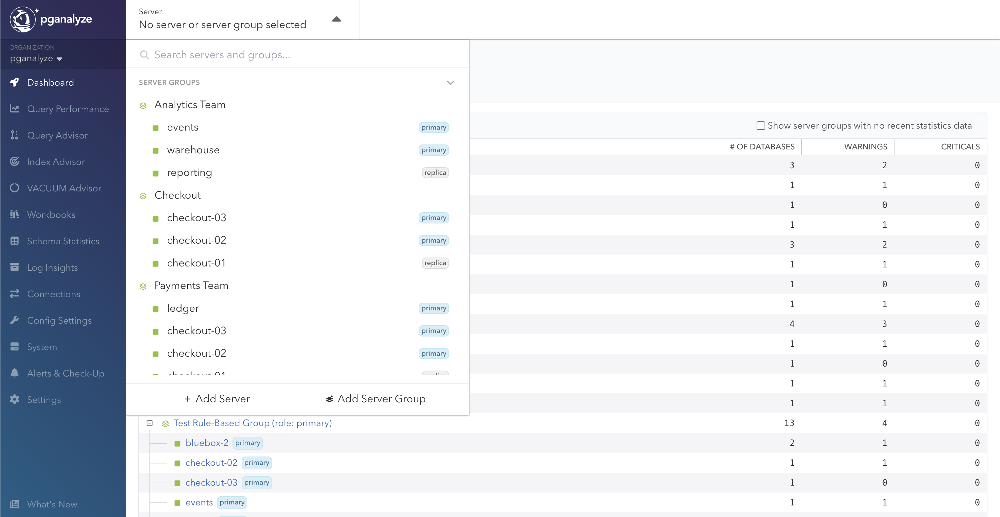
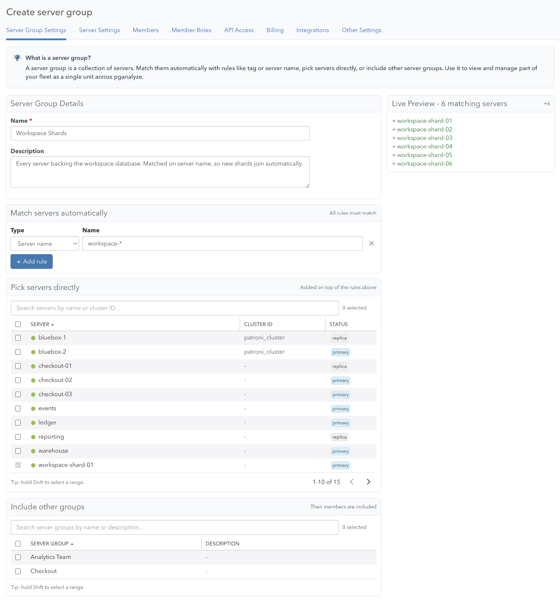
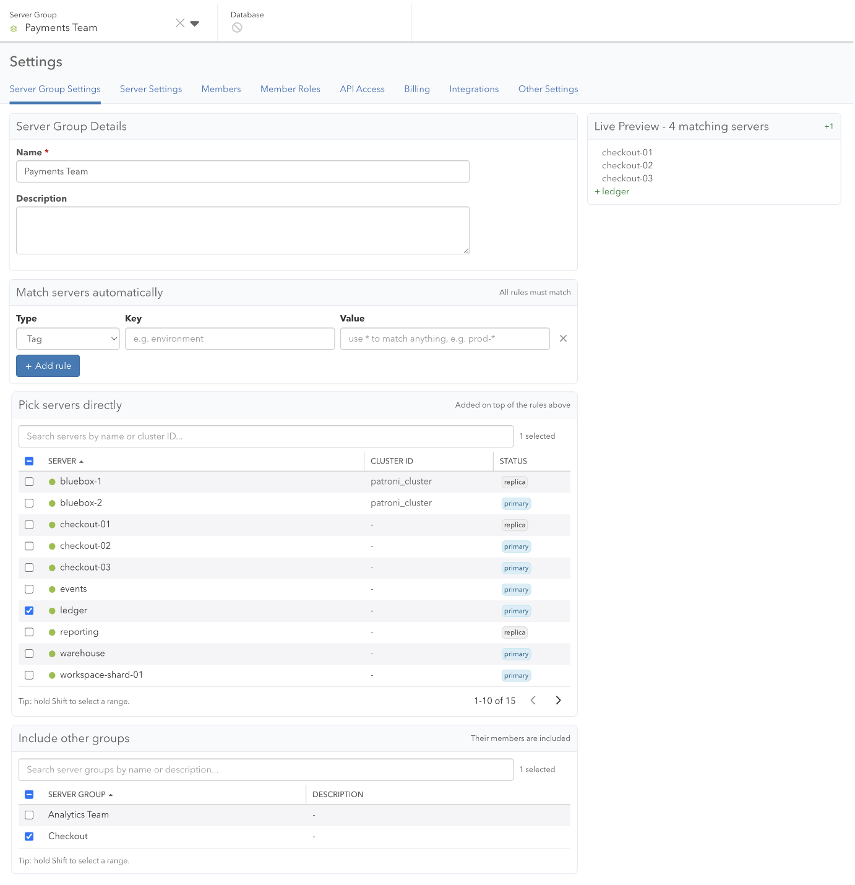
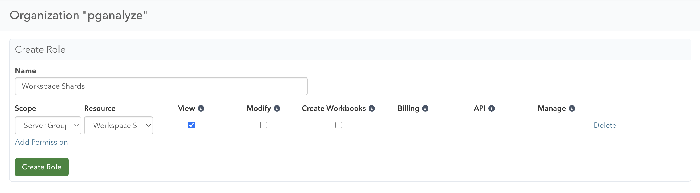
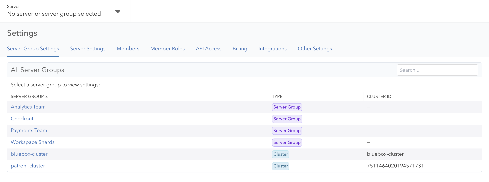
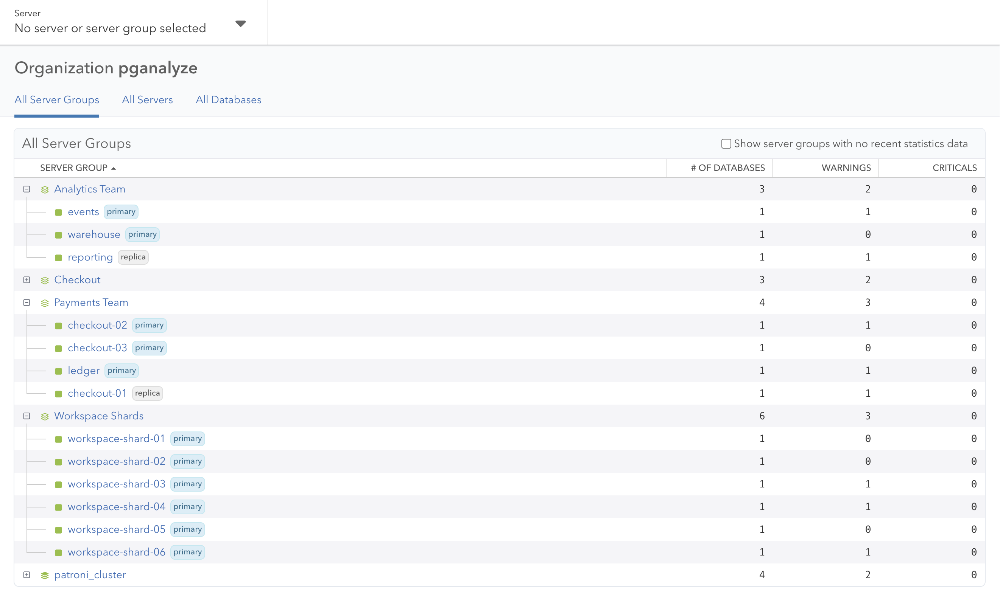
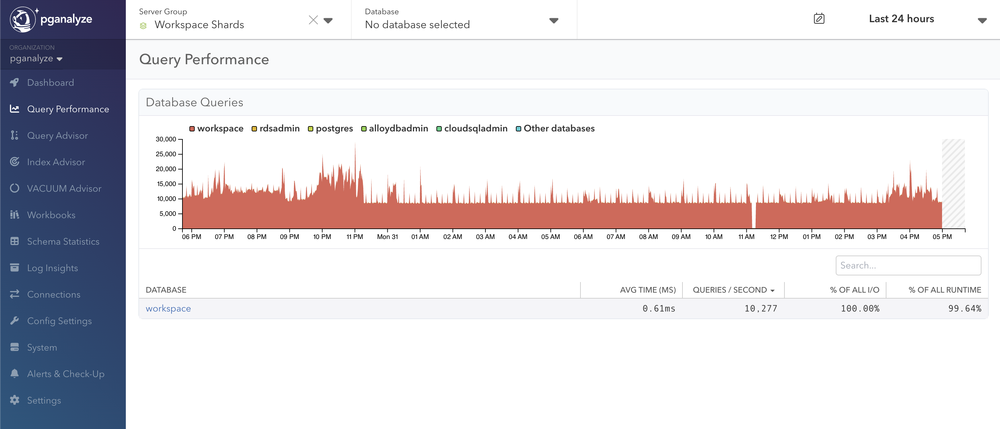
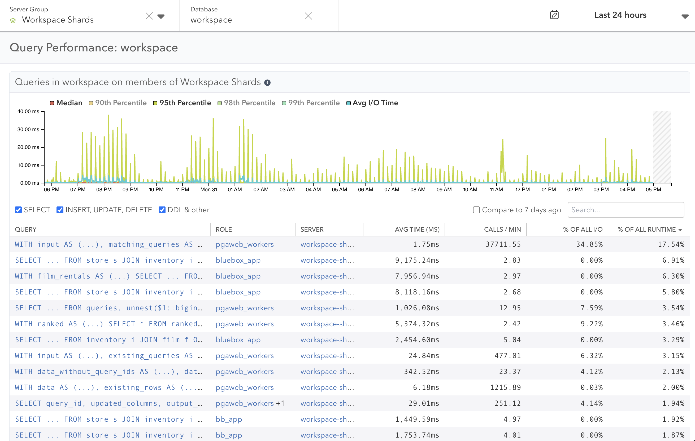

A server group lets you navigate a set of servers as a single unit. You see Dashboard and Query Performance aggregated across every member, and you can scope roles to a group so people in your organization see exactly what they own.

There are server groups, which you create yourself, and clusters, which come from your infrastructure. Both types are defined below.

## Server Groups and Clusters

### Server Groups

You define a server group yourself, which requires the [Manage permission](/docs/accounts/permissions#manage). It groups servers by how your organization thinks about them rather than by how they are deployed, so it can represent a team, an environment, or a sharded database. Membership comes from any combination of [match rules](#match-rules) and [explicit membership](#explicit-membership) including both servers and nested groups.

Server groups are in early access. Contact your organization admin to enable the feature, or reach out to [pganalyze Support](mailto:support@pganalyze.com) for access.

### Clusters

A cluster is defined by your infrastructure rather than by you. It is managed automatically from the cluster ID a server reports, set via `api_cluster_id`, and every server reporting the same ID belongs to it. You cannot add or remove members.

A cluster with a single member is expected, because it exists as soon as one server reports an ID. Some platform integrations, including Crunchy Bridge, derive the cluster ID for you, so a cluster can appear without you configuring one.

See [Configuring Clusters](/docs/index-advisor/configuration#configuring-clusters) for setup.

## When to Use a Server Group

1. Team ownership. Group the servers your team owns, then scope a role to the group. Each member sees exactly those servers in Dashboard, Query Performance, and Workbooks, nothing else. The group defines ownership. The role grants access.
2. Compliance or environment boundary. Match on a tag like `env:staging` and the group stays current as servers are added and removed.
3. Sharded database. Match on a name pattern like `workspace-shard-*` and every shard joins automatically, including new ones added later. Query Performance shows the combined workload across all shards in one view.

## Feature Support

Clusters and server groups both support:

* [Dashboard](#server-groups-dashboard), with issue counts rolled up per member
* [Query Performance](#query-performance), with query statistics aggregated across members and grouped by database name
* [Workbooks](/docs/workbooks), with query tuning scoped to the group's servers
* [Permissions](#permissions), where you can scope roles to a particular group and assign members to mirror your org chart

Features that operate on a single server land you on a default member instead. For a cluster that is the primary. For a server group it is the oldest member.

## Managing Server Groups

Open the Server dropdown and click the Add Server Group button.

Give the group a name and optional description, then add members using any combination of match rules, explicit server membership, or nested group membership. A preview diff on the right shows which servers will join before you save.

### Match Rules

A match rule selects servers by a property. When multiple rules are present, a server must match every rule. Servers matched by rules cannot also be explicit members.

| Rule type | Matches on | Example |
|---|---|---|
| Server name | Display name | `workspace-shard-*` |
| Tag | Key-value tag | key: `shard_set`, value: `workspace` |
| Cluster ID | Collector-assigned cluster ID | `prod-us-east-*` |
| Role | Primary or replica | `primary` |

Use `*` as a wildcard. Rules are evaluated on read, so servers added later are picked up automatically.

### Explicit Membership

Add individual servers with the server picker. Use Shift-click to select a range, or filter and select all. A server matched by a rule cannot also be an explicit member.

A server group can also include another server group as a member. Nesting is one level deep, so a group that contains another group cannot itself be nested. To pull in a cluster, use a match rule on cluster ID instead.

### Editing and Deleting

Open a group from [Server Group Settings](#server-group-settings), or navigate to it in the Server dropdown and open Settings > Server Group Settings. The preview diff shows how proposed changes compare to current membership before you save.

You can delete a server group from this page. Deleting removes it from navigation and Dashboard, and a role scoped to it stops granting access through it. Member servers are not affected.

A cluster cannot be deleted and its members cannot be changed. You can rename one by opening its Server Group Settings and entering a name, which otherwise defaults to the cluster ID. Leaving the field blank reverts to the cluster ID. To verify which cluster a server belongs to, check the Debug Info panel in Settings > Server Settings.

## Permissions

A role's [permissions](/docs/accounts/permissions) can be scoped to a group, and a permission granted on one applies to every server and database in it. This works for clusters and server groups alike.

See [Permissions and Roles](/docs/accounts/permissions) for which permission types support this.

## Server Group Settings

Settings > Server Group Settings lists every group in your organization, clusters included. Search by name, sort by any column, and read the Type column to tell the two apart. Cluster ID shows the collector-assigned ID, or a dash for a server group.

Selecting a name opens that group's settings, where you can edit or delete it.

## Server Groups Dashboard

The Server Groups page shows everything in your organization. Groups are expanded by default to show members. Both group and member rows share the same columns, including database count and open issue counts, so you can compare totals against individual members at a glance. Sort by any column to surface the worst-affected group first.

## Query Performance

[Query Performance](/docs/query-performance) works across a group. The default page summarizes query activity per database group, meaning databases that share a name across members.

Pick a database group to see top queries aggregated across every member that hosts that database. The drill-down adds a column showing which server each query came from.

See [Group-Wide Query Performance](/docs/query-performance#group-wide-query-performance) for more detail.

## Navigation

The Server dropdown in the header has a Clusters section and a Server Groups section above your standalone servers, and each group lists its members. Selecting a group takes you to the Server Groups Dashboard or group-wide Query Performance.

## Coming Soon

We are actively working on:

* Merged queries in Query Performance, so the same query running on every shard appears as one entry in your workload instead of one per member
* Combining the All Servers and All Server Groups dashboards into a single view
* Alerts & Check-Up across a group, so it reports its own status rather than only its members'
