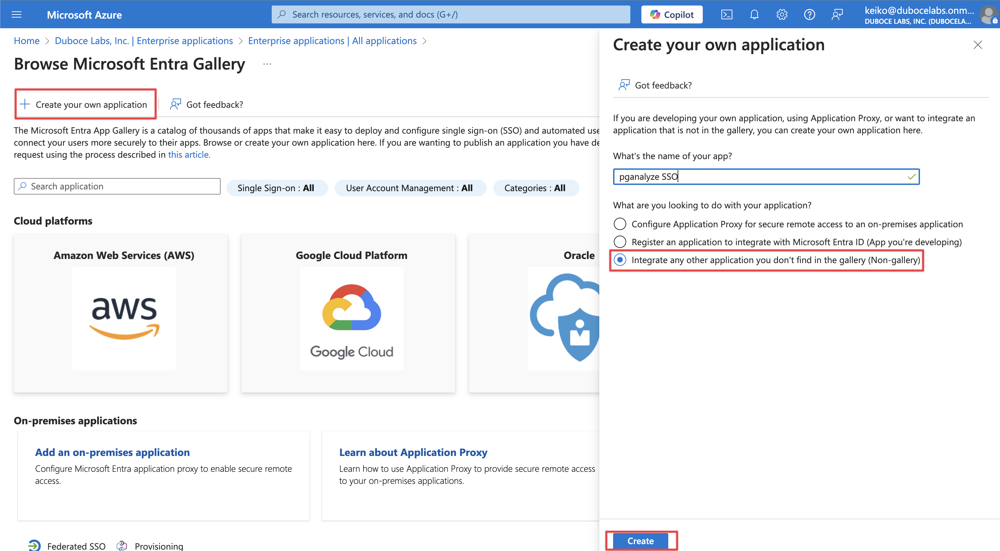
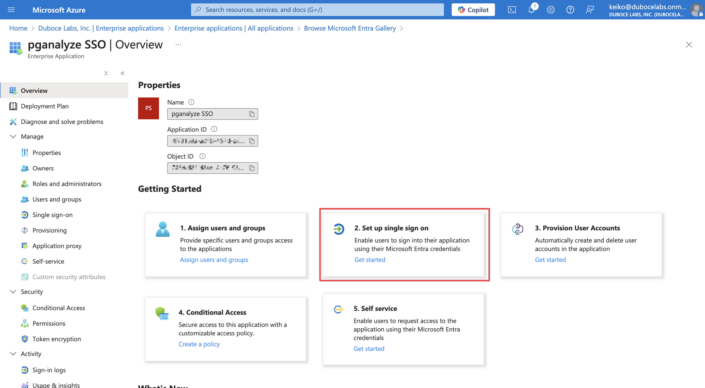
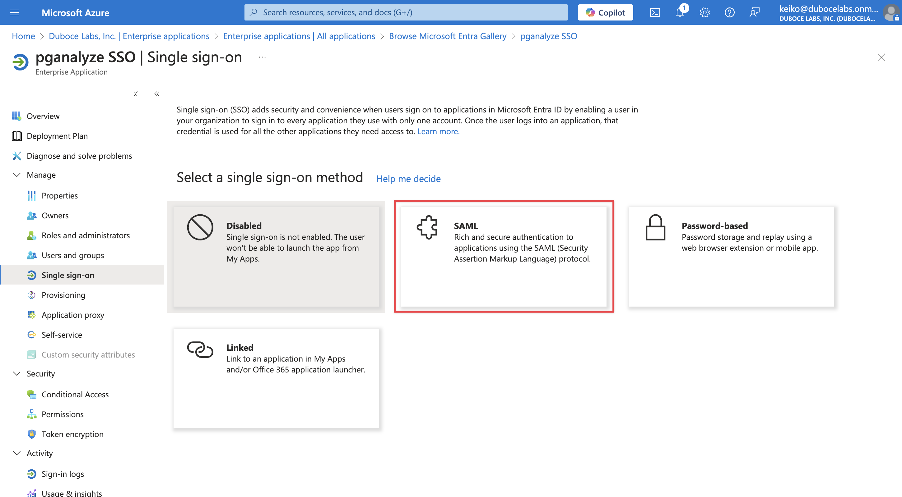
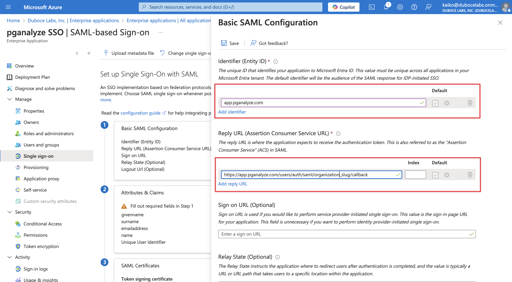
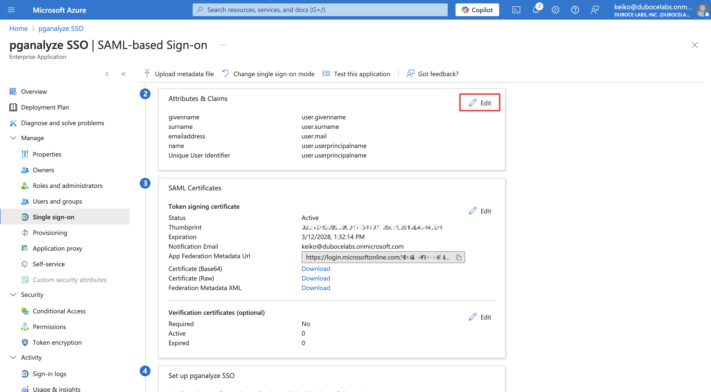
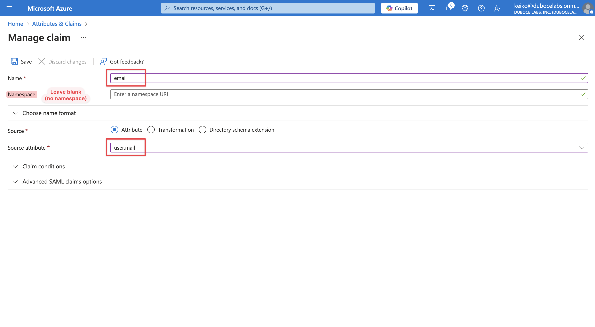
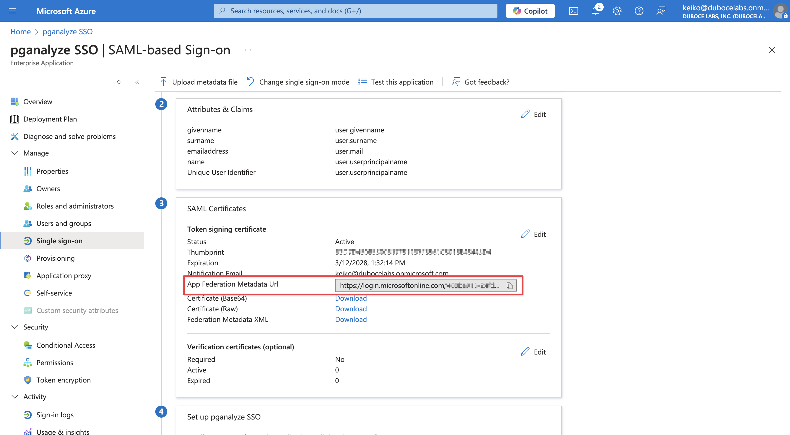
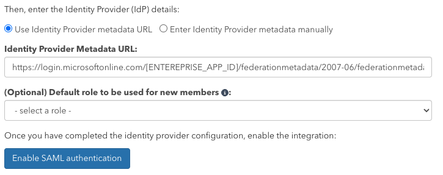

pganalyze supports integrating with [Microsoft Entra ID (formerly Azure AD)](https://www.microsoft.com/en-us/security/business/identity-access/microsoft-entra-id)
for Single Sign-On, using [SAML 2.0](https://learn.microsoft.com/en-us/entra/architecture/auth-saml).

There are two steps for integrating with Microsoft Entra ID:

1. Create a new Microsoft Entra ID Enterprise application
2. Register the Microsoft Entra ID Enterprise application with pganalyze

## Create a new Microsoft Entra ID Enterprise application

In your Azure portal, navigate to **Enterprise applications** page, then select **New application**.
On the New application page, select **Create your own application** to create an application for SSO.

Once the application is created, select **Set up single sign on** panel.

In the setting up single sign-on page, choose **SAML** as a single sign-on method.

In the step 1, **Basic SAML Configuration**, fill the **Identifier (Entity ID)** and the **Reply URL (Assertion Consumer Service URL)**.

These can be found in the SAML settings page in pganalyze.
To retrieve the SAML settings specific to your organization, you can navigate to the **Integrations**
settings page in your pganalyze account, where you will see the **Single Sign-On with SAML** panel.

The **Single Sign-On URL (ACS)** above is the one you'll need to copy to the **Reply URL (Assertion Consumer Service URL)**.

Next, navigate to the step 2 and click **Edit**:

In the Attributes & Claims page, click **Add new claim** to add a new claim.
Create a new claim with a name `email`. Please note that the namespace field _must be empty_.
For the source attribute, you'll typically choose `user.email` unless your organization keeps the user's email in another attribute.

Ensure that each user has an email attribute set. This field is empty by default when a new user is created.
You can check this by navigating to **Users**, select a user, then check the **Properties** tab.

If this is not set up correctly, you will see the error "SAML integration configuration error - missing email attribute" when trying to sign in to pganalyze.

Next, keep the setup page open, and register the Microsoft Entra ID Enterprise application with pganalyze before testing.

## Register the Microsoft Entra ID Enterprise application with pganalyze

First, copy the **App Federation Metadata Url** from the setup page.

Then, in the pganalyze app, Specify the **Identity Provider metadata** URL in pganalyze on the **Integrations** settings page.

Once you submit the Metadata URL, pganalyze will verify the configuration, and either provide an error,
or show the following indicating successful setup:

You can now assign the Enterprise application to users on your team. Going forward your team members can sign in to pganalyze by using the Enterprise application.

Once setup is complete, return to the SAML setup page in your Azure portal and run the **Test single sign-on** step to verify the integration.

[Read more about how to migrate existing users to Single Sign-On in pganalyze and general SSO functionality](/docs/accounts/sso).
