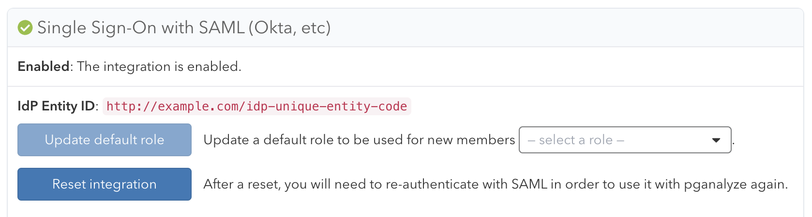

Single Sign-On (or SSO) enables management of user access to your organization through a third-party identity provider.

pganalyze integrates with providers such as Okta and Azure AD using [SAML 2.0](https://en.wikipedia.org/wiki/SAML_2.0). This feature is only available on the [Scale Plan](/pricing) and higher.

## Provider integration

Before continuing with setup, please reach out to [pganalyze Support](mailto:support@pganalyze.com) to enable the SSO feature for your organization.

If you integrate with Okta, you can follow the [Okta integration](/docs/accounts/sso/okta) steps.

For all other providers, you can follow the [Custom SAML 2.0 integration](/docs/accounts/sso/saml2) steps.

## Default membership

Users that authenticate through SSO for the first time will receive the standard "View & Modify (All Servers)" permission in your organization. You currently cannot change this default, but you can assign new roles after the user has signed in successfully for the first time.

## Migrating to Single Sign-On

When you enable Single Sign-On for the first time you can continue to utilize username/password authentication for existing users. You currently cannot turn off username/password authentication for your whole organization, but you can remove all members utilizing it, and then only rely on Single Sign-On going forward.

Members utilizing Single Sign-On can be identified on the **Members** settings page by the `Single Sign-On Required?` column:

When a user tries to sign in through SSO that previously used username/password authentication, they may receive the error "Email has already been taken". In this situation the existing user account needs to change their email address, in order to avoid the conflict with the separate SSO managed user. The user can also request their old user account to be deleted by contacting [pganalyze Support](mailto:support@pganalyze.com).

## Removing user accounts

If a user has left your organization, and you have removed them from your identity provider, they will continue to show as a member in pganalyze, even though they can no longer sign in. You can remove the members in pganalyze by going to the **Members** settings page.

We plan to support System for Cross-Domain Identity Management (SCIM) in the future to help with automated ahead of time provisioning and deprovisioning of user accounts.

## Turning off Single Sign-On

If you'd like to register a different SAML Identity Provider (IdP), or turn off SSO, you can reset the SSO integration. This requires being logged in as a username/password based user with the [manage permission](/docs/accounts/permissions). You can then click the "Reset integration" button on the **Integrations** settings page:

Resetting the integration will remove all organization members that are linked with the IdP.

**All linked permissions and other per-user customizations will be lost with the reset.**
