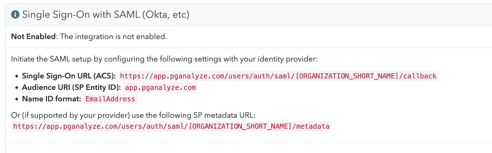
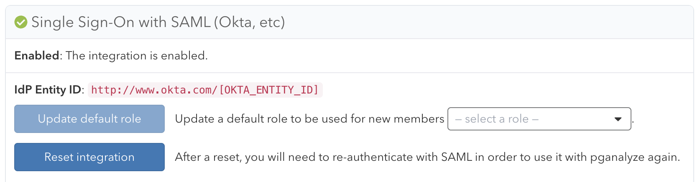

pganalyze supports integrating with [Okta](https://www.okta.com/) for Single Sign-On, using Okta's [SAML 2.0](https://en.wikipedia.org/wiki/SAML_2.0) integration.

There are two steps for integrating with Okta:

1. Register pganalyze with Okta by creating a new Okta application
2. Register the Okta application with pganalyze

## Register pganalyze with Okta by creating a new Okta application

Before we go into Okta, we will need access to the SAML settings from pganalyze:

To retrieve the SAML settings specific to your organization, you can navigate to the **Integrations**
settings page in your pganalyze account, where you will see the **Single Sign-On with SAML** panel.



For Okta we will need the `Single Sign-On URL (ACS)` value.

Within your Okta account, change into **Admin mode**, and add a new application with the **Create App Integration** button under **Applications**:


Specify **SAML 2.0** as the **Sign-in method**:


Next you can specify "pganalyze" as the **App name**:


Continuing, on the **Configure SAML** screen, you will need to specify a few settings:

* **Single sign on URL**: Use the `Single Sign-On URL (ACS)` setting copied from pganalyze
* **Audience URI (SP Entity ID)**: Use `app.pganalyze.com`, unless you are using pganalyze Enterprise Server (in which case this needs to match your `DOMAIN_NAME` environment variable)
* **Name ID format**: Use `EmailAddress`
* **Attribute Statements**:
  - (1) Name: `email` and Value: `user.email`
  - (2) Name: `name` and Value: `String.join(" ", user.firstName, user.lastName)`

This should now look like this:


Continue, and on the last screen, select **I'm an Okta customer adding an internal app**, and complete the setup:


In order to register the Okta application with pganalyze, you will need the **Identity Provider metadata** URL, which you can find under the **Sign On** tab:


You will need to use your browser's Copy Link feature to get the URL from the "Identity Provider metadata" link (highlighted in the screenshot).

The URL should look like this, with `OKTA_ORG_NAME` and `OKTA_ENTITY_ID` having specific values:

```
https://[OKTA_ORG_NAME].okta.com/app/[OKTA_ENTITY_ID]/sso/saml/metadata
```

## Register the Okta application with pganalyze

Specify the **Identity Provider metadata** URL in pganalyze on the **Integrations** settings page:


Once you submit the Metadata URL, pganalyze will verify the configuration, and either provide an error,
or show the following indicating successful setup:



You can now assign the Okta application to the appropriate members of your team. Going forward your team members can now sign in to pganalyze by using the Okta application.

[Read more about how to migrate users and general Single Sign-On functionality](/docs/accounts/sso).
