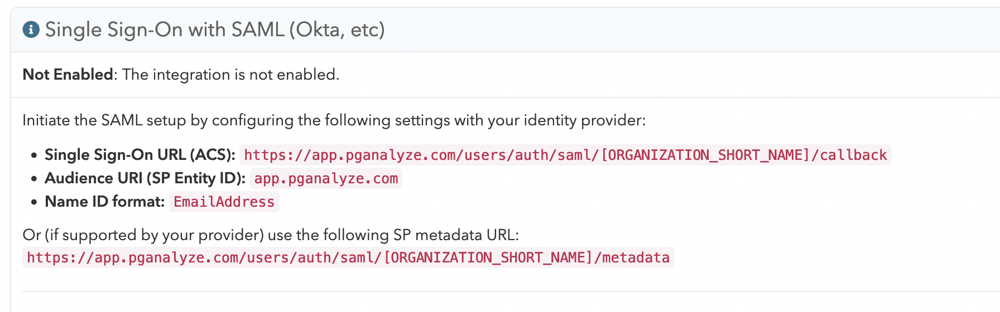
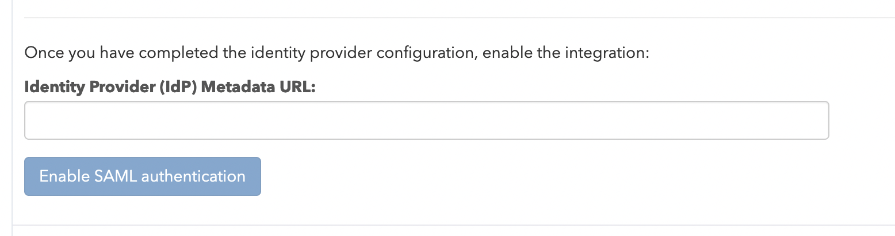
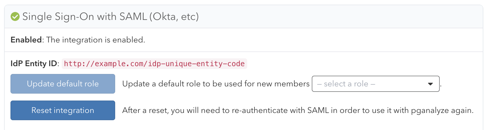

pganalyze supports the Identity Provider (IdP) initiated SSO feature of [SAML 2.0](https://en.wikipedia.org/wiki/SAML_2.0).

There are two steps to enable the SAML integration:

1. Register pganalyze with your Identity Provider (IdP)
2. Register the Identity Provider (IdP) with pganalyze

When using Okta you can follow the more-specific [Okta integration](/docs/accounts/sso/okta) steps.

## Register pganalyze with your Identity Provider (IdP)

To retrieve the SAML settings specific to your organization, you can navigate to the **Integrations**
settings page in your pganalyze account, where you will see the **Single Sign-On with SAML** panel.

If you do not see this panel, the SAML integration is not active on your account. Please reach out to [pganalyze Support](mailto:support@pganalyze.com).

**We recommend copying these values directly from the pganalyze app to your Identity Provider (IdP).** Alternatively, you can use the templates at the end of this document for reference.

When configuring settings manually with your IdP, make sure to specify both the `Single Sign-On URL (ACS)` as well as setting the `Name ID Format` to `EmailAddress`.

In addition, you also need to specify the following SAML attribute mappings:

* `email`: The user's email address (required)
* `name`: The user's full name (recommended)

Note that you do not need to provide a pganalyze-issued certificate to the IdP, as this is not required for IdP-initiated SSO.

Once you have configured the provider, you can continue in the pganalyze app.

## Register the Identity Provider (IdP) with pganalyze

To tell pganalyze which IdP you trust, you need to retrieve the metadata URL from the IdP, and then configure
it on the pganalyze **Integrations** settings page:

Note that this is the only method of configuration supported, at this point you cannot specify Service Provider (SP) settings
directly. Please reach out to [pganalyze Support](mailto:support@pganalyze.com) for alternate setup methods.

Once you submit the Metadata URL, pganalyze will verify the configuration, and either provide an error,
or show the following indicating successful setup:

SSO setup is now complete. Going forward your team members can now sign in to pganalyze through your Identity Provider (IdP).

[Read more about how to migrate users and general Single Sign-On functionality](/docs/accounts/sso).

## Reference: pganalyze SAML IdP settings template

We recommend copying the IdP settings directly from the pganalyze app, but you can alternately construct the IdP settings based on this template.

The settings follow this format for cloud-based pganalyze accounts:

* ACS URL: `https://app.pganalyze.com/users/auth/saml/[ORGANIZATION_SHORT_NAME]/callback`
* Metadata URL: `https://app.pganalyze.com/users/auth/saml/[ORGANIZATION_SHORT_NAME]/metadata`
* Audience URI: `app.pganalyze.com`

Replace `[ORGANIZATION_SHORT_NAME]` with your organization's short name
(e.g. used in `/organizations/[ORGANIZATION_SHORT_NAME]` URLs).

The format for pganalyze Enterprise Server installs is similar, but based on your chosen domain name:

* ACS URL: `https://[DOMAIN_NAME]/users/auth/saml/[ORGANIZATION_SHORT_NAME]/callback`
* Metadata URL: `https://[DOMAIN_NAME]/users/auth/saml/[ORGANIZATION_SHORT_NAME]/metadata`
* Audience URI: `[DOMAIN_NAME]`

If you are using pganalyze Enterprise Server, also replace `[DOMAIN_NAME]` with the value of your `DOMAIN_NAME` environment variable.
