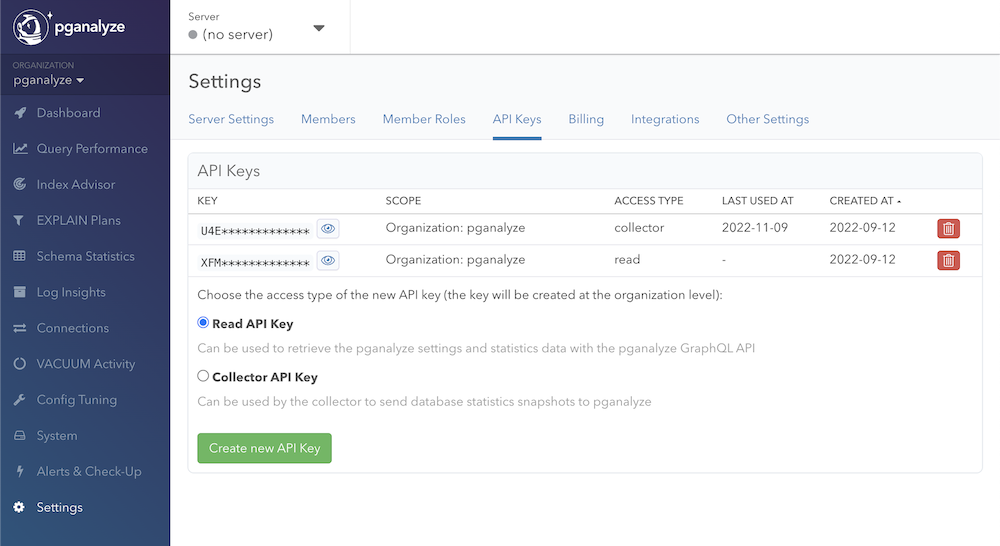
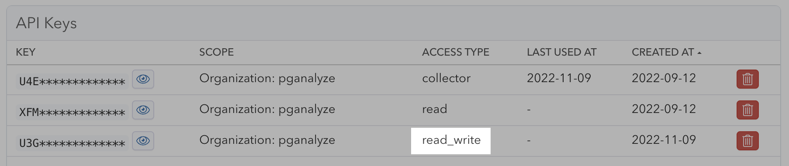

## Create an API token

First, start by going to the API Keys page for your organization, and creating a new read API key:

You now have a separate read-only API token that can be used for requests to our GraphQL API.

## Making API requests

You can make API requests to our GraphQL API endpoint like this:

<CodeBlock language="bash">
{`curl -XPOST -H 'Authorization: Token XXXXXXX' -F 'query=query { getQueryStats(databaseId: 12345) { id, queryUrl, truncatedQuery, statementType, tableNames, totalCalls, avgTime, bufferHitRatio, pctOfTotal } }' https://app.pganalyze.com/graphql
`}
</CodeBlock>

Note that you'll need to replace `XXXXXXX` with your API key, and `12345` with the correct database ID.

Formatted more readable, the query parameter has to look like this:

<CodeBlock language="graphql">
{`query {
  getQueryStats(databaseId: 12345) {
    id
    queryUrl
    truncatedQuery
    statementType
    tableNames
    totalCalls
    avgTime
    bufferHitRatio
    pctOfTotal
  }
}
`}
</CodeBlock>

In case you don't use newlines, use `,` to separate the different fields. Feel free to omit fields that you don't need (e.g. bufferHitRatio).

The result will be a JSON document that looks like this:

<CodeBlock language="json">
{`{
  "data": {
    "getQueryStats": [
      {
        "id":"678910",
        "queryUrl": "https://app.pganalyze.com/databases/12345/queries/678910",
        "truncatedQuery": "UPDATE \"pgbench_accounts\" SET abalance = $1 WHERE \"aid\" = $2",
        "statementType": [
          "UPDATE"
        ],
        "tableNames": [
          "pgbench_accounts"
        ],
        "totalCalls": 1887313,
        "avgTime": 35.3024511808419,
        "bufferHitRatio": 69.50736528891339,
        "pctOfTotal": 96.0880225982751
      },
      [ ... ]
    }
  }
}
`}
</CodeBlock>

## Creating a read-write API token (pganalyze Enterprise Server)

In order to create a read-write API token for use with pganalyze Enterprise Server,
make sure you run at least the [2019.04.1](/docs/enterprise/releases/2019-04-1)
and then use the "Create new API Key" button with "Read-Write API Key" type.

You should then see the new key marked as read-write in the UI:

