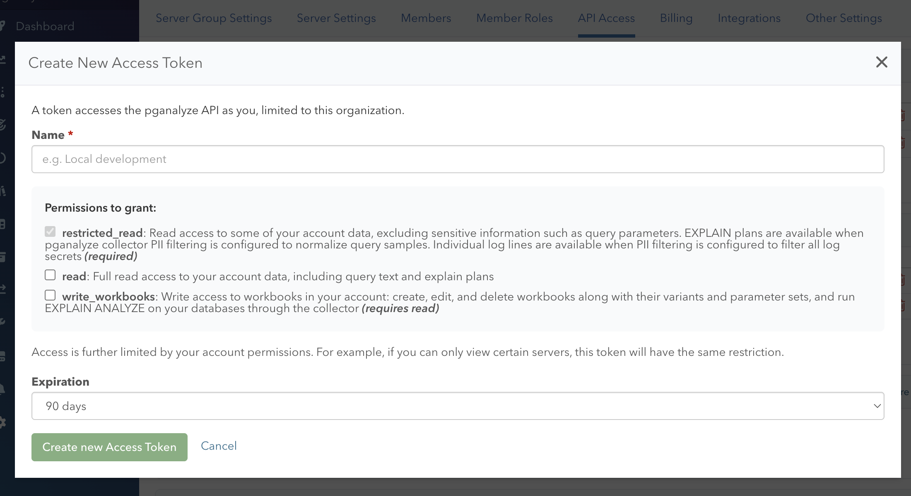

import DocsEarlyAccessFeature from '../components/DocsEarlyAccessFeature'

<DocsEarlyAccessFeature feature="Personal access tokens" />

A personal access token lets a script, agent, or CI job call the pganalyze [GraphQL API](/docs/api) or [MCP server](/docs/mcp) on your behalf. Each token belongs to you and to a single organization, and carries only the scopes you choose when you create it.

Personal access tokens are not yet available on pganalyze Enterprise Server.

## How access is determined

A personal access token can do what both of the following allow:

- **The token's scopes**, chosen when you create the token (see [Scopes](#scopes)).
- **Your account permissions** in the token's organization. For example, if you can only view certain servers, the token has the same restriction. See [Permissions and Roles](/docs/accounts/permissions).

A token only works in the organization it was created in. If you are a member of several organizations, create a separate token in each one.

## Creating a personal access token

Any member of the organization can create personal access tokens for themselves. No additional permission is required.

1. Go to **Settings > API Access** for your organization.
2. In the **Personal Access Tokens** section, click **Create Access Token**.
3. Enter a name that tells you where the token is used, for example "Local development" or "CI pipeline".
4. Select the [scopes](#scopes) to grant.
5. Choose an expiration: 30 days, 60 days, 90 days (the default), 1 year, or no expiration.
6. Click **Create new Access Token**.



The token is shown only once, right after you create it. Copy it and store it somewhere safe, such as a secrets manager. pganalyze stores only a hash of the token and cannot show it to you again.

Tokens start with `pgat_`. The API Access page lists your tokens by name and the first few characters of the token, so you can tell them apart without the full value.

## Scopes

Personal access tokens use the same [scopes](/docs/api/authentication#scopes) as OAuth. Basic read access (`restricted_read`) is always granted, and Full read access (`read`) and Workbook write access (`write_workbooks`) are optional. See [Scopes](/docs/api/authentication#scopes) for what each scope allows.

## Using a personal access token

Pass the token in the `Authorization` header, using either the `Bearer` or `Token` scheme.

### GraphQL API

```bash
curl -XPOST -H 'Authorization: Bearer pgat_XXXXXXX' -F 'query=query { getServers(organizationSlug: "your-organization") { id, name } }' https://app.pganalyze.com/graphql
```

See [Queries](/docs/api/queries) for the available endpoints.

### MCP server

Configure your MCP client to send the token as a Bearer token. For example, with Claude Code:

```bash
claude mcp add --transport http \
  pganalyze https://app.pganalyze.com/mcp \
  -H "Authorization: Bearer pgat_XXXXXXX"
```

See [MCP Server](/docs/mcp) for the available tools and how to configure other MCP clients.

## Revoking a personal access token

To revoke a token, click the trash icon next to it on the API Access page. Revocation takes effect immediately.

When you are removed from an organization, your personal access tokens for that organization are revoked automatically.
