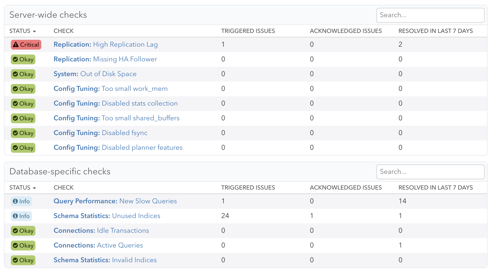
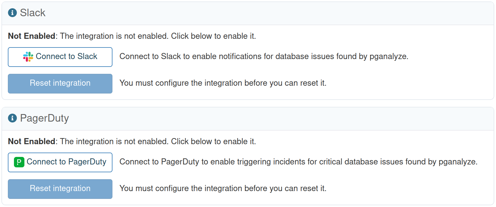
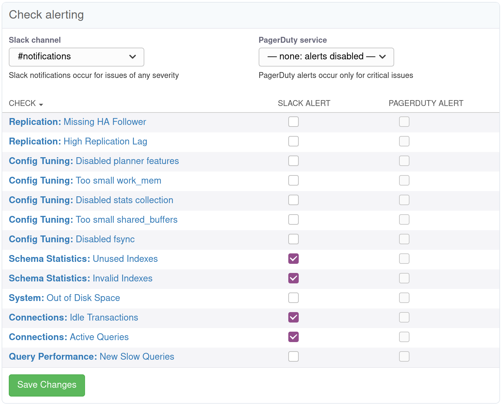

import * as checkUtil from '../util/checks'

export const CheckLinks = () => {
  const checkTitles = checkUtil.CHECK_TITLES;
  return (
    <ul>
      {Object.entries(checkTitles).map(([checkGroup, items]) => {
        return (
          <li key={checkGroup}>
            <strong>{checkGroup}</strong>
            <ul>
              {Object.entries(items).map(([checkName, checkTitle]) => {
                if (checkGroup == "index_advisor" && checkName == "missing_index") return null;
                return (
                  <li key={checkName}>
                    <Link to={`/docs/checks/${checkGroup}/${checkName}`}>
                      {checkTitle}
                    </Link>
                  </li>
                )
              })}
            </ul>
          </li>
        )
      })}
    </ul>
  )
}

To help you discover potential problems, pganalyze automatically performs a number
of checks on your database.

Checks run regularly, at different frequencies depending on the check type. When
a problem is detected, an issue is created for the server or database where the
problem is found.

Issues may have severity "info", "warning", or "critical". Critical issues may
indicate a serious performance problem or potential database outage within a matter
of hours. Warnings are less serious, but should still be investigated as they can
often escalate to critical severity. Info-level issues encourage best practices and
indicate opportunities for performance improvements.

## Alerting

If an issue is of severity "critical" (either because it starts as critical or
escalates to that level), it will alert organization users by e-mail according to
their configured Alert Policy. You can edit Alert Policies in the Configure section
of the Alerts & Check-Up page. You can edit organization members' assigned policies
in each member's organization profile page, accessible from the Members section of
the organization Settings page.

Alerting is also available through integrations with select third-party services.
Currently supported services are [PagerDuty](https://pagerduty.com) and [Slack](https://slack.com).
To enable alerting via a third-party integration, go to the Integrations tab in your
Organization settings page:

Here you can click the "Connect to ..." buttons to go through the authentication flow
with the selected provider to enable the integration within pganalyze. Once connected,
you can use the "Test" button to make sure the integration is configured correctly. For
Slack, this will send a message to the selected channel; for PagerDuty, it will open an
incident for the selected service (you should resolve the incident yourself).

By default, completing the integration setup does not enable alerting through the integrated
provider. You will need to configure alerting notifications on the alert configuration
page for each server:

### Slack Notifications

Slack integration allows you to send Slack messages about issues discovered by pganalyze.
You can configure Slack notifications for any type of check.

Slack notifications will be sent for all issue activity of the checks selected on configured
servers. The initial alert will be sent as a new message, and subsequent changes to the issue
will update the original message and start a thread summarizing issue activity (excluding
notifications).

**Note**: the pganalyze app **must be invited to the channel** you select for notifications
in order to be able to post there. You can do so from within Slack by typing "@pganalyze"
within the channel: you'll be prompted to invite the app.

### PagerDuty Alerting

PagerDuty integration allows you to trigger PagerDuty alerts for critical issues discovered
by pganalyze. This is available for both issues that start at critical severity immediately
(like a disabled `fsync` setting) and for issues that can escalate to critical severity (like
a long-running query). Alerts for the latter are triggered upon escalation.

When you first click "Connect ...", you will be prompted to select which services you are
interested in integrating with pganalyze. You should select any services you may want to
trigger incidents on in the future. You can later configure which specific service to use
for which server.

Acknowledging the issue in pganalyze will acknowledge the PagerDuty incident. Re-opening an
issue in pganalyze will re-trigger the incident. Once the issue is resolved in pganalyze, the
PagerDuty incident will also be resolved automatically. You may interact with the incident
normally through PagerDuty, though changes will not be reflected in the corresponding pganalyze
issue.

[Read more about the PagerDuty integration](/docs/checks/pagerduty)

## Checks

Checks are organized into several different categories:

<CheckLinks />