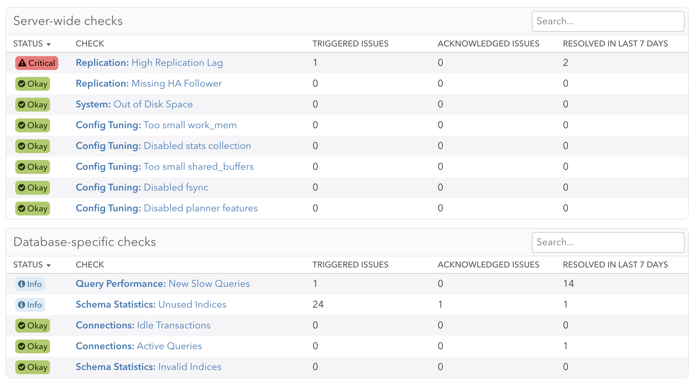
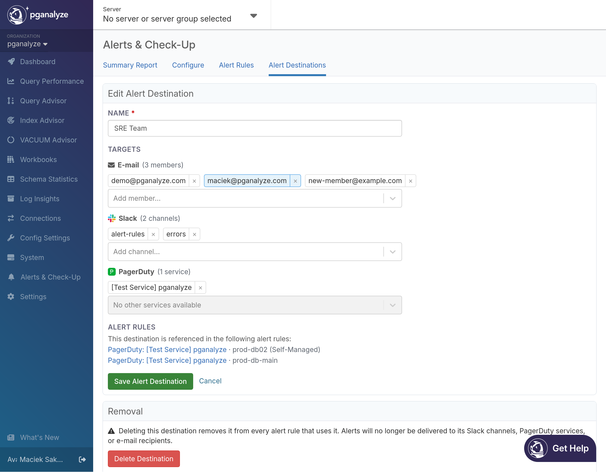
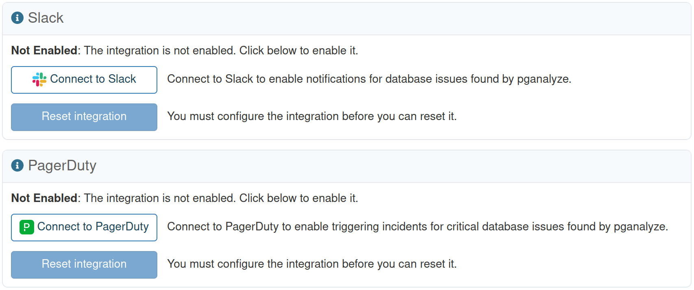
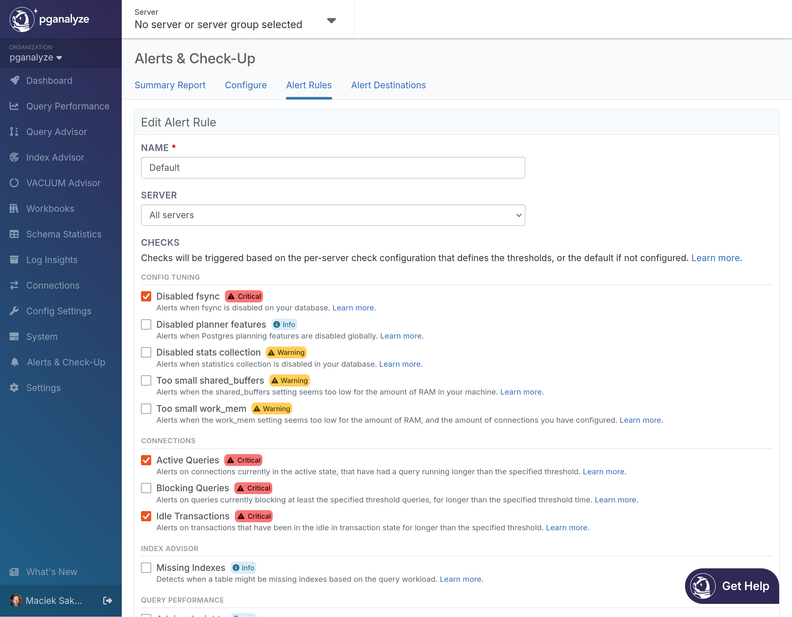

import * as checkUtil from '../util/checks'

export const CheckLinks = () => {
  const checkTitles = checkUtil.CHECK_TITLES;
  return (
    <ul>
      {Object.entries(checkTitles).map(([checkGroup, items]) => {
        return (
          <li key={checkGroup}>
            <strong>{checkGroup}</strong>
            <ul>
              {Object.entries(items).map(([checkName, checkTitle]) => {
                return (
                  <li key={checkName}>
                    <Link to={`/docs/checks/${checkGroup}/${checkName}`}>
                      {checkTitle}
                    </Link>
                  </li>
                )
              })}
            </ul>
          </li>
        )
      })}
    </ul>
  )
}

To help you discover potential problems, pganalyze automatically performs a number
of checks on your database.

Checks run regularly, at different frequencies depending on the check type. When
a problem is detected, an issue is created for the server or database where the
problem is found.

Issues may have severity "info", "warning", or "critical". Critical issues may
indicate a serious performance problem or potential database outage within a matter
of hours. Warnings are less serious, but should still be investigated as they can
often escalate to critical severity. Info-level issues encourage best practices and
indicate opportunities for performance improvements.

## Alerting

When a check creates or updates an issue, pganalyze can notify you through one or
more alert destinations. A destination is a named, reusable target that can send
alerts to any combination of:

- E-mail — selected organization members
- Slack — a channel, via the Slack integration
- PagerDuty — a service, via the PagerDuty integration

You manage destinations on the Alert Destinations tab of the Alerts & Check-Up
page. Each organization has a default destination that new members are added to
automatically.

### Connecting integrations

Slack and PagerDuty destinations require a connected integration. Connect them on the
Integrations tab of your organization Settings page:

Click the "Connect to ..." button for a provider and complete its authentication flow.
Once connected, use the "Test" button to confirm the setup: for Slack this sends a
message to the selected channel, and for PagerDuty it opens an incident on the selected
service (which you should then resolve yourself). A destination's Slack and PagerDuty
targets are chosen from the channels and services these integrations make available.

### Alert rules

Alert rules decide which issues reach which destinations. A rule applies to a
specific server (or all servers), matches a set of checks, and routes matching issues
to one or more destinations. You manage rules on the Alert Rules tab of the
Alerts & Check-Up page. Whether and when an issue reaches a given severity is still
governed by each server's per-check configuration; alert rules only control where
matching issues are sent.

Alerts are delivered according to severity: Slack destinations receive matching issues
of any severity, while PagerDuty and e-mail destinations are notified only for critical
issues — either issues that start at critical severity (like a disabled `fsync` setting)
or issues that escalate to critical (like a long-running query).

### Slack notifications

The initial alert is sent as a new message, and subsequent changes to the issue update
that message and start a thread summarizing issue activity.

**Note**: the pganalyze app **must be invited to the channel** you select in order to
post there. You can do so from within Slack by typing "@pganalyze" in the channel:
you'll be prompted to invite the app.

### PagerDuty alerting

Acknowledging an issue in pganalyze acknowledges the PagerDuty incident; re-opening an
issue re-triggers it; and resolving the issue in pganalyze resolves the incident
automatically. You may interact with the incident through PagerDuty, though those
changes are not reflected back in the corresponding pganalyze issue.

[Read more about the PagerDuty integration](/docs/checks/pagerduty)

## Checks

Checks are organized into several different categories:

<CheckLinks />