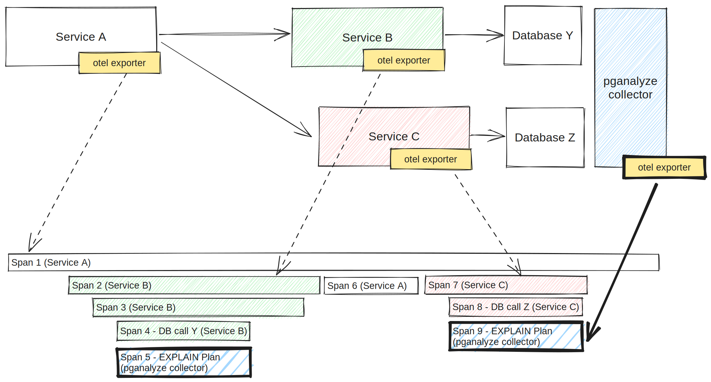

To integrate with application performance monitoring (APM) tools, the collector
can optionally act as an [OpenTelemetry tracing](https://opentelemetry.io/docs/concepts/signals/traces/)
exporter.
This adds data from pganalyze into existing application traces, and allows
application engineers to have a quick way to find out if slow database queries
are causing performance problems in the app.

The exporter will send a tracing span for each [collected EXPLAIN plan](/docs/explain/setup)
to the configured OpenTelemetry endpoint, with a link back to the full plan in
pganalyze via the `db.postgresql.plan` span attribute.
The span will be recorded with the service name "Postgres (pganalyze)" and the
span name "EXPLAIN Plan" by default.



## Set up the pganalyze collector with third-party services

By setting up `otel_exporter_otlp_endpoint` (or `OTEL_EXPORTER_OTLP_ENDPOINT`),
the collector will start sending out tracing spans to the specified endpoint.

You can test this by pointing this endpoint to an OpenTelemetry collector
instance running locally too. For example, you can use the [collector Docker image](https://hub.docker.com/r/otel/opentelemetry-collector-contrib)
and having it output all tracing data that the collector is sending out.
In this case, use `http://localhost:4318` for the `otel_exporter_otlp_endpoint`
(`OTEL_EXPORTER_OTLP_ENDPOINT`).

To set up OpenTelemetry collectors with third party services, see the following
instructions.

* [Setting up with Honeycomb](/docs/collector/otel-setup/honeycomb)
* [Setting up with New Relic](/docs/collector/otel-setup/newrelic)

## Limitations

* Tracing spans are only created for queries with EXPLAIN plans
  * [Automatic EXPLAIN plan collection](/docs/explain/setup) must be set up to
    allow the pganalyze collector to collect EXPLAIN plans
  * If a query doesn't have an EXPLAIN plan, such as a query that completes in
    less time than `auto_explain.log_min_duration`, a tracing span will not be
    created
* Queries must contain the `traceparent` query tag. Queries without the tag will
  not create nor send a tracing span

## Troubleshooting

You can check if the collector is successfully reading the OTLP endpoint by
running the collector with a verbose option (`pganalyze-collector --test -v`).
You should be able to see the following log and no error after that.

```
2023/10/20 14:42:18 V Initializing OpenTelemetry tracing provider with endpoint: http://localhost:4318
```
