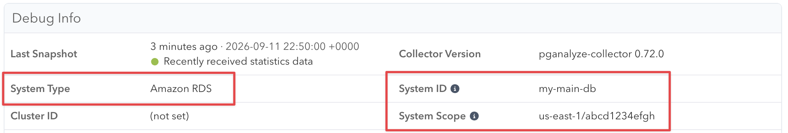

pganalyze recognizes a server by an identity that the collector derives from your configuration
and reports with every snapshot. As long as that identity stays the same, all statistics keep
accumulating on the same server, and the server keeps its history, name, tags, check
configuration, and alert settings.

Part of the identity changes when you replace an instance, move a database to a different hosting
provider, or move it to a different AWS account. The collector then reports an identity that
pganalyze has not seen before. By default this creates a *new* server, leaving the original one
behind with all of the previous history. To avoid that, you can tell the collector what the
previous identity was, using the `api_system_id_fallback`, `api_system_type_fallback`, and
`api_system_scope_fallback` settings. pganalyze then finds the existing server and updates it to
the new identity, so the history carries over.

```toc
```

## How pganalyze identifies a server

A server's identity consists of three parts:

- **System type** (`api_system_type`): the kind of system, e.g. `amazon_rds` or `self_hosted`
- **System ID** (`api_system_id`): identifies the instance within that system type
- **System scope** (`api_system_scope`): additional identifying characteristics, used when the
  system ID alone is not unique across your infrastructure (for example, an RDS instance ID is
  only unique within an AWS account and region)

The collector detects all three automatically, based on how you configured it:

| System type | System ID | System scope |
|---|---|---|
| `amazon_rds` | Instance ID, or cluster ID for Aurora | `region/account_identifier`, see below |
| `azure_database` | Server name | (empty) |
| `google_cloudsql` | Instance ID, or `cluster:instance` for AlloyDB | GCP project ID |
| `aiven` | Service ID | Aiven project ID |
| `crunchy_bridge` | Cluster ID | (empty) |
| `tembo` | Namespace | (empty) |
| `planetscale` | `org/database/branch` | (empty) |
| `neon` | Database hostname | (empty) |
| `supabase` | Project ref | (empty) |
| `heroku` | Name of the config var, without the `_URL` suffix (e.g. `DATABASE`) | (empty) |
| `self_hosted` | Database hostname, or the collector host's hostname for local connections | `port/dbname` |

For Amazon RDS, the account identifier in the scope comes from the `aws_account_id` setting. Unless
you set that explicitly, the collector reads it from the second label of the RDS hostname, which is
the account-specific identifier AWS assigns, and usually not your numeric AWS account ID. For
example,
`production.abcd1234efgh.us-east-1.rds.amazonaws.com` produces the scope `us-east-1/abcd1234efgh`.
For an Aurora cluster endpoint the identifier keeps its `cluster-` prefix (`cluster-ro-` for a
reader endpoint), giving a scope like `us-east-1/cluster-abcd1234efgh`. If no account identifier is
available at all, the scope is just the region.

You can override any of them explicitly, but we recommend leaving the automatic detection in place
unless you have a specific reason not to.

### Finding the current values

Open the Settings page for the server in pganalyze and look at the **Debug Info** panel. The
**System Type**, **System ID**, and **System Scope** fields show the identity that pganalyze
currently has stored.



Note that the panel shows a display name for the system type ("Amazon RDS"), whereas the setting
takes the value from the table above (`amazon_rds`). An empty **System Scope** is expected for the
system types that the table shows without one.

## When you need to set a fallback

Set the fallback for each part of the identity that is changing, before the collector starts
reporting the new identity:

| What is changing | Fallbacks to set |
|---|---|
| The instance is replaced within the same provider, and the instance ID changes | `api_system_id_fallback` |
| The database moves to a different provider | `api_system_id_fallback` and `api_system_type_fallback`, plus `api_system_scope_fallback` if the previous provider stored a scope |
| The database moves to a different AWS account, GCP project, or Aiven project | `api_system_scope_fallback` |
| The port or database name of a self-hosted server changes | `api_system_scope_fallback` |

Each fallback only widens the lookup for the part of the identity you give it. If two parts change
and you only set one fallback, pganalyze will not find the existing server, so make sure to cover
every part that is changing.

## Setting the fallbacks

The fallbacks are regular collector settings, so they go in the server's section of the `INI`
config, or are set as environment variables for environment-only setups such as Docker:

| Setting | Environment variable |
|---|---|
| `api_system_id_fallback` | `PGA_API_SYSTEM_ID_FALLBACK` |
| `api_system_type_fallback` | `PGA_API_SYSTEM_TYPE_FALLBACK` |
| `api_system_scope_fallback` | `PGA_API_SYSTEM_SCOPE_FALLBACK` |

### Example: moving from Heroku Postgres to Amazon RDS

The previous identity was the `heroku` system type with the `DATABASE` system ID (from the
`DATABASE_URL` config var) and no scope. Since Heroku stores no scope, only the ID and type
fallbacks are needed:

```ini
[rds_production]
db_host = production.abcd1234efgh.us-east-1.rds.amazonaws.com
db_name = production
api_system_id_fallback = DATABASE
api_system_type_fallback = heroku
```

### Example: moving a self-hosted server to Amazon RDS

The previous identity was the `self_hosted` system type, with the database hostname as the system
ID and `port/dbname` as the scope. Unlike Heroku in the example above, self-hosted servers do store
a scope, so all three fallbacks are needed:

```ini
[rds_production]
db_host = production.abcd1234efgh.us-east-1.rds.amazonaws.com
db_name = production
api_system_id_fallback = db1.internal.example.com
api_system_type_fallback = self_hosted
api_system_scope_fallback = 5432/production
```

If the collector previously connected to Postgres on `localhost`, the system ID was the hostname of
the machine the collector ran on, rather than a database hostname. Check the **Debug Info** panel
to see which value pganalyze has stored.

### Example: replacing an RDS instance

Only the instance ID changes, so only the ID fallback is needed:

```ini
[rds_production]
db_host = production-v2.abcd1234efgh.us-east-1.rds.amazonaws.com
db_name = production
api_system_id_fallback = production
```

### Example: moving an RDS instance to a different AWS account

The system ID and type stay the same, and only the scope changes, since the RDS scope contains the
account identifier from the hostname:

```ini
[rds_production]
db_host = production.wxyz5678mnop.us-east-1.rds.amazonaws.com
db_name = production
api_system_scope_fallback = us-east-1/abcd1234efgh
```

## Carrying the server over

The fallbacks take effect on the first snapshot the new collector sends, including the one sent by
`pganalyze-collector --test`. That snapshot re-keys the existing server to the new identity for
good, so the test run performs the carry-over rather than previewing it.

Because of that, stop the collector for the old instance first. If it keeps running afterwards, its
snapshots no longer match the server, which now carries the new identity, and pganalyze creates a
second server for the old instance.

1. Stop the collector that monitors the old instance, or remove its section from the collector
   configuration and reload.
2. Open the existing server in pganalyze and note the URL of its page, for example
   `https://app.pganalyze.com/servers/exampleserverexampleserver`. This is the server whose history
   you are carrying over.
3. Add the fallback settings to the collector configuration for the new instance, and point the
   collector at it.
4. Run `pganalyze-collector --test` to submit the first snapshot under the new identity.

The test summary reports the identity the collector detected for each configured server, and links
to the server that the snapshot was associated with:

```
Server rds_production:

    ✓ System Type:          amazon_rds
    ✓ System Scope:         us-east-1/abcd1234efgh
    ✓ System ID:            production
    ✓ pganalyze connection: ok
    ...
      View in pganalyze:    https://app.pganalyze.com/servers/exampleserverexampleserver

    ✓ All features ok
```

If the **View in pganalyze** link points at the existing server, the fallback matched, and that
server kept its history under its new identity. If it points at a server you have not seen before,
a new server was created and the fallback did not match.

Once the link points at the right server, remove the fallback settings again. They are only needed
for the snapshot that carries the server over, and leaving them in place makes the configuration
harder to reason about later. For package-based installs, a successful `--test` also reloads the
collector, so no separate reload is needed.

If a new server was created instead, compare the system type, scope, and ID from the test summary
against the previous identity shown in the **Debug Info** panel of the original server, and see the
limitations below.

## Limitations

- **The fallbacks must be in place before the collector first reports the new identity.** pganalyze
  always looks for the new identity first, so once a second server exists, that one matches and the
  fallbacks never take effect.
- **The two instances cannot be monitored at the same time.** Carrying a server over is a cutover:
  a server holds one identity, so once it is re-keyed to the new instance, snapshots from the old
  instance no longer match it and create a second server. If you need to monitor both instances in
  parallel during a migration, they are two servers in pganalyze, and their history cannot be
  merged afterwards.
- **Only servers in the same organization are matched.** Carrying a server over to a different
  organization is not supported.
- **Explicit fallbacks replace the automatic ones.** The collector sets some fallbacks by itself:
  for Aiven, Neon, and Supabase it fills in all three, so servers that older collector versions
  detected as `self_hosted` are still recognized, and for Amazon RDS it sets the scope fallback to
  the bare region, which is the scope format from before the account identifier was included.
  Setting a fallback by hand replaces the automatic value, so on those platforms make sure the
  value you set describes the identity that pganalyze has stored.
- **Version requirements.** Setting the fallbacks through environment variables requires collector
  0.74.0 or newer; earlier versions support the `INI` config settings only. On
  [pganalyze Enterprise Server](/docs/enterprise), releases 2026.08.0 and older only support
  `api_system_scope_fallback`, so carrying a server over with a changed system ID or type requires
  a newer release.
