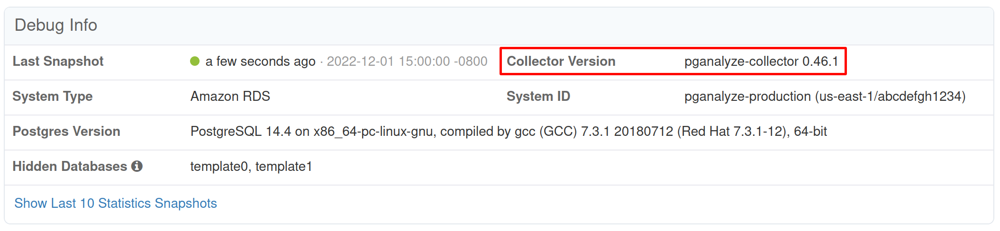

The pganalyze collector is regularly updated to fix bugs and add new features.
Sometimes new features in pganalyze will require an updated collector. There is
no predefined release schedule, but information about the latest changes is
always posted to the
[changelog](https://github.com/pganalyze/collector/blob/main/CHANGELOG.md#changelog)
once a new release is available. If you run into problem in using pganalyze,
it's a good to try updating your collector as a first step.

## Upgrading

Since there are many different ways to run the collector, the upgrade process will
depend on how you originally set up the collector:

 - [RPM package deployment](#rpm-package-deployment) (for Amazon Linux 2, RHEL, CentOS, Fedora VMs)
 - [Debian and Ubuntu package deployment](#debian-and-ubuntu-package-deployment) (for Debian and Ubuntu VMs)
 - [Container deployment](#container-deployment) (for Docker, ECS and other container runtimes)
 - [Heroku deployment](#heroku-deployment)

Once the upgrade completes, you should be able to see the new version reported
in pganalyze, on the server's Settings page in the Debug Info panel near the
bottom:

### RPM package deployment

On Amazon Linux 2, RHEL, CentOS, Fedora, and other systems using RPM packages,
you can update the collector through the standard update mechanism.

First, update the package metadata:
<CodeBlock language="bash">
{`sudo yum makecache
`}
</CodeBlock>

Then, update to the latest version of the collector package:
<CodeBlock language="bash">
{`sudo yum upgrade pganalyze-collector
`}
</CodeBlock>

Installing the new collector will automatically restart the pganalyze collector
service that's running in the background.

### Debian and Ubuntu package deployment

On systems using Debian-based packages, you can update the collector through the
standard update mechanism.

First, update the package metadata:
<CodeBlock language="bash">
{`sudo apt update
`}
</CodeBlock>

Then, update to the latest version of the collector package:
<CodeBlock language="bash">
{`sudo apt install --only-upgrade pganalyze-collector
`}
</CodeBlock>

Installing the new collector will automatically restart the pganalyze collector
service that's running in the background.

### Container deployment

On Amazon ECS, Google Cloud Run, or other Docker environments, you will need to
restart the container and pull a new image.

The recommended `quay.io/pganalyze/collector:stable` tag will always point to
the latest stable collector release. In most cases, restarting your collector
container should pull in a new image.

If you have configured caching in your container runtime, you may need to clear
the cache before restarting the container.

### Heroku deployment

To update the collector running on Heroku, pull the latest version of the code
from the [collector GitHub repo](https://github.com/pganalyze/collector/), and
push it to your collector app.

First, check out the latest collector code and `cd` into its directory:

<CodeBlock language="bash">
{`git clone https://github.com/pganalyze/collector
cd collector
`}
</CodeBlock>

Next, look up the git remote for your app (replace `my-heroku-collector` with
the name of your collector app):
<CodeBlock language="bash">
{`heroku info --app my-heroku-collector
`}
</CodeBlock>

The output should contain a line like
<CodeBlock language="bash">
{`Git URL:        https://git.heroku.com/my-heroku-collector.git
`}
</CodeBlock>

Add that URL as a git remote for Heroku to your local collector repo:
<CodeBlock language="bash">
{`git remote add heroku https://git.heroku.com/my-heroku-collector.git
`}
</CodeBlock>

Then push the latest code to your collector app:
<CodeBlock language="bash">
{`git push heroku main
`}
</CodeBlock>

Once the `git push` completes, the upgrade is done.

