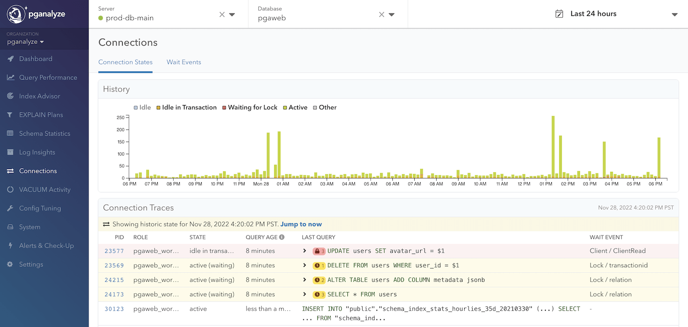
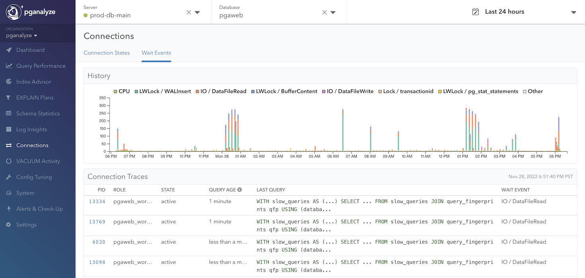

The Connections page in pganalyze tells you about the database connections,
using the data from the `pg_stat_activity`.
Select the server to get the overall connections info, or select the database
as well to get more detailed data such as wait events per database.

You can check the history of connection states in the History chart. This chart
is using the data collected every 10 minutes. This section helps you to
understand the trend of the total count of connections or some unusual pattern
of the connections such as the increase of the Waiting For Lock connections.

## Connection States tab

The Connection States tab has the History chart and the Connection Traces
panel. The Connection Traces panel shows what kind of queries are running
currently, with the automatic refresh (will be paused after a while).
You can also jump to the certain time point's Connection Traces by clicking
the specific time of the History chart.

The Connection Traces panel is only available on the [Scale Plan](/pricing)
and higher.

### Lock Monitoring

You can monitor various wait events including locks with the Wait Events tab.
The History chart of the Connection States tab also gives you the historical
count of the Waiting For Lock state connections.

With the Lock Monitoring, you can dig into this lock information deeper. Within
Connection Traces panel in Connection States tab, whenever the connection is
waiting for a lock, the background color of the row will be highlighted. For
the connection that is holding a lock (in other words, blocking other queries)
is also highlighted.

* 🔒: the lock icon with the red highlight indicates that the query is blocking other queries, and number indicates how many queries it's blocking
* 🕓: the clock icon with the yellow highlight indicates that the query is waiting for other queries, and number indicates how many queries it's waiting for

When a trivial query is taking a long time, often it's waiting for something.
With the Lock Monitoring, you can see which queries the query is waiting for.
It is common that the waiting situation is "chained". For example, a query A
is waiting for a query B, and a query B is waiting for a query C. The Lock
Monitoring supports the situation like this, and highlights query C the most
with the lock icon. In this case, you can run `pg_cancel_backend` or
`pg_terminate_backend` to cancel or terminate the query C to unblock the query
B and A.

This information is available for the historical data too. For example, let's
say the database was slow and requests were timing out 3 hours ago. You can
check out the History chart of the Connection States tab to see if there were
any queries with "Waiting for Lock" state during that time. If so, you can
click the chart to see the snapshot Connection Traces data of that time with
the Lock Monitoring information to see what kind of queries were running and
blocking and/or blocked at that time.

## Wait Events tab

Wait Events history chart tells you a historical data of connections with the
wait events. For example, wait event `IO / DataFileRead` indicates that a
process is currently waiting for data to be read from disk or the page cache.

The chart is using the data collected every 10 seconds, but the data is
aggregated and plotted with the 150 seconds buckets.

See also [this blog post](https://pganalyze.com/blog/postgres-connection-tracing-wait-event-analysis-and-vacuum-monitoring)
to learn more about wait events.

The Wait Events tab is only available on the [Scale Plan](/pricing) and higher.

# Checks and Alerts

Connections checks and alerts are enabled by default for all your databases.

Connections supports the following checks:
 - [Active Queries](/docs/checks/connections/active_query)
 - [Idle Transactions](/docs/checks/schema/idle_transaction)
 - [Blocking Queries](/docs/checks/schema/blocking_query)

Each check has the different purpose and it is recommended to adjust the check
config depending on what your system requires. For example, Active Queries
check will trigger and create a warning issue when the query is in the active
state and running more than 30 minutes. If your system is known to have long
running queries such as nightly batches, you can either extend the threshold or
add the `/* pganalyze:no-alert */` or `/* pganalyze=no-alert */` magic comment
to avoid getting alerted.
The Blocking Queries alert is powerful to get notified when there is any query
blocking other queries. Such situation could easily cause a system wide
performance degradation, so you want to get notified way earlier than what
Active Queries or Idle Transactions can notify.

You can read more details about the [Alerts & Check-Up system](/docs/checks) in
its own section of the documentation.
