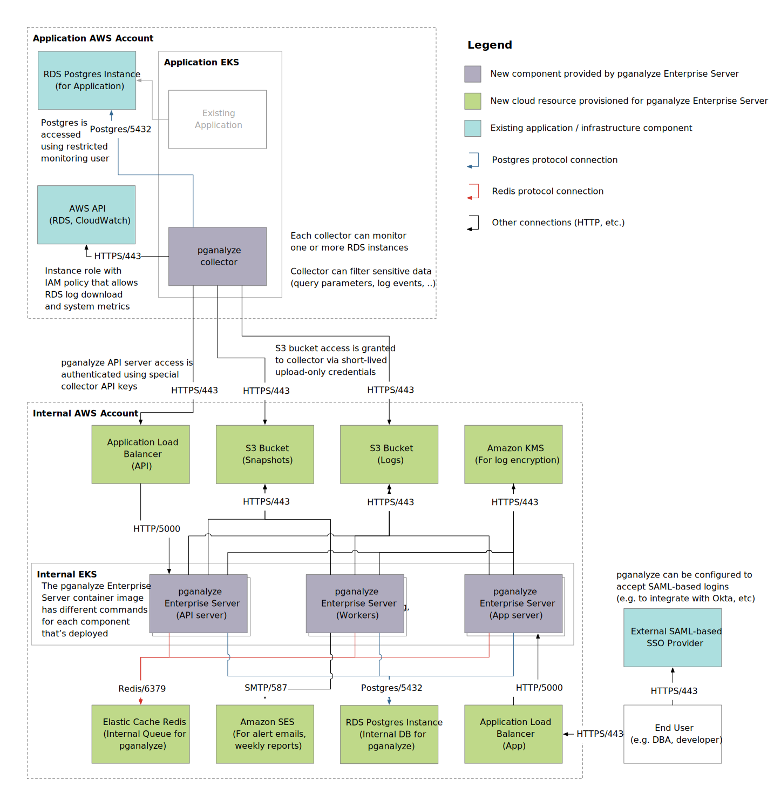

Here you can see the reference architecture for a scaled out version of pganalyze Enterprise Server. This diagram also illustrates how data gets sent between different components.

This is focused on a deployment for monitoring Amazon RDS or Aurora, [deployed using Amazon EKS](/docs/enterprise/setup/kubernetes_amazon_eks) and intended for larger setups that [run the collector separately](/docs/enterprise/setup/separate-collector-install), with a separation between the central AWS account and the application AWS accounts.

