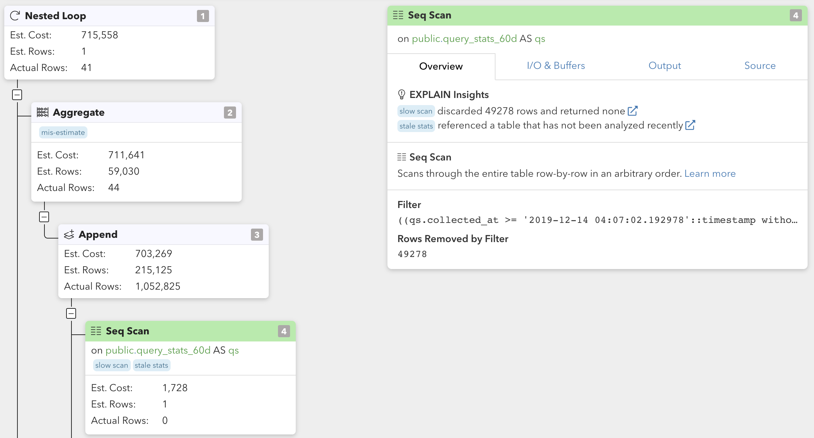

First time looking at **EXPLAIN**, or trying to understand how query plans work?

Start here: **[The Basics of Postgres Query Planning](/docs/explain/basics-of-postgres-query-planning)**

## Query Plan Visualization

pganalyze includes built-in visualization of query plans:

Visualizations are available for all plans collected automatically:

## How to collect EXPLAIN plans automatically

pganalyze integrates with two main mechanism for collecting EXPLAIN plans automatically:

* **Log-based EXPLAIN:** pganalyze collector runs EXPLAIN (without ANALYZE) on all queries logged based on `log_min_duration_statement`, after the query has completed
* **auto_explain:** Postgres collects EXPLAIN (or EXPLAIN ANALYZE) data as part of query processing, based on `auto_explain.log_min_duration`, reflecting the actual plan that was used

Generally we recommend utilizing **auto_explain** where available, as it provides higher data quality.

## Supported platforms & setup

Platform         | Log-based EXPLAIN |    auto_explain   |
-----------------|-------------------|-------------------|
Amazon RDS       | Yes               | Yes (Recommended) |
Azure Database   | Yes               | No                |
Google Cloud SQL | Yes               | No                |
Heroku Postgres  | Yes               | No                |
Self-managed VM  | Yes               | Yes (Recommended) |
Kubernetes       | No                | No                |
Other PaaS       | No                | No                |

We are constantly evaluating new platform to support - please [reach out](/contact) if you're missing an integration, to help us prioritize.

Learn more how to set up the integration:

* [Setup Log-based EXPLAIN with pganalyze](/docs/log-insights/setup/log_explain)
* [Setup auto_explain with pganalyze](/docs/log-insights/setup/auto_explain)

## pganalyze EXPLAIN Insights

Wondering how you should optimize a particular query?

pganalyze automatically analyses EXPLAIN plans to find the most important insights:

* **[Disk Sort](/docs/explain/insights/disk-sort)** When a Sort operation spills to disk due to low work_mem settings
* **[Expensive Nodes](/docs/explain/insights/expensive)** When particular nodes are more expensive than others in a plan
* **[Hash Batches](/docs/explain/insights/hash-batches)** When a Hash operation spilles to disk due to low work_mem settings
* **[Inefficient Index](/docs/explain/insights/inefficient-index)** When an index is inefficient because its loading too much data and then filters rows without an index
* **[Large Offset](/docs/explain/insights/large-offset)** When OFFSET is used for pagination, instead of an efficient method such as keyset-based pagination
* **[Lossy Bitmaps](/docs/explain/insights/lossy-bitmaps)** Bitmap Heap Scan that utilizes a lossy bitmap due to low work_mem 
* **[Mis-Estimate](/docs/explain/insights/mis-estimate)** The Postgres planner mis-estimated the number of rows a particular plan node returns
* **[Slow Scan](/docs/explain/insights/slow-scan)** Sequential Scan that removed a significant number of rows (an index would have helped to avoid this)
* **[Stale Stats](/docs/explain/insights/stale-stats)** The table referenced has not had an `ANALYZE` run recently (potentially leading to inefficient plans)

## Postgres Plan Nodes

Understanding the behavior and performance of individual plan nodes (and when Postgres chooses them for a plan) is critical to understanding overall query planning.

Node types can be broadly considered in three categories:

* [Scan nodes](/docs/explain/scan-nodes): Produce rows from underlying table data
* [Join nodes](/docs/explain/join-nodes): Combine rows from child nodes
* [Other nodes](/docs/explain/other-nodes): Broad variety of functionality (e.g. aggregation, limiting, grouping, etc)
