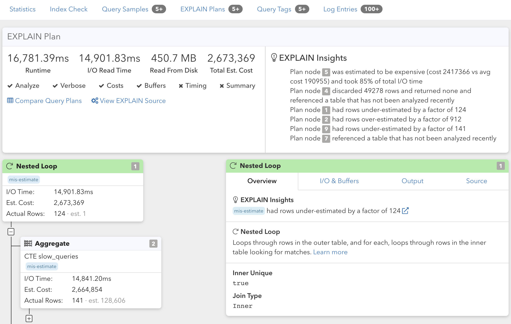

The recommended way to set up Automated EXPLAIN is to use the Postgres `auto_explain` module.
This module is part of core Postgres but is not enabled by default. It can instrument all queries
on your system and log detailed execution information for ones slower than a certain threshold.
With our recommended configuration, performance impact is minimal.

Here are the instructions for environments that support `auto_explain`:

 * [Amazon RDS and Amazon Aurora](amazon_rds/01_auto_explain_check)
 * [Azure Database for PostgreSQL](azure_database/01_auto_explain_check)
 * [Google Cloud SQL and AlloyDB](google_cloud_sql/01_auto_explain_check)
 * [Crunchy Bridge](crunchy_bridge/01_auto_explain_check)
 * [Self-Managed Server](self_managed/01_auto_explain_check)

For other environments, we also offer an alternative [log-based Automated EXPLAIN](log_explain) mechanism.

EXPLAIN plans are visualized on the associated query detail page, and include **[EXPLAIN insights](/docs/explain)**:

