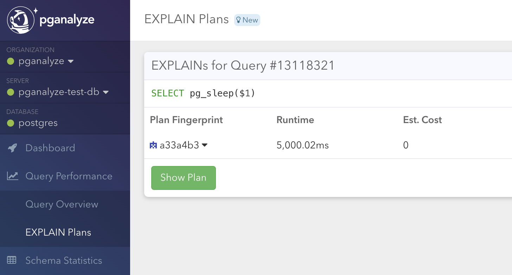

import ToC from '../../../components/Toc'

EXPLAIN plans are essential to understand why exactly a query is slow. We generally recommend using [auto_explain](/docs/explain/setup/auto_explain) to collect EXPLAIN plans automatically.

However, not all environments support the `auto_explain` extension (bundled with Postgres), and therefore we support an alternative mechanism.

<ToC items={props.toc} />

## How Log-based EXPLAIN works

This method relies on Postgres logging slow queries to the logs, based on the `log_min_duration_statement` setting.

For example, when we have configured `log_min_duration_statement = 1000`, we will get output like the following for all queries slower than 1,000 ms:

```
LOG: duration: 3205.800 ms execute a2: SELECT "servers".* FROM "servers" WHERE "servers"."id" = 1 LIMIT 2
```

When the pganalyze collector sees these events, it runs EXPLAIN automatically, so you get the EXPLAIN plan for each slow query, together with the log event.

Note the Log-based EXPLAIN method has the following limitations:

* Plans might be different from the executed plans, as the EXPLAIN runs after a statement has finished
* The collector only runs EXPLAIN, not EXPLAIN ANALYZE (to avoid any performance impact)
* Execution metrics, such as I/O time and Buffer counts are not captured
* The pganalyze monitoring user needs to have sufficient permissions to run EXPLAIN on the query
* Statements involving temporary tables are not supported

## Setup steps

### Pre-requisites

* You have a working [Log Insights integration](/docs/log-insights) that is showing data in the pganalyze UI

### Step 1: Enabling log-based EXPLAIN

Enabling log-based EXPLAIN only requires adding the following configuration setting to your collector:

```
enable_log_explain: 1
```

When using the Docker container, instead use `PGA_ENABLE_LOG_EXPLAIN=1` as an environment variable setting.

Afterwards make sure to reload the pganalyze collector, so the setting takes effect:

```
sudo pganalyze-collector --test --reload
```

### Step 2: Create helper functions

In order to use log-based EXPLAIN, the collector needs permissions to run EXPLAIN queries on your database.
The safest way to permit this is to use the [helper function we provide](https://github.com/pganalyze/collector/#setting-up-log-explain-helper).
Because EXPLAIN needs to run in the same database where the query ran, you will need to create this function
in each database you want to monitor.

### Step 3: Testing the configuration

To test the configuration, we recommend running a `pg_sleep` statement that exceeds the `log_min_duration_statement` threshold:

```
SELECT pg_sleep(5);
```

Assuming the collector is running in the background, after a few minutes you should then see an EXPLAIN plan show up in the pganalyze EXPLAIN plan list:



When you go to the details, you will find the corresponding plan:


From now on, you will now get EXPLAIN plans automatically in the pganalyze UI, for all your slow queries.

[Learn more about how pganalyze works with EXPLAIN data.](/docs/explain)