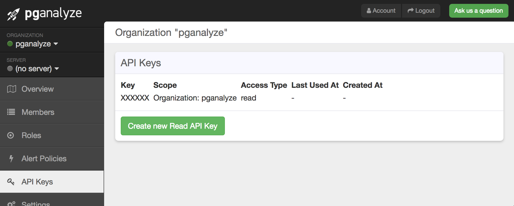

Sometimes you'd like to generate additional reports to the ones available in pganalyze,
but using the data provided by pganalyze. Our efforts to provide a stable public API
are ongoing, but this guide serves to document the most frequent use case:

**Getting the list of the top queries by % of runtime**, in order to do analysis on which
queries have been newly introduced into the system.

You can use this data to e.g. export new slow queries to ticketing systems, or to
compare the frequency and impact of queries over time.

Note that the API methods described in this guide are subject to change.

## Create an API token

First, start by going to the API Keys page for your organization, and creating a new read API key:



You now have a separate read-only API token that can be used for requests to our GraphQL API.

## Making API requests

You can make API requests to our GraphQL API endpoint like this:

```
curl -XPOST -H 'Authorization: Token XXXXXXX' -F 'query=query { getQueryStats(databaseId: 12345) { id, queryUrl, truncatedQuery, statementType, tableNames, totalCalls, avgTime, bufferHitRatio, pctOfTotal } }' https://app.pganalyze.com/graphql
```

Note that you'll need to replace `XXXXXXX` with your API key, and `12345` with the correct database ID.

Formatted more readable, the query parameter has to look like this:

```
query {
  getQueryStats(databaseId: 12345) {
    id
    queryUrl
    truncatedQuery
    statementType
    tableNames
    totalCalls
    avgTime
    bufferHitRatio
    pctOfTotal
  }
}
```

In case you don't use newlines, use `,` to separate the different fields. Feel free to omit fields that you don't need (e.g. bufferHitRatio).

The fields currently available on the `getQueryStats` endpoint:

* **`id` (number)**<br>Unique identifier for this query in the pganalyze system
* **`queryUrl` (string)**<br>URL to the pganalyze query page
* **`truncatedQuery` (string)**<br>Shortened query text up to 100 characters (same as displayed in "Query Performance" overview)
* **`queryComment` (string)**<br>First comment contained in the query (this is taken from the full query string, not just the truncated one)
* **`statementType` (array of strings)**<br>List of statement type(s) used in this query
* **`tableNames` (array of strings)**<br>Fully qualified list of table names used in this query
* **`totalCalls` (integer)**<br>Total number of calls for this query
* **`avgTime` (float)**<br>Average runtime in milliseconds for this query
* **`avgIoTime` (float)**<br>Average time spent in I/O operations for this query (this requires `track_io_timing` to be enabled on the database)
* **`bufferHitRatio` (float)**<br>% of query data that was returned from the buffer cache, instead of the disk or page cache
* **`pctOfTotal` (float)**<br>% of runtime this query represents compared to the cumulative runtime of all queries

Note that the data returned reflects the statistics of the previous 24 hours, from the time the API request was run.

## The result will be a JSON document that looks like this:

```
{
  "data": {
    "getQueryStats": [
      {
        "id":"678910",
        "queryUrl": "https://app.pganalyze.com/databases/12345/queries/678910",
        "truncatedQuery": "UPDATE \"pgbench_accounts\" SET abalance = $1 WHERE \"aid\" = $2",
        "statementType": [
          "UPDATE"
        ],
        "tableNames": [
          "pgbench_accounts"
        ],
        "totalCalls": 1887313,
        "avgTime": 35.3024511808419,
        "bufferHitRatio": 69.50736528891339,
        "pctOfTotal": 96.0880225982751
      },
      [ ... ]
    }
  }
}
```

## CSV Export

In case you are looking for a CSV export instead of the JSON output from the above API call, the following Ruby script can be used:

```
require 'csv'
require 'json'
require 'net/http'

DATABASE_ID = 12345
API_TOKEN = 'XXXXXX'

API_ENDPOINT = 'https://app.pganalyze.com/graphql'
QUERY = '''
query {
  getQueryStats(databaseId: %d) {
    id
    queryUrl
    truncatedQuery
    statementType
    tableNames
    totalCalls
    avgTime
    bufferHitRatio
    pctOfTotal
  }
}
'''

uri = URI(API_ENDPOINT)
req = Net::HTTP::Post.new(uri.request_uri)
req['authorization'] = 'Token ' + API_TOKEN
req.form_data = { 'query' => format(QUERY, DATABASE_ID) }
res = Net::HTTP.new(uri.host, uri.port).request(req)

stats = JSON.parse(res.body)['data']['getQueryStats']
exit(1) if stats.empty?

csv_output = CSV.generate do |csv|
  csv << stats[0].keys
  stats.each do |d|
    csv << d.values
  end
end

puts csv_output
```

This will output the following on stdout:

```
id,queryUrl,truncatedQuery,statementType,tableNames,totalCalls,avgTime,bufferHitRatio,pctOfTotal
678910,https://app.pganalyze.com/databases/12345/queries/678910,"UPDATE ""pgbench_accounts"" SET abalance = $1 WHERE ""aid"" = $2","[""UPDATE""]","[""pgbench_accounts""]",1887313,35.3024511808419,69.50736528891339,96.0880225982751
...
```

## Rate Limits

Note that this API is currently not rate limited, but we ask that you don't send
requests more than a few times per hour, to avoid unnecessary stress on our systems.

Based on usage patterns we may rate limit this API in the future.

## Other API requests

There are more GraphQL API endpoints available - please [contact us](mailto:team@pganalyze.com)
if you have a use case thats not fulfilled by the above.

We're happy to share details on private APIs that are only used by pganalyze itself,
with the disclaimer that they may change at any time.
