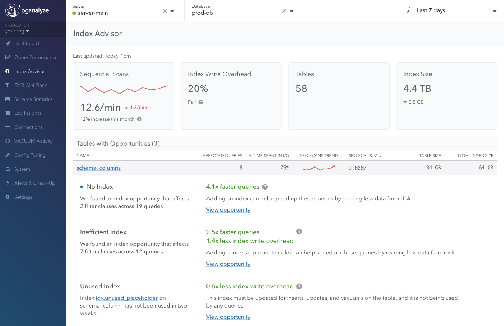

The Index Advisor is integrated into several places in pganalyze.

## Index Advisor Database Overview

Navigate to the Index Advisor report in the main menu and view opportunities
found across your whole database.

At the top you are able to review data about [Index Write
Overhead](/docs/index-advisor/behind-the-scenes#index-write-overhead) over the
last 7 days, and contextual information about overall table count and index
size. Roughly, this is the context Index Advisor considers when creating
opportunities for missing indexes.

Below you find a summary of different optimization opportunities grouped by
type. Each type links to a list with more summary information specific to that
type, and the items in those lists link to an issue page with more detailed
information on queries affected, our recommendation, and analysis.

Opportunity types we support include:

### Missing indexes

Detects scans on tables that have potential to be improved on cost by adding an
index. We look at all the queries and the scan that are contained within the
queries, then filter out clauses, and based on that determine if an index would
make sense (see more details in the [Behind the
Scenes](/docs/index-advisor/behind-the-scenes) section).

### Unused indexes

Every index causes additional write overhead, and sometimes indexes are created
but then never used in reality. The unused index check detects indexes that
haven't been used in the last 2 weeks, as determined by the Postgres statistics,
and notes these indexes as potentially being candidates for removal.

In addition to these checks that are performed as part of the Index Advisor,
pganalyze can also help you alert on [invalid
indexes](/docs/checks/schema/index_invalid).

## Query Detail Page

Index Advisor is also still available from query detail pages as you are used to
today. If you have checks enabled for missing indexes it will appear at the top
of each tab, as well as in the Index Advisor tab.

## Table Detail Page

With the updated approach we show new opportunities for indexes on our table
detail pages, there you get an overview of all the scans occurring on a
particular table.
