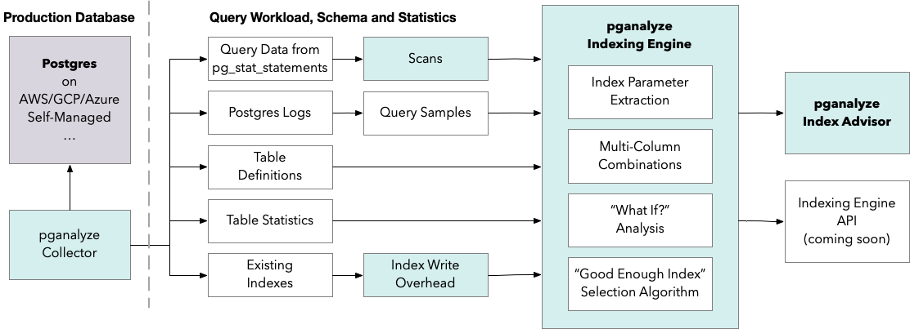

The pganalyze Indexing Engine automatically analyses your Postgres query workload, as well as the schema information and schema statistics, to determine the right set of "good enough" indexes that enable high query performance whilst keeping Index Write Overhead low.

The Indexing Engine runs in the background (in the pganalyze app, separate from the database), and presents results using the [Index Advisor](/docs/index-advisor).

## How the Indexing Engine detects missing index opportunities

When the Postgres query planner decides how to execute a query, it considers a
number of factors to determine if existing indexes can help the query complete
more efficiently. The Indexing Engine builds on this core Postgres code and
extends it to determine what indexes could be useful even if they do not exist.

By evaluating many different possible plans, the Indexing Engine can find index
recommendations to help you optimize your schema for your specific queries.
Since pganalyze already monitors information about your schema (like table and
index definitions and sizes), we can use this to analyze any of your queries,
without requiring specific EXPLAIN plan samples.

The Indexing Engine model used for recommendations is built on:

 - Scans, extracted from the full query workload (collected by means of
   pg_stat_statements)
 - I/O estimates through the use of costing logic aligning with the Postgres
   cost model (similar cost to the one shown in an EXPLAIN plan)
 - Prioritizing indexes for frequent queries over infrequent queries
 - Optimizing for reducing the amount of index pages fetched by prioritizing
   conditions with higher index selectivity (high selectivity = match a small
   number of rows)

## Architecture overview

The Indexing Engine consists of multiple components, and runs in two phases:

* Phase 1: Query and schema analysis
  - [Query To Scan Breakdown](/docs/indexing-engine/query-to-scan-breakdown)
  - [Index Write Overhead Calculation](/docs/indexing-engine/index-write-overhead)

* Phase 2: Index recommendation algorithm
  - [Index Parameter Extraction](/docs/indexing-engine/index-parameter-extraction)
  - [Multi-Column Combinations](/docs/indexing-engine/multi-column-combinations)
  - [What If? Analysis](/docs/indexing-engine/what-if-analysis)
  - ["Good Enough" Index Selection](/docs/indexing-engine/good-enough-index-selection)

You can review the [changelog](/docs/indexing-engine/changelog) to see when changes to the Indexing Engine algorithm are made, or review current [limitations](/docs/indexing-engine/limitations) of the engine.

To learn more about how recommendations are presented in the pganalyze app, you can view the [Index Advisor](/docs/index-advisor) documentation.

## Supported Index Types

The Indexing Engine currently recommends the following index types:

* B-tree: Single-column, Multi-Column, Partial Indexes
* GIST: Single-column, Multi-Column, Partial Indexes

We plan to add support for more index types (such as GIN, Hash and BRIN), as well as expression and covering indexes in the future.

## FAQ

### What type of recommendations does the Indexing Engine provide?

In the initial release the Indexing Engine provides missing index recommendations, as well as unused index recommendations.

We are also working on index consolidation recommendations in a future release, by using the ["Good Enough Index" Selection](/docs/indexing-engine/good-enough-index-selection) algorithm to help you reduce [Index Write Overhead](/docs/indexing-engine/index-write-overhead).

### Does the Indexing Engine require special extensions?

No. The Indexing Engine is fully built into pganalyze, and as long as you integrate your database with pganalyze (i.e. send query statistics and schema data to pganalyze) no further configuration is necessary.

pganalyze integrates with Postgres running in your own VM, Postgres as a Service running on all leading cloud providers, as well as Postgres-compatible offerings such as Amazon Aurora.

### How do I use the Indexing Engine?

The pganalyze Indexing Engine powers the [pganalyze Index Advisor](/docs/index-advisor) - simply sign up for a pganalyze account, integrate your production system into pganalyze, and you will automatically receive recommendations in your pganalyze account powered by the pganalyze Indexing Engine.

We are also working on making an API available that allows customizing how you use the pganalyze Indexing Engine recommendations in your workflows.

### Is the Indexing Engine using machine learning?

No. The Indexing Engine is powered by a purpose-built optimization algorithm based on the Postgres planner (see architecture overview above), and is executed in a deterministic way. If you provide the same inputs (queries and schema) the same version of the Indexing Engine will always produce the same outputs (recommendations).

Whilst there have been attempts to use machine learning for index selection algorithms, in practice it has been shown (see e.g. ["An Experimental Evaluation of Index Selection Algorithms"](http://www.vldb.org/pvldb/vol13/p2382-kossmann.pdf)) that they take significantly longer to run, without providing better recommendations.

As part of its optimization algorithm, the pganalyze Indexing Engine is able to test possible indexes a lot quicker, due to its unique [What If? analysis](/docs/indexing-engine/what-if-analysis) logic.

### Is the Indexing Engine fully automating index creation for me?

In the initial release the Indexing Engine results require a human review by a database operator. Specifically, when index recommendations are presented through the pganalyze Index Advisor, we expect you to [perform a benchmark on a production copy](/docs/index-advisor/test-recommendations), and if results are suitable, to deploy the index to production with your existing workflows.

In future releases we plan to offer more workflow integrations, for example by automatically testing suggested indexes on a database copy, and, if suitable for your use case, applying them to your production database in a (semi-)automated manner.
