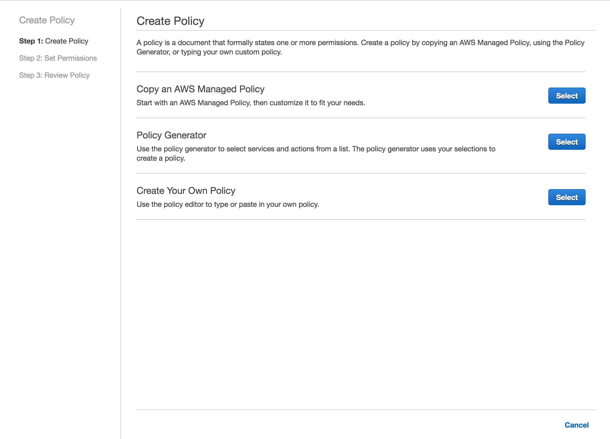

Almost done! 🎉

We now need to setup an IAM policy that the collector can use to access RDS information.

To start, open up **Security Credentials** in your AWS Console.

Continue by clicking on Policies on the left side, and then clicking "Create Policy":



Select **Copy an AWS Managed Policy**, search for `RDS` and select the `AmazonRDSReadOnlyAccess` policy:


---

Before saving, modify the policy so it reads as follows:

```
{
    "Version": "2012-10-17",
    "Statement": [
        {
            "Action": [
                "rds:Describe*",
                "rds:ListTagsForResource",
                "ec2:DescribeAccountAttributes",
                "ec2:DescribeAvailabilityZones",
                "ec2:DescribeSecurityGroups",
                "ec2:DescribeVpcs"
            ],
            "Effect": "Allow",
            "Resource": "*"
        },
        {
            "Action": [
                "cloudwatch:GetMetricStatistics",
                "logs:DescribeLogStreams",
                "logs:GetLogEvents"
            ],
            "Effect": "Allow",
            "Resource": "*"
        },
        {
            "Action": [ "rds:DownloadDBLogFilePortion" ],
            "Effect": "Allow",
            "Resource": "*"
        }
    ]
}
```

Note the added section at the end that allows downloading of the log files.

We recommend naming the policy "pganalyze" or similar, so you can easily identify it again. It should look like this once created:


---

In the last step we'll download and run the pganalyze collector software to one
of your EC2 instances:

[Proceed to Step 4: Install the Collector on an EC2 Instance](/docs/install/amazon_rds/04_install_collector)
