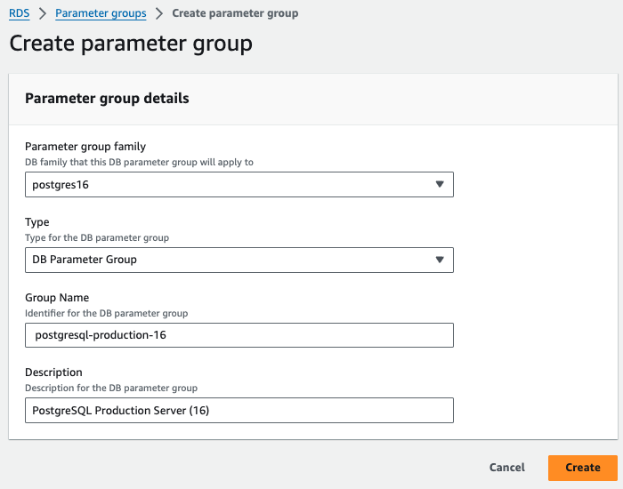
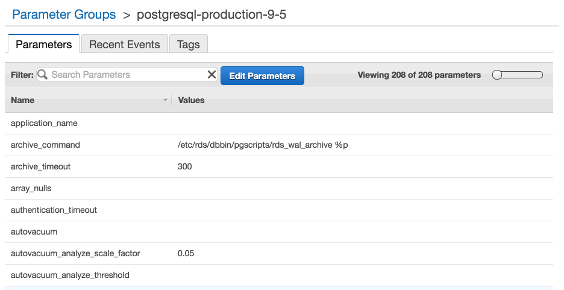
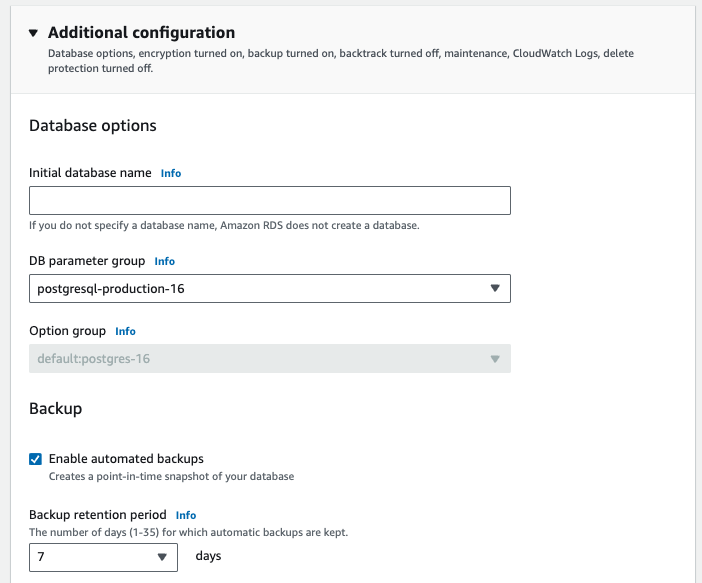

You may get the following error when you setup pganalyze, which collects query performance information using pg\_stat\_statements:

```
ERROR: pg_stat_statements must be loaded via shared_preload_libraries
```

This error indicates that you have not fully enabled pg\_stat\_statements in your database yet.
To enable it for a database running on Amazon RDS, go to your [AWS Console](https://console.aws.amazon.com/rds/), modify your existing custom DB Parameter Group, or create a new custom DB Parameter Group:



In the custom parameter group, modify the `shared_preload_libraries` setting and make sure it includes `pg_stat_statements`.



In case you created a **new** parameter group you'll have to modify your database to use this new parameter group:



To apply the configuration change you will need to reboot your database.

Then re-run `SELECT * FROM pg_stat_statements LIMIT 1` and make sure you get a result.
