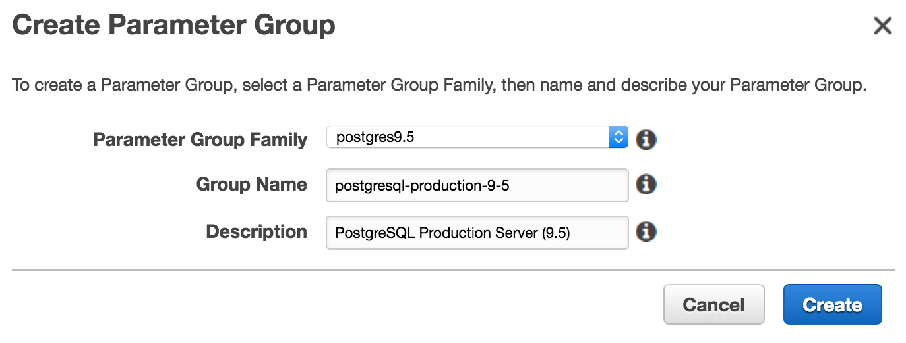
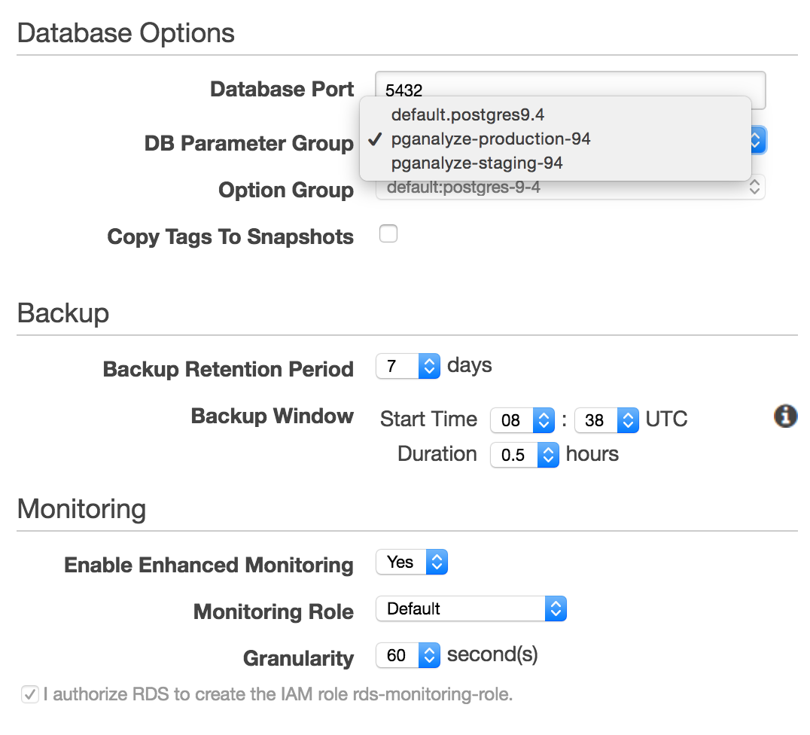

In order to setup pganalyze monitoring for [Amazon RDS](https://aws.amazon.com/rds/postgresql/) you'll need to first follow these steps<br>
to enable the [pg\_stat\_statements](http://www.postgresql.org/docs/current/static/pgstatstatements.html) extension for collecting query statistics.

This guide assumes you have an already running Amazon RDS PostgreSQL server you want to monitor.

---

## Enabling pg\_stat\_statements

In your [AWS Console](https://console.aws.amazon.com/rds/), modify your existing custom DB Parameter Group, or create a new custom DB Parameter Group:



---

Then set the following configuration parameters:


 Name | New Value | &nbsp;
 ---- | ------ | -------
 [pg\_stat\_statements.track](https://demo.pganalyze.com/databases/6/config/track_activity_query_size) | ALL | Optional, enables tracking of queries inside stored procedures
[shared\_preload\_libraries](https://demo.pganalyze.com/databases/6/config/shared_preload_libraries) | pg\_stat\_statements
[track\_activity\_query\_size](https://demo.pganalyze.com/databases/6/config/track_activity_query_size) | 2048

---

In case you created a new parameter group you'll have to modify your database to use the Parameter Group you created earlier:<br>



## Enable Enhanced Monitoring

We also highly recommend turning on Enhanced Monitoring, if you haven't already - it will give you<br>
more detailed system-level statistics that can be helpful, e.g. to debug I/O issues.<br>

If Enhanced Monitoring is enabled, pganalyze will automatically collect and show this additional information in the dashboard as well.

## Reboot your database

To enable the extension you need to reboot your database.

Note that this only needs to be done if you haven't enabled pg\_stat\_statements on this database before.

---

## Verify that pg\_stat\_statements is enabled

Connect to your database as an RDS superuser (usually the credentials you created the database with), e.g. using `psql`.

Run the following SQL commands to enable the extension, and make sure it was installed correctly:

```
CREATE EXTENSION IF NOT EXISTS pg_stat_statements WITH SCHEMA public;
SELECT * FROM pg_stat_statements LIMIT 1;
```

This should return one row of query statistics information - if it gives an error you might not have restarted your database or changed the configuration correctly.

---

Continue by creating the monitoring user:

[Proceed to Step 2: Create Monitoring User](/docs/install/amazon_rds/02_create_monitoring_user)

<br>
<div><signup-cta event-label="Docs"></signup-cta></div>
