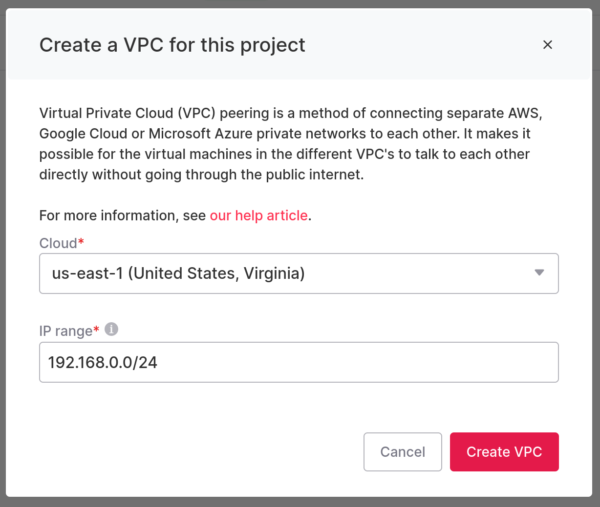
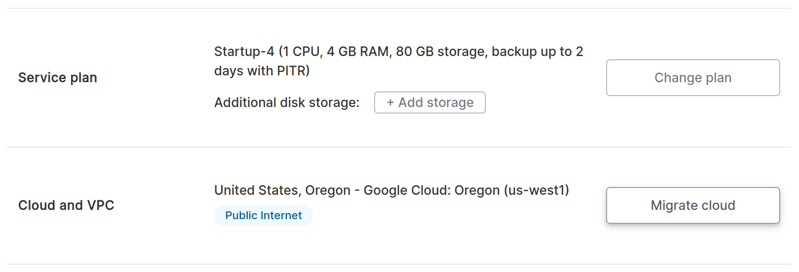

In order to securely deliver logs to the collector, your database must run in an
Aiven VPC peered to a VPC the collector is running in. If you have not done so
yet, go to the Aiven console and create a VPC for the project in the same region
where your database is running:

Make sure that the VPC IP range does not overlap with the collector VPC you will
need to peer. For example, if your collector VPC uses the 10.0.0.0/24 range,
selecting 192.168.0.0/24 for your Aiven project VPC makes it possible to peer
the networks.

Then, go to the database details page in the Aiven console click "Migrate Cloud"
to migrate your database to the VPC you just created:

Rebalancing your database nodes will take a few minutes after migration.

<Link className="btn btn-success" to="02_configure_vpc_peering">
  Continue to Step 2: Configure VPC Peering
</Link>
