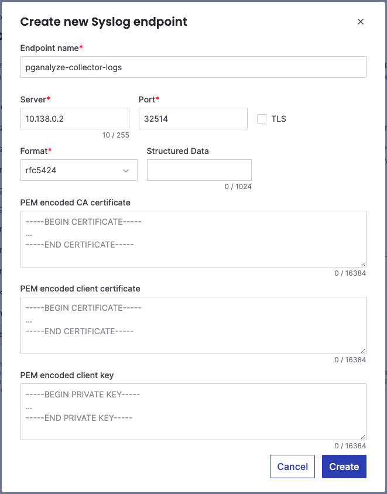
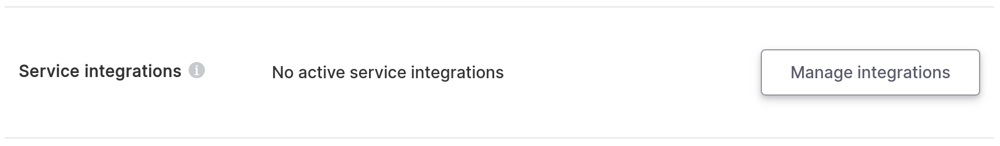
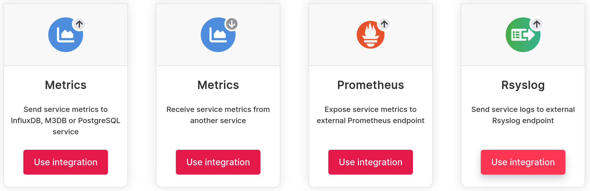
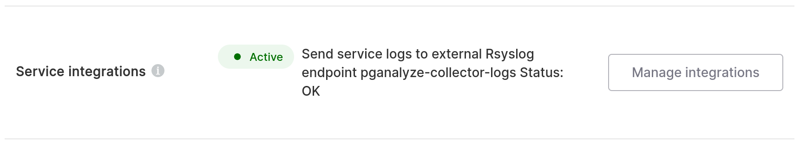

import imgLogInsightsScreenshot from '../log_insights_screenshot.png'

export const ImgLogInsightsScreenshot = () => 

The last step is setting up the Aiven Service Integration. Go to the
Service Integration page in your Aiven console, select Syslog from the
list of options, and click "Add new endpoint".

Fill in the Endpoint form with the internal IP of your collector instance and
the port you selected in the previous step. Disable TLS (the collector does not
support receiving logs over TLS, and since you're sending logs over the peered
VPC connection, the traffic is already private). Leave the format as rfc5424,
and the other fields blank:

Once this is done, return to the service details page for your database, and
click Manage Integrations:

Scroll down to the bottom, find the Rsyslog tile, and click "Use Integration":

Select the endpoint you just created from the dropdown and click "Enable". Then
dismiss the integrations screen.

After a few minutes, the Service Integrations item should refresh automatically and
show your integration as active:

<PublicOnly>
  

    Once the syslog connection is active, you will start seeing log events on the
    Log Insights page in pganalyze.
  

  

    <ImgLogInsightsScreenshot />
  

  

    We recommend setting up <a href="/docs/explain/setup">Automated EXPLAIN</a> as
    a follow-up step, to automatically EXPLAIN slow queries in Postgres.
  

</PublicOnly>
