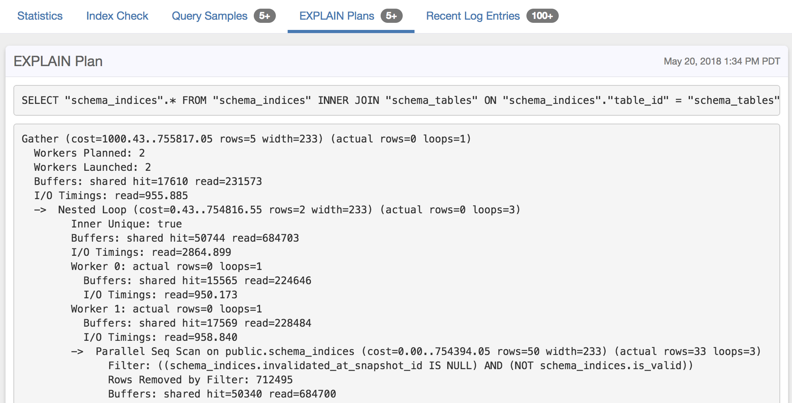

We support extraction of EXPLAIN plans from `auto_explain` output. Please
review the [auto_explain documentation](https://www.postgresql.org/docs/current/static/auto-explain.html)
carefully to see what makes sense for your system.

We've had good experience with a configuration like this, which will log the
EXPLAIN output for every query slower than 1s:

```
auto_explain.log_analyze = 1
auto_explain.log_buffers = 1
auto_explain.log_timing = 0
auto_explain.log_triggers = 1
auto_explain.log_verbose = 1
auto_explain.log_format = json
auto_explain.log_min_duration = 1000
auto_explain.log_nested_statements = 1
auto_explain.sample_rate = 1

# Also add auto_explain to shared_preload_libraries:
shared_preload_libraries = 'auto_explain, pg_stat_statements'
```

The important detail here is that `auto_explain.log_timing` is turned off, as this will have a
negative performance impact on query execution.

You may also want to turn off `auto_explain.log_analyze` if you see increased CPU utilization after enabling `auto_explain`.

EXPLAIN plans are visualized on the associated query detail page, and include **[EXPLAIN insights](/docs/explain)**:


