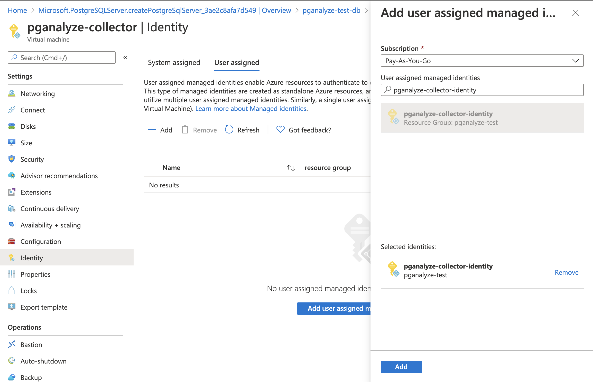

To start, we need [create a new user-assigned Managed Identity](https://portal.azure.com/#create/Microsoft.ManagedIdentity) through the Azure Portal.

After the Managed Identity is created, assign it to your virtual machine:

Now the pganalyze collector running inside the virtual machine will be able to call Azure REST APIs using the Managed Identity.

<Link className="btn btn-success" to="02_set_up_azure_event_hub">
  Continue to Step 2: Set Up Azure Event Hub
</Link>

 
 

### Alternate setup: authentication using Azure AD application

Whilst using Managed Identity is recommended, you can also utilize explicit credentials via an Azure AD application.

Follow the same steps as above, but instead of creating a Managed Identity, follow these steps to create an Azure AD application:

1. Go to "Azure Active Directory" in the Azure Portal
2. Go to "App registrations"
3. Register a new application with a name of your choice, set supported account type to "Accounts in this organizational directory only", and leave Redirect URI as is
4. Go to "Certificates & secrets" and either create a client secret, or upload a certificate

When specifying the access permissions, select the Azure AD application, instead of the Managed Identity.

When configuring the collector, additionally set the following parameters:

pganalyze-collector.conf setting | Environment variable (container-based setup) | Description 
---------------------------------|------------------------------------|-------------
`azure_ad_tenant_id`             | `AZURE_AD_TENANT_ID`               | The "Directory (tenant) ID" on your application
`azure_ad_client_id`             | `AZURE_AD_CLIENT_ID`               | The "Application (client) ID" on your application
`azure_ad_client_secret`         | `AZURE_AD_CLIENT_SECRET`           | When using client secrets, specify the generated secret here
`azure_ad_certificate_path`      | `AZURE_AD_CERTIFICATE_PATH`        | When using certificates, specify the path to your certificate here
`azure_ad_certificate_password`  | `AZURE_AD_CERTIFICATE_PASSWORD`    | When using certificates, specify your certificate password here, if required

To verify your setup works, again run the `pganalyze-collector --test` command, as described in Step 5.

<Link className="btn btn-success" to="02_set_up_azure_event_hub">
  Continue to Step 2: Set Up Azure Event Hub
</Link>
