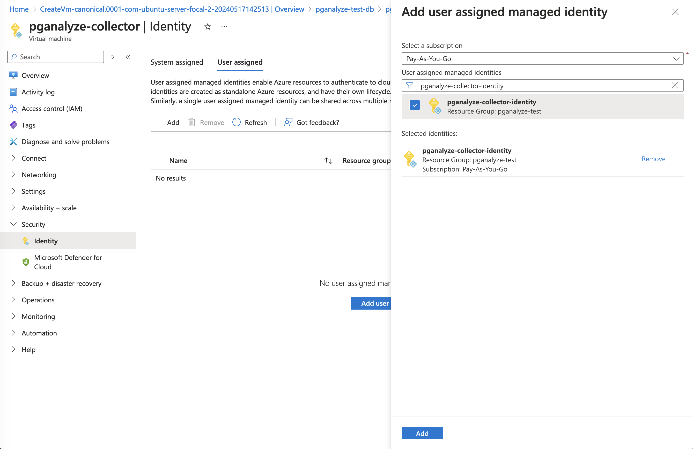
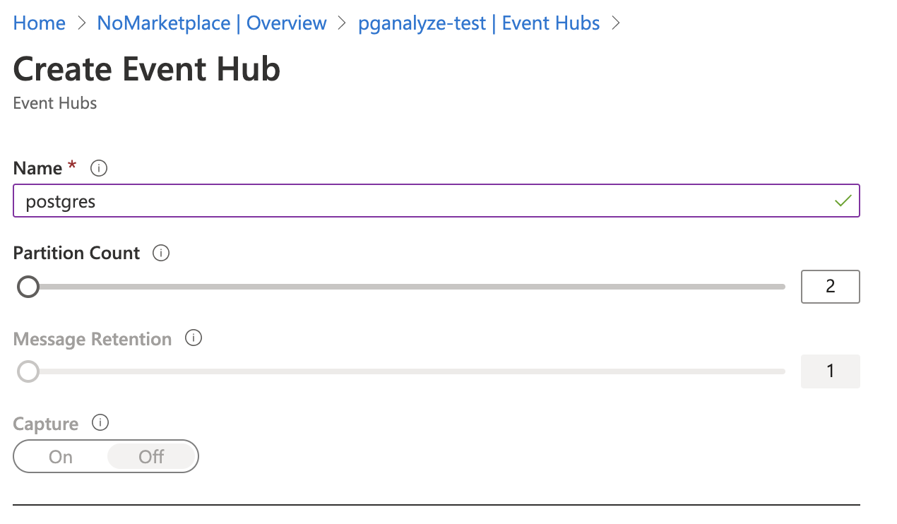
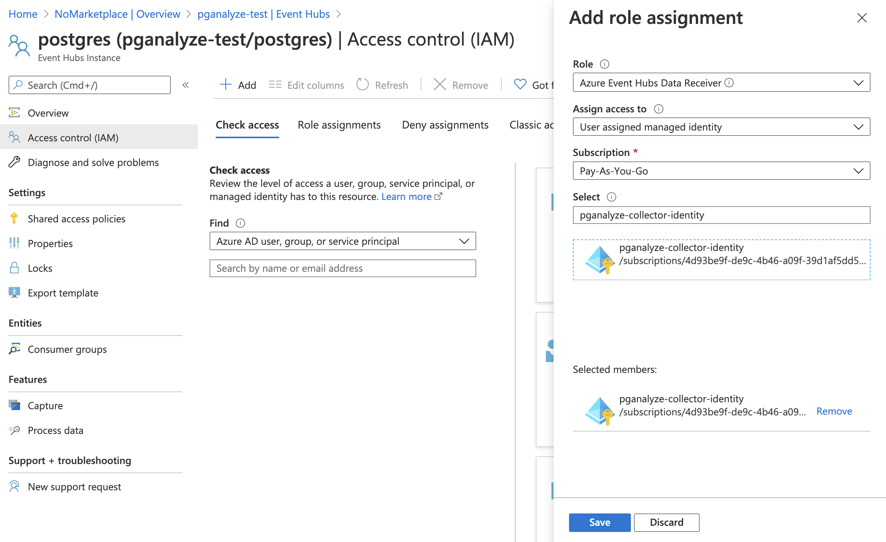
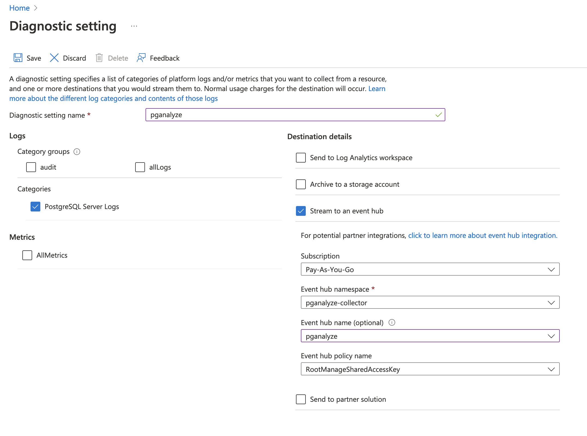

These instructions guide you how to enable [pganalyze Log Insights](/docs/log-insights) for Azure Database for PostgreSQL.

```toc
```

## Installation steps

### Pre-requisites

* You are already running the pganalyze collector inside an Azure virtual machine, or in a container
* You have pganalyze successfully configured for your Azure Database for PostgreSQL server

### Step 1: Setup Managed Identity

To start, we need [create a new user-assigned Managed Identity](https://portal.azure.com/#create/Microsoft.ManagedIdentity) through the Azure Portal.

After the Managed Identity is created, assign it to your virtual machine:



Now the pganalyze collector running inside the virtual machine will be able to call Azure REST APIs using the Managed Identity.

**Note:** Alternatively, instead of using Managed Identity, you can also use an [Azure AD application](#setting-up-authentication-using-azure-ad-application-alternative-to-managed-identity).

### Step 2: Setup Azure Event Hub

In order to retrieve logs from your database server continuously, the pganalyze collector utilizes an Azure Event Hub in your account.

To start, create a new [Azure Event Hub namespace](https://portal.azure.com/#create/Microsoft.EventHub), using the Basic pricing tier.

Next, create an Event Hub inside the namespace, using the standard partition count (2):

<p style="max-width: 400px">

</p>

Within the Event Hub, grant the "Azure Event Hubs Data Receiver" permission for the Managed Identity (or Azure AD application) we created earlier:



Now the pganalyze collector will be able to read log data that is sent into the Azure Event Hub.

### Step 3: Stream Postgres Logs into Azure Event Hub

To send logs to the Event Hub, within your database server, go to Diagnostic settings, and add a new diagnostic setting:

* **Category Details:** Select "PostgreSQLLogs" under "log"
* **Destination Details:** Select "Stream to an event hub", and then select your Event Hub Namespace and Event Hub Name



Save the new diagnostic setting. Now your Event Hub should be receiving Postgres log messages.

### Step 4: Adjust your Postgres log line prefix

By default Azure uses `%t-%c-` as the `log_line_prefix` setting. Whilst we support this setting, we recommend you utilize the following `log_line_prefix` parameter value instead:

```
log_line_prefix = '%m [%p] %q[user=%u,db=%d,app=%a] '
```

You can change this setting in the "Server parameters" section of your database. Please note the trailing space in the parameter value, which is required.

The correct setting for `log_line_prefix` ensures that the collector can associate each log line to the correct session, database and username.

### Step 5: Configure collector

To complete the setup, we can now go to your virtual machine that is running the collector, and enable access to the Azure Event Hub.

We go into the `pganalyze-collector.conf` configuration file, and add these two settings. Note the values need to match what you created in Step 2:

```
azure_eventhub_namespace: pganalyze-test
azure_eventhub_name: postgres
```

Thanks to the Managed Identity that's assigned to the VM, we don't need to specify any credentials here.

Run the collector test to verify the setup works:

```
sudo pganalyze-collector --test --reload
```

And you will see this output when its successful:

```
I [server1] Testing statistics collection...
I [server1]   Test submission successful (29.3 KB received, server abc123)
I [server1] Testing activity snapshots...
I [server1]   Test submission successful (2.44 KB received, server abc123)
I [server1] Testing log collection (Azure Database)...
I [server1]   Log test successful
I Successfully reloaded pganalyze collector (PID 123)
```

You will start seeing log data in pganalyze Log Insights within a few minutes.

We recommend setting up [Log-based EXPLAIN](/docs/explain/setup/log_explain) as follow-up step, to automatically EXPLAIN slow queries in Postgres.

## Troubleshooting

### Error: "Could not get logs through Azure Event Hub: Timeout"

This error can occur when you went quickly through the steps, and the Postgres database server has not been able to deliver a message yet to the Event Hub. There is a delay of 2-5 minutes for log messages to reach the Event Hub.

We recommend waiting 5 minutes, and then retrying. You can verify whether the Event Hub has received any messages by navigating to it in the Azure Portal.

If this error persists, verify that you've configured the diagnostic setting in Step 3 correctly.

### Error: "status code 401 and description: Attempted to perform an unauthorized operation."

This occurs when the collector can't access the Azure Event Hub API.

Review whether you have followed Step 1 correctly for Managed Identity, or have setup the Azure AD application as documented below.

### Error: "failed to configure Azure AD JWT provider"

This error occurs when there is no authentication configured - when using Managed Identity, verify that you have actually assigned the identity to your VM.

### Error: "failed to connect to the Event Hub management node"

Double check your Event Hub namespace and Event Hub name that you have configured in Step 4.

## Special setups

### Running pganalyze collector as a container

When running the collector in a container, you will need to use these environment variables instead of the configuration file:

* `AZURE_EVENTHUB_NAMESPACE` (same as `azure_eventhub_namespace`)
* `AZURE_EVENTHUB_NAME` (same as `azure_eventhub_name`)

### Setting up authentication using Azure AD application (alternative to Managed Identity)

Whilst using Managed Identity is recommended, you can also utilize explicit credentials via an Azure AD application.

Follow the same steps as above, but instead of creating a Managed Identity, follow these steps to create an Azure AD application:

1. Go to "Azure Active Directory" in the Azure Portal
2. Go to "App registrations"
3. Register a new application with a name of your choice, set supported account type to "Accounts in this organizational directory only", and leave Redirect URI as is
4. Go to "Certificates & secrets" and either create a client secret, or upload a certificate

When specifying the access permissions, select the Azure AD application, instead of the Managed Identity.

When configuring the collector, additionally set the following parameters:

pganalyze-collector.conf setting | Environment variable (container-based setup) | Description 
---------------------------------|------------------------------------|-------------
`azure_ad_tenant_id`             | `AZURE_AD_TENANT_ID`               | The "Directory (tenant) ID" on your application
`azure_ad_client_id`             | `AZURE_AD_CLIENT_ID`               | The "Application (client) ID" on your application
`azure_ad_client_secret`         | `AZURE_AD_CLIENT_SECRET`           | When using client secrets, specify the generated secret here
`azure_ad_certificate_path`      | `AZURE_AD_CERTIFICATE_PATH`        | When using certificates, specify the path to your certificate here
`azure_ad_certificate_password`  | `AZURE_AD_CERTIFICATE_PASSWORD`    | When using certificates, specify your certificate password here, if required

To verify your setup works, again run the `pganalyze-collector --test` command, as described in Step 5.