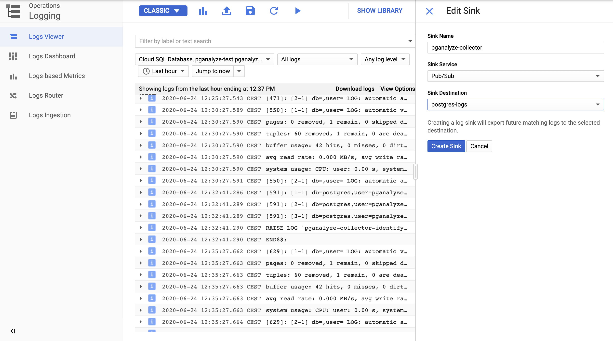

import ToC from '../components/Toc'

These instructions guide you how to enable [pganalyze Log Insights](/docs/log-insights) for Google Cloud SQL.

<ToC items={props.toc} />

## Installation steps

### Pre-requisites

* You are already running the pganalyze collector inside a Google Cloud VM
* You have pganalyze successfully configured for your Google Cloud SQL instance
* You have explicitly configured the GCP project ID (`gcp_project_id`) and GCP Cloud SQL instance ID (`gcp_cloudsql_instance_id`) in the `pganalyze-collector.conf` file

### Step 1: Create new Pub/Sub topic and subscriber

In the Google Cloud Console, navigate to "Pub/Sub" and create a new Topic, e.g. calling it "postgres-logs".

Next, create a Pub/Sub subscriber, with the following settings:

* **Subscription ID:** Name of your choice (e.g. "pganalyze-collector")
* **Cloud Pub/Sub topic:** Select the topic you just created
* **Delivery type:** Pull
* **Subscription expiration:** Leave at default (expire after 31 days)
* **Message retention duration:** 1 day
* **Retry policy:** Retry immediately

You now have the Pub/Sub topic and subscriber that can receive the Postgres log messages.

### Step 2: Configure log routing for the database instance

Navigate to your Cloud SQL database instance, click on "View PostgreSQL error logs", and then click on "Logs Router".

Click "Create Sink", and select your Pub/Sub topic. Make sure that the left side is actually showing PostgreSQL logs (as it does in this screenshot), and that you don't have a different type of resource selected:



Now we need to create a service account that can access the logs sent to the Pub/Sub topic.

### Step 3: Setup Service Account

Go to "IAM & Admin", click on "Service accounts" and then "Create Service Account".

* Pick a name of your choice, e.g. "pganalyze-collector"
* Grant "Pub/Sub Subscriber" permission to the service account

We now have two options here:

* Option 1: Associate a key to the service account, download the private key in JSON format and specify as value for `gcp_credentials_file` pganalyze collector setting
* Option 2: Assign the service account to the VM directly

To keep things simple and secure, we recommend assigning the service account to the VM. To do so, navigate to your virtual machine.

If your virtual machine is running, you will need to stop it to change the associated service account. Then, edit the VM instance details, and set the "Service account" setting to the just created service account. Now, start the VM again.

Local processes on the VM, such as the pganalyze collector, can now access APIs through the service account.

### Step 4: Configure pganalyze collector

Sign in to your virtual machine, and add the following configuration setting:

```
gcp_pubsub_subscription: projects/PROJECT_ID/subscriptions/SUBSCRIPTION_ID
```

This is the value of "Subscription name" you can see when clicking on the details for the Pub/Sub subscriber we created earlier.

Now test the collector configuration:

```
sudo pganalyze-collector --test --reload
```

This should return something like the following:

```
I [server1] Testing statistics collection...
I [server1]   Test submission successful (29.3 KB received, server abc123)
I [server1] Testing activity snapshots...
I [server1]   Test submission successful (2.44 KB received, server abc123)
I [server1] Testing log collection (Google Cloud SQL)...
I [server1]   Log test successful
I Successfully reloaded pganalyze collector (PID 123)
```

You will start seeing log data in pganalyze Log Insights within a few minutes.

We recommend setting up [Log-based EXPLAIN](/docs/explain/setup/log_explain) as follow-up step, to automatically EXPLAIN slow queries in Postgres.

## Troubleshooting

### Error: "Could not get logs through Google Cloud Pub/Sub: Timeout"

This error occurs when we could not send a message end-to-end through the database log and Pub/Sub pipeline in 10 seconds.

A common error cause is that the Project ID and/or CloudSQL instance ID do not match the names that show in the log stream. Double check your pganalyze collector configuration settings.