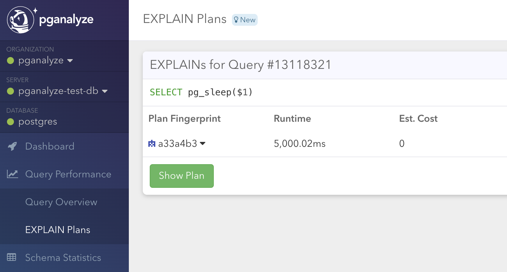

EXPLAIN plans are essential to understand why exactly a query is slow. We generally recommend using [auto_explain](/docs/log-insights/setup/auto_explain) to collect EXPLAIN plans automatically.

However, not all environments support the `auto_explain` extension (bundled with Postgres), and therefore we support an alternative mechanism. This method relies on Postgres logging slow queries to the logs, based on the `log_min_duration_statement` setting.

For example, when we have configured `log_min_duration_statement = 1000`, we will get output like the following for all queries slower than 1,000 ms:

```
LOG: duration: 3205.800 ms execute a2: SELECT "servers".* FROM "servers" WHERE "servers"."id" = 1 LIMIT 2
```

pganalyze supports running EXPLAIN automatically in the pganalyze collector on these statements, so you get the execution plan for each slow query.

Note this method is not perfect, because plans might change (and this runs after a statement has already been executed), but in many cases still provides useful information with minimal effort.

## Setup steps

### Pre-requisites

* You have a working [Log Insights integration](/docs/log-insights) that is showing data in the pganalyze UI

### Step 1: Enabling log-based EXPLAIN

Enabling log-based EXPLAIN only requires adding the following configuration setting to your collector:

```
enable_log_explain: 1
```

When using the Docker container, instead use `PGA_ENABLE_LOG_EXPLAIN=1` as an environment variable setting.

Afterwards make sure to reload the pganalyze collector, so the setting takes effect:

```
sudo pganalyze-collector --test --reload
```

### Step 2: Testing the configuration

To test the configuration, we recommend running a `pg_sleep` statement that exceeds the `log_min_duration_statement` threshold:

```
SELECT pg_sleep(5);
```

Assuming the collector is running in the background, after a few minutes you should then see an EXPLAIN plan show up in the pganalyze EXPLAIN plan list:



When you go to the details, you will find the corresponding plan:


From now on, you will now get EXPLAIN plans automatically in the pganalyze UI, for all your slow queries.

[Learn more about how pganalyze works with EXPLAIN data.](/docs/explain)