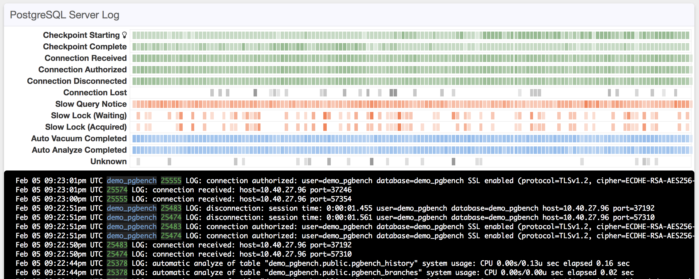

This guide helps you set up the pganalyze Log Insights feature for a self-hosted system, i.e. one that is managed and configured by yourself, instead of one that is provided as a service by a cloud provider.

Note that your account needs to be on the **Scale** plan or higher to be able to use Log Insights, or you need to be in your initial 14-day trial period.

## 1. Update pganalyze collector (if needed)

Make sure you are running an up-to-date pganalyze-collector version, by running `yum update pganalyze-collector` or `apt-get upgrade pganalyze-collector`.

Also make sure the collector is running on your database server directly, and not on another system.

## 2. Locate your PostgreSQL log file / directory

Log Insights works by continuously tailing your local Postgres log files, and classifying log lines, and submitting log data and statistics to pganalyze.

In order to do that, you need to configure the `db_log_location` in the `pganalyze-collector.conf` file, which should be either the Postgres log file, or the directory in which log files are located.

We provide a helper for discovering the log directory, which you can run like this as root:

```
pganalyze-collector --discover-log-location
```

This will then produce output like this:

```
2018/05/20 19:51:30 I [server1] Found log location, add this to your pganalyze-collector.conf in the [server1] section:
db_log_location = /var/log/postgresql/postgresql-9.3-main.log
```

In some cases where discovery doesn't work you might have to review in more detail how your system is set up. Please reach out to pganalyze support for help if needed.

Note that both individual files and directories are supported for `db_log_location`.

## 3. Adjust configuration and run test

We can now configure the log directory for the collector, by adding the `db_log_location` setting, so the configuration file looks similar to this:

```
[pganalyze]
api_key: XXX

[server1]
db_name: postgres, *
db_username: pganalyze
db_password: mypassword
db_host: 127.0.0.1
db_port: 5432
db_log_location: /var/log/postgresql/postgresql-9.3-main.log
```

Now we can use the `--test` option of the collector to verify that log collection and parsing works:

```
pganalyze-collector --test
```

In the successful case, the log output will look like this:

```
2018/05/08 08:40:06 I [server1] Testing statistics collection...
2018/05/08 08:40:07 I [server1] Test submission successful (15.8 KB received)
2018/05/08 08:40:07 I [server1] Testing local log tailing...
2018/05/08 08:40:13 I [server1] Log test successful
2018/05/08 08:40:13 I Re-running log test with reduced privileges of "pganalyze" user (uid = 107, gid = 113)
2018/05/08 08:40:13 I [server1] Testing local log tailing...
2018/05/08 08:40:19 I [server1] Log test successful
```

There are a few error cases, in particular permission related ones for the "log test with reduced privileges", which you will likely encounter. They are documented at the end of this page.

## 5. Reload your collector

Once the log test is successful you need to reload the collector for the new configuration to take effect:

```
pganalyze-collector --reload
```

After this you should see data showing up in the "Log Insights" tab in pganalyze in less than a minute:



---

## Collector test error: "log\_line\_prefix not supported"

When you see output like this:

```
2018/05/20 19:56:18 I [server1] Testing statistics collection...
2018/05/20 19:56:20 I [server1] Test submission successful (15.9 KB received)
2018/05/20 19:56:20 I [server1] Testing local log tailing...
2018/05/20 19:56:20 E [server1] ERROR - Could not tail logs for server: Unsupported log_line_prefix setting: '%t '
```

It means that the currently configured `log_line_prefix` is not supported by the collector. You need to change your PostgreSQL configuration, reload the Postgres server, and then re-run `pganalyze-collector --test`.

Currently we support the following log\_line\_prefix settings when using Postgres built-in logging (`log_destination = stderr`):

* **`log_line_prefix = '%m [%p] %q[user=%u,db=%d,app=%a] '`** (recommended)
* `log_line_prefix = '%m [%p] %q[user=%u,db=%d,app=%a,host=%h] '`
* `log_line_prefix = '%t:%r:%u@%d:[%p]:'`
* `log_line_prefix = '%t [%p-%l] %q%u@%d '`
* `log_line_prefix = '%t [%p]: [%l-1] user=%u,db=%d - PG-%e '`
* `log_line_prefix = '%t [%p]: [%l-1] user=%u,db=%d,app=%a,client=%h '`
* `log_line_prefix = '%t [%p]: [%l-1] [trx_id=%x] user=%u,db=%d '`

The following are supported but not recommended, since they do not include the user name and database name:

* `log_line_prefix = '%m %r %u %a [%c] [%p] '`
* `log_line_prefix = '%m [%p][%v] : [%l-1] %q[app=%a] '`
* `log_line_prefix = '%m [%p] '`

We also support the parsing of `rsyslogd` log lines that look like the following default template, with an empty log\_line\_prefix:

```
Feb  2 09:04:39 ip-172-31-14-41 postgres[7395]: [3-1] LOG:  database system is ready to accept connections
```

If you have a log\_line\_prefix config thats not covered, please reach out to us, as it is easy for us to add additional parsing support.

## Collector test error: "permission denied"

When you see output like this:

```
2018/05/05 21:32:02 I [server1] Testing statistics collection...
2018/05/05 21:32:03 I [server1] Test submission successful (15.9 KB received)
2018/05/05 21:32:03 I [server1] Testing local log tailing...
2018/05/05 21:32:09 I [server1] Log test successful
2018/05/05 21:32:09 I Re-running log test with reduced privileges of "pganalyze" user (uid = 107, gid = 113)
2018/05/05 21:32:09 I [server1] Testing local log tailing...
2018/05/05 21:32:09 E [server1] ERROR - open /var/log/postgresql/postgresql-9.3-main.log: permission denied
2018/05/05 21:32:19 E [server1] ERROR - Could not tail logs for server: Timeout
```

It means that the log test was able to run successfully as a root user, but could not be completed when testing with the "pganalyze" user that the collector background process runs as.

See "Allowing access when using Postgres built-in logging" or "Allowing access when using rsyslogd built-in logging" below for details on how to fix this.

## Allowing access when using Postgres built-in logging

In the case of built-in Postgres logging you will likely run into the issue that
log files are by default written in a way that prevents users other than the
postgres user from accessing them.

We need to grant the pganalyze user access to them, by doing the following:

First choose a location for log files thats outside of the Postgres data directory,
and then set it up like this:

```
mkdir /my/log/directory
chown postgres:postgres /my/log/directory
```

Also make sure that the pganalyze user can access this directory, by making it a member of the postgres group:

```
usermod -a -G postgres pganalyze
```

Adjust the Postgres configuration to log everything to this new directory by doing the following:

```
log_directory = '/my/log/directory'
log_file_mode = 0640
```

Reload Postgres afterwards, as well as **restart** the collector background process, and then re-run the permission test as described in Step 3.

## Allowing access when using rsyslogd built-in logging

For rsyslogd and other syslog daemons, the issue can often be that new log files
are created with permissions that don't allow the pganalyze user access.

Assuming that your the log files are owned by the Postgres user, you first
need to add the pganalyze user to the postgres group:

```
usermod -a -G postgres pganalyze
```

And then make sure that new files are written with chmod 640, in your `/etc/rsyslog.conf`:

```
# Place this at the beginning of the rsyslog.conf file:
$umask 0000
$FileCreateMode 0600

# Place this where the postgres log is being output
$FileCreateMode 0640
local0.* /var/log/postgres/postgres.log
$FileCreateMode 0600
```

As well as making sure the current log file has the correct permissions:

```
chmod 640 /var/log/postgres/postgres.log
```

Then reload rsyslog and re-run `pganalyze-collector --test`.
