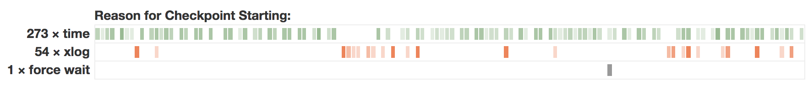

Here we describe the individual parameters you can configure with Postgres to
get useful log output that can then be read and analyzed by **pganalyze Log Insights**.

If you want to skip the details, this is the recommended configuration to start
with:

```
log_min_duration_statement = 1000
log_lock_waits = on
log_temp_files = 0
# Note: log_checkpoints is not available on AWS Aurora (see below)
log_checkpoints = on
log_connections = on
log_disconnections = on
log_autovacuum_min_duration = 0
```

## Slow queries

For logging specific slow queries, instead of the generalized form which has `?`
and `$1` instead of values, the `log_min_duration_statement` setting can be quite
useful.

As a start, you can set this to `1s`, or `1000` milliseconds, which logs every query
that takes longer than that:

```
log_min_duration_statement = 1000
```

pganalyze will then show these as query samples on the query detail page:


## EXPLAIN plans

See **[Collect Postgres EXPLAIN plans using auto_explain](/docs/explain/setup)**.

## Lock waits

To enable logging of [L70: Process acquired lock](/docs/log-insights/locks/L70)
and [Process still waiting for lock](/docs/log-insights/locks/L71) events, add
the following:

```
log_lock_waits = on
```

Note that this will only report on lock waits that exceed `deadlock_timeout`,
which defaults to 1s. Whilst you can lower this a bit, the lock checks can be
expensive if run much more often than the default setting.

See **[Guide: Monitoring Postgres locks using Log Insights](/docs/guides/monitoring-postgres-locks-using-log-insights)** for more details.

## Temporary files

For getting [S7: Temporary file](/docs/log-insights/server/S7) notices, add the following:

```
log_temp_files = 0
```

Note that the value here is a threshold, but in practice its often very useful
to start with a threshold of `0` (i.e. log all temp files) and then raise the
setting value if you are getting too much log output.

Also see **[Guide: Adjusting work_mem based on temporary file creation](/docs/guides/adjusting-work-mem)**.

## Checkpoints

Checkpoints can be I/O intensive events in Postgres, and so its highly recommended
to enable logging for them to get more details:

```
log_checkpoints = on
```

Note that this setting is not available on AWS Aurora (see [here](https://docs.aws.amazon.com/AmazonRDS/latest/AuroraUserGuide/AuroraPostgreSQL.Reference.html) and [here](https://aws.amazon.com/blogs/database/optimizing-and-tuning-queries-in-amazon-rds-postgresql-based-on-native-and-external-tools/)).

This will then give you the following log events: [W40: Checkpoint starting](/docs/log-insights/checkpoints/W40), [W41: Checkpoint complete](/docs/log-insights/checkpoints/W41) as well as others.

pganalyze will also do analysis on the checkpoint reason for you:



See **[Guide: Tuning checkpoint intervals to reduce I/O spikes](/docs/guides/tuning-checkpoint-intervals)** for more details.

## Connections

For logging connections, i.e. [C20: Connection received](/docs/log-insights/connections/C20) and [C21: Connection authorized](/docs/log-insights/connections/C21), enable the following:

```
log_connections = on
```

For disconnects ([C23: Disconnection](/docs/log-insights/connections/C23)) add the following:

```
log_disconnects = on
```

In general it is very useful to enable connection logging, both from an auditing perspective
as well as to be able to trace back when a connection was opened and closed.

That said, if you are not using a connection pooler, and you are getting a lot of
very short connections, you might find the amount of log data from connection logs
overwhelming, and it'd be better to disable it in such cases.

## DDL changes

In order to log changes to your schema, or other database-affecting operations,
you can enable logging of all DDL statements:

```
log_statement = ddl
```

**Warning:** Enabling this also causes `ALTER USER` statements to be logged. Make sure that
you run a session-local `SET log_statement = none` before running any statement that contains
a password.

These will then show up as [T83: Statement notice](/docs/log-insights/statements/T83).

Note that there is also a setting that would log every single query (`log_statement = all`)
which is not recommended for production systems, since the effort of log output
would slow down your database.

## Autovacuum logs

You can use the `log_autovacuum_min_duration` setting to enable logging of autovacuum
operations ([A65: Automatic vacuum of table completed](/docs/log-insights/autovacuum/A65) and
[A66: Automatic analyze of table completed](/docs/log-insights/autovacuum/A66)):

```
log_autovacuum_min_duration = 0
```

If you are seeing a lot of autovacuum activity it may make sense to specify a specific
threshold so only slow vacuums get logged. Note that as a starting point `0` is actually
useful, since you will also see if you have tables that get vacuumed a lot, but VACUUM
is too fast to get seen by other methods (e.g. sampling of `pg_stat_activity`).
