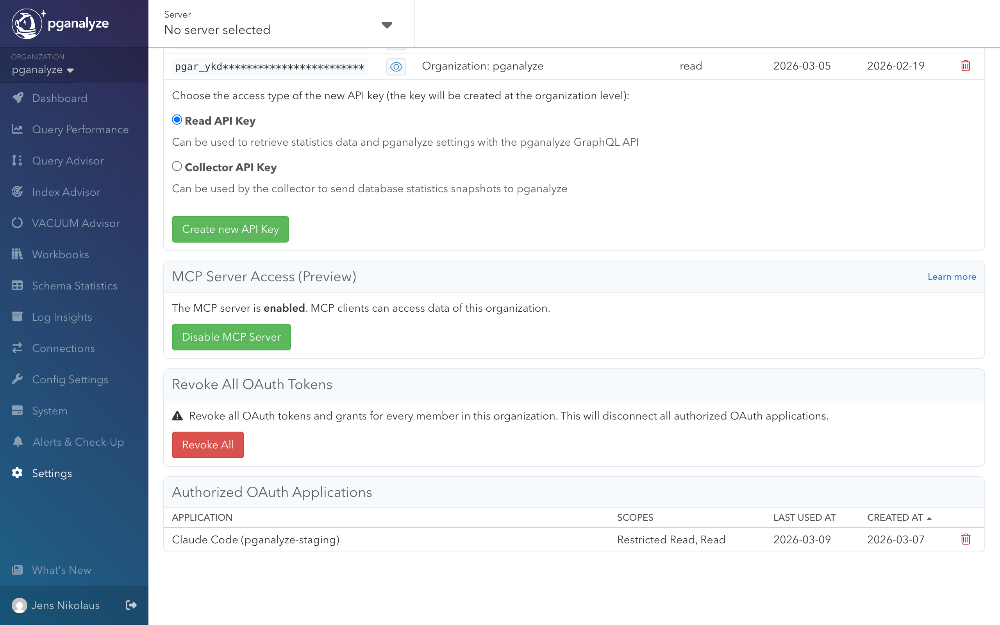

The pganalyze [MCP (Model Context Protocol)](https://modelcontextprotocol.io/) server allows AI assistants to interact with your pganalyze data. This enables AI coding tools like Claude Code, Codex, or Cursor to query server metrics, inspect EXPLAIN plans, run the Index Advisor, and review active issues.

The pganalyze MCP server is currently in public preview, and available on current pganalyze [plans](/pricing). If you are on a legacy plan you may need to upgrade to access the MCP Server.

For a demo of the MCP server in action, watch the webinar recording:

<iframe
    width="750"
    height="421"
    src="https://www.youtube-nocookie.com/embed/Av_vNGIZz_k?start=1581"
    frameborder="0"
    modestbranding="1" controls="0" allownetworking="internal"
    allow="autoplay; encrypted-media"
    allowfullscreen
>
</iframe>
  

## Enabling the MCP server

Admins can enable or disable the MCP server for the entire organization from the API Access settings page. New organizations have the MCP server enabled by default; organizations created before the public preview have it disabled and need to opt in.

When the MCP server is disabled, MCP clients cannot access any data for the organization.

## Setup

### Claude Code

Add the pganalyze MCP server using the CLI:

<CodeBlock language="bash">
{`claude mcp add --transport http pganalyze https://app.pganalyze.com/mcp`}
</CodeBlock>

### Codex

Add the pganalyze MCP server using the CLI:

<CodeBlock language="json">
{`codex mcp add pganalyze --url https://app.pganalyze.com/mcp`}
</CodeBlock>

### Cursor

In Cursor settings, add a new MCP server with the following configuration:

<CodeBlock language="json">
{`{
  "mcpServers": {
    "pganalyze": {
      "url": "https://app.pganalyze.com/mcp"
    }
  }
}`}
</CodeBlock>

### Other MCP clients

MCP clients that support HTTP transport can connect to the pganalyze MCP server at `https://app.pganalyze.com/mcp`. Refer to your client's documentation for how to configure HTTP-based MCP servers.

If you're using an MCP client hosted on the web (instead of running locally) the OAuth redirect URI may not be permitted and you will get an authentication error during OAuth Dynamic Client Registration (DCR). Reach out to pganalyze support to verify the permitted redirect URIs.

## Authentication

The MCP server supports two authentication methods: **OAuth** (interactive) and **API key** (non-interactive).

### OAuth (recommended)

When you first connect, your MCP client will open an OAuth authorization flow through your pganalyze account. During authorization, you can choose between two permission levels:

- **Basic read access** (required): Read access to your account data, excluding sensitive information such as query parameters. EXPLAIN plans are available when the pganalyze collector is configured to normalize query samples for PII filtering.
- **Full read access** (optional): Full read access to your account data, including query parameters and EXPLAIN plans.

Access is further limited by your account permissions. For example, if you can only view certain servers, the MCP server will have the same restriction.

### API key

As an alternative to OAuth, you can authenticate using a pganalyze read API key. This gives full read access to your account data, equivalent to granting the "Full read access" OAuth permission.

To use API key authentication, first [create an API key](/docs/api/create-api-key), then configure your MCP client to pass the key as a Bearer token in the `Authorization` header. For example, with Claude Code:

<CodeBlock language="bash">
{`claude mcp add --transport http \\
  pganalyze https://app.pganalyze.com/mcp \\
  -H "Authorization: Bearer YOUR_API_KEY"`}
</CodeBlock>

The exact configuration for other MCP clients depends on how they support custom headers. Refer to your client's documentation for details.

Since API key authentication does not require interactive authorization, it is suited for scenarios where OAuth is impractical, for example, automated background agents, CI/CD pipelines, or other programmatic integrations that run without user interaction.

## Rate limiting

During the preview, the MCP server is limited to 100 requests per [billable server](/docs/accounts/billing) per hour per organization, regardless of authentication method. If you exceed this limit, requests will be rejected until the quota gradually refills over time. This limit may be adjusted as we learn more about common use cases and usage patterns.

## Available tools

The MCP server exposes tools, organized by the type of data they access. Since this feature is in preview, the available tools and their parameters may change.

| Tool | Description |
|------|-------------|
| **Servers** | |
| `list_servers` | List monitored PostgreSQL servers |
| `get_server_details` | Get details for a specific server |
| `get_postgres_settings` | Get PostgreSQL configuration settings |
| **Databases** | |
| `get_databases` | List databases with size stats and issue counts |
| **Queries** | |
| `get_query_stats` | Get top queries by runtime percentage |
| `get_query_details` | Get full normalized query text |
| `get_query_samples` | Get sample executions with runtime and parameters |
| **Tables** | |
| `get_tables` | List tables with filtering and pagination |
| `get_table` | Get detailed information about a single table: schema details, columns (with per-column stats), indexes, and constraints |
| `get_table_stats` | Get time-series table statistics |
| `get_index_selection` | Get Index Advisor results for an existing run |
| `run_index_selection` | Run the Index Advisor for a table |
| **EXPLAIN Plans** | |
| `get_query_explains` | List EXPLAIN plans for a query (last 7 days) |
| `get_query_explain` | Get a specific EXPLAIN plan with full output |
| `get_query_explain_from_trace` | Resolve a trace span to an EXPLAIN plan (requires [OpenTelemetry integration](/docs/opentelemetry)) |
| **Backends** | |
| `get_backend_counts` | Get time-series connection counts by state |
| `get_backends` | Get a point-in-time snapshot of active connections |
| `get_backend_details` | Get details for a specific connection |
| **Issues** | |
| `get_issues` | Get active check-up issues and alerts |
| `get_checkup_status` | Get check-up status overview for a database |

## Example use cases

- **Investigate slow queries during development**: Ask your AI tool to pull the top queries by runtime for a specific database using `get_query_stats`, then inspect EXPLAIN plans for a query that regressed using `get_query_explains` and `get_query_explain`.
- **Review active issues**: Check the current check-up status for a database using `get_checkup_status` to see if there are unresolved alerts, such as insufficient VACUUM frequency or unused indexes.
- **Trace a slow request to its query plan**: If your application uses [OpenTelemetry tracing](/docs/opentelemetry), resolve a trace span to the corresponding EXPLAIN plan using `get_query_explain_from_trace` to understand why a specific request was slow.
