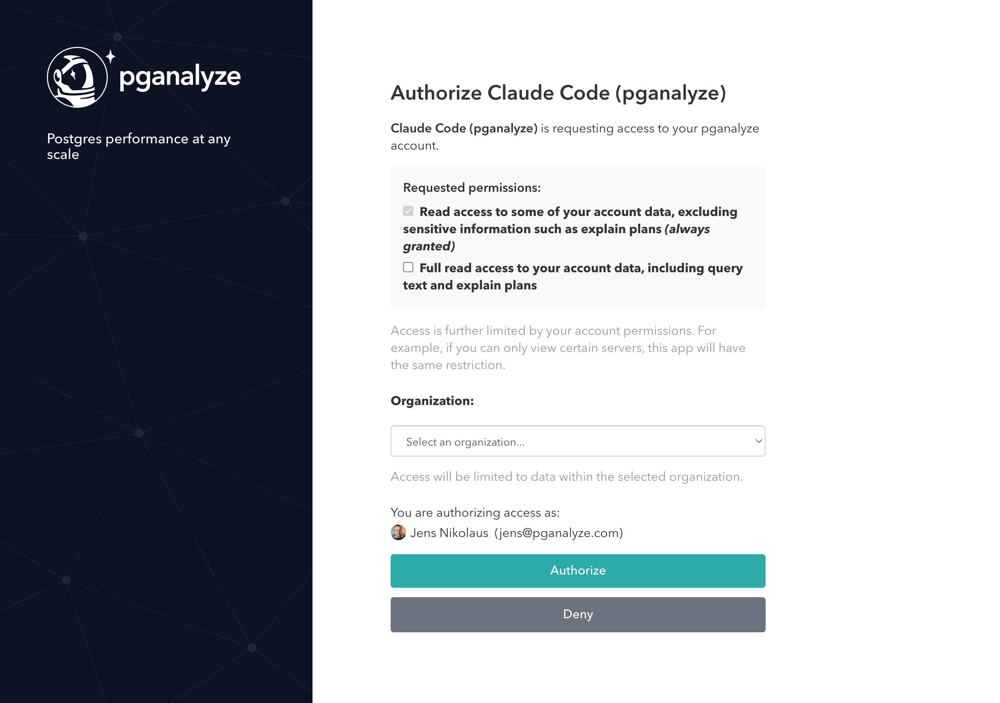

The pganalyze [MCP (Model Context Protocol)](https://modelcontextprotocol.io/) server allows AI assistants to interact with your pganalyze data. This enables AI coding tools like Claude Code, Codex, or Cursor to query server metrics, inspect EXPLAIN plans, run the Index Advisor, and review active issues.

The MCP server uses OAuth for authentication. When you first connect, you will be prompted to authorize access through your pganalyze account. Access is further limited by your account permissions. For example, if you can only view certain servers, this app will have the same restriction.

## Setup

### Claude Code

Add the pganalyze MCP server using the CLI:

<CodeBlock language="bash">
{`claude mcp add --transport http pganalyze https://app.pganalyze.com/mcp`}
</CodeBlock>

### Codex

Add the pganalyze MCP server in your project's `codex.json` configuration:

<CodeBlock language="json">
{`{
  "mcpServers": {
    "pganalyze": {
      "type": "url",
      "url": "https://app.pganalyze.com/mcp"
    }
  }
}`}
</CodeBlock>

### Cursor

In Cursor settings, add a new MCP server with the following configuration:

<CodeBlock language="json">
{`{
  "mcpServers": {
    "pganalyze": {
      "url": "https://app.pganalyze.com/mcp"
    }
  }
}`}
</CodeBlock>

### Other MCP clients

Any MCP client that supports HTTP transport can connect to the pganalyze MCP server at `https://app.pganalyze.com/mcp`. Refer to your client's documentation for how to configure HTTP-based MCP servers.

## Available tools

The MCP server exposes 19 tools, organized by the type of data they access. Since this feature is in preview, the available tools and their parameters may change.

| Tool | Description |
|------|-------------|
| **Servers** | |
| `list_servers` | List monitored PostgreSQL servers |
| `get_server_details` | Get details for a specific server |
| `get_postgres_settings` | Get PostgreSQL configuration settings |
| **Databases** | |
| `get_databases` | List databases with size stats and issue counts |
| **Queries** | |
| `get_query_stats` | Get top queries by runtime percentage |
| `get_query_details` | Get full normalized query text |
| `get_query_samples` | Get sample executions with runtime and parameters |
| **Tables** | |
| `get_tables` | List tables with filtering and pagination |
| `get_table_stats` | Get time-series table statistics |
| `get_index_selection` | Get Index Advisor results for an existing run |
| `run_index_selection` | Run the Index Advisor for a table |
| **EXPLAIN Plans** | |
| `get_query_explains` | List EXPLAIN plans for a query (last 7 days) |
| `get_query_explain` | Get a specific EXPLAIN plan with full output |
| `get_query_explain_from_trace` | Resolve a trace span to an EXPLAIN plan |
| **Backends** | |
| `get_backend_counts` | Get time-series connection counts by state |
| `get_backends` | Get a point-in-time snapshot of active connections |
| `get_backend_details` | Get details for a specific connection |
| **Issues** | |
| `get_issues` | Get active check-up issues and alerts |
| `get_checkup_status` | Get check-up status overview for a database |

