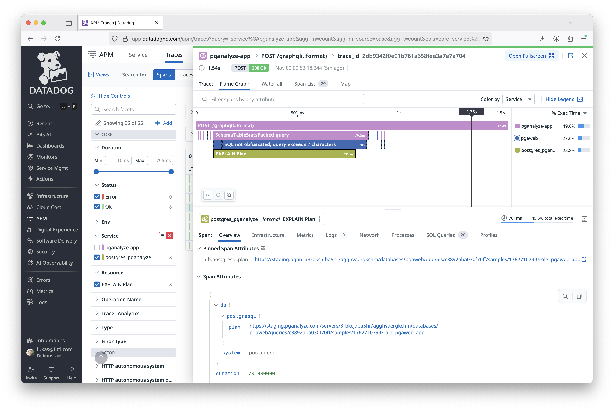
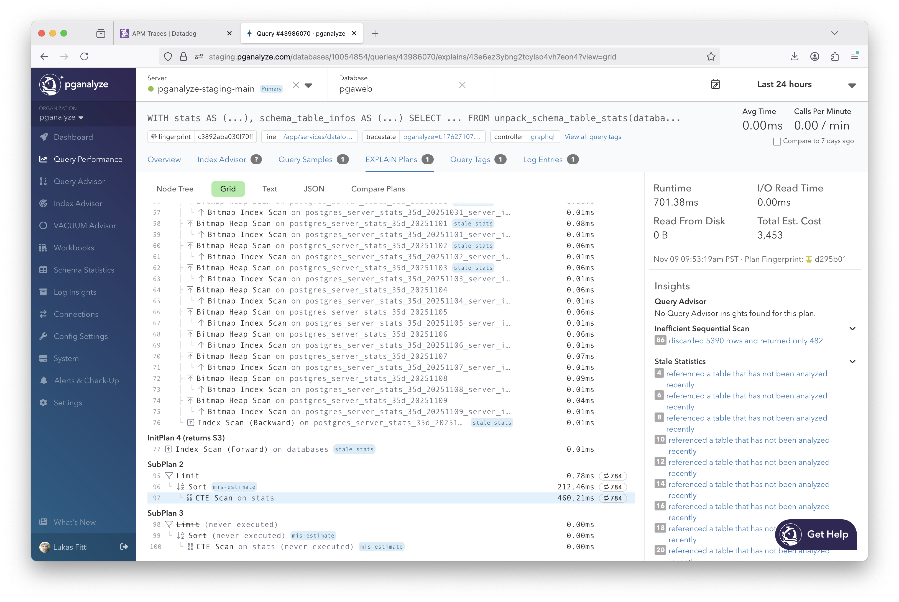

You can set up the pganalyze collector OpenTelemetry exporter with Datadog APM to
show spans for slow query EXPLAIN plans inside your traces.
The span contains the link to the EXPLAIN plan in the pganalyze app, so that you
can easily visit the pganalyze page to find out why the query is slow.



Compared to Datadog DBM, pganalyze gives you exact details on the specific query execution
by combining `auto_explain` data extracted from the Postgres logs with a specific trace.

For example, in this specific request we can determine that the slowness originated in
a Nested Loop that executed 784 times over a CTE scan:



## Setup steps

1. [Annotate your queries with tracing information](#annotate-your-queries-with-tracing-information)
2. [Set up the OpenTelemetry exporter to send to Datadog](#set-up-the-opentelemetry-exporter-to-send-to-datadog)
3. [Configure pganalyze collector to send to the OpenTelemetry collector](#configure-pganalyze-collector-to-send-to-the-opentelemetry-collector)

## Annotate your queries with tracing information

In order for query samples to be correlated with the original trace on the application side,
the special `traceparent` tag is utilized.

When you're using a [Datadog tracing library](https://docs.datadoghq.com/tracing/trace_collection/automatic_instrumentation/dd_libraries/) in your application, set `DD_DBM_PROPAGATION_MODE`
to `full`. [This setting](https://docs.datadoghq.com/database_monitoring/connect_dbm_and_apm/) affects what the library adds to queries, and does not require using Datadog DBM.

With full propagation, the library will automatically set `traceparent` as a query comment / query tag:

```sql
/* dde='dev',ddps='api',ddpv='1.2',dddbs='db_service',traceparent='00-00000000000000000000000000c0ffee-0000000000000bee-fe'*/
SELECT * FROM my_table;
```

If you are not using the Datadog tracing library, for example when using OpenTelemetry SDKs, read the alternate documentation on how to add [the traceparent query tag within your application](/docs/opentelemetry/traceparent).

## Set up the OpenTelemetry exporter to send to Datadog

There are different mechanisms to send OpenTelemetry tracing data to Datadog. In this example
we are using the [OpenTelemetry collector](https://docs.datadoghq.com/opentelemetry/setup/collector_exporter/)
with the `datadog/exporter` from the contrib collection.

Alternate mechanisms include the [DDOT Collector](https://docs.datadoghq.com/opentelemetry/setup/ddot_collector)
(an OpenTelemetry collector distribution), or the [Datadog Agent](https://docs.datadoghq.com/opentelemetry/setup/otlp_ingest_in_the_agent). Note that Datadog's [direct OTLP ingest](https://docs.datadoghq.com/opentelemetry/setup/otlp_ingest) does not yet support tracing data.

First, we install the OpenTelemetry collector, as described in the [OpenTelemetry documentation](https://opentelemetry.io/docs/collector/installation/). We then configure the Datadog contrib modules, as described in the [Datadog documentation](https://docs.datadoghq.com/opentelemetry/setup/collector_exporter/install/#2---configure-the-datadog-exporter-and-connector).

In this case we installed the package on a VM, so we edit the otel collector configuration located in `/etc/otelcol-contrib/config.yaml` to export to Datadog.

```
receivers:
  otlp:
    protocols:
      http:
        endpoint: 0.0.0.0:4318
      grpc:
        endpoint: 0.0.0.0:4317

processors:
  batch:
    send_batch_max_size: 100
    send_batch_size: 10
    timeout: 10s

exporters:
  datadog/exporter:
    api:
      site: datadoghq.com
      key: REPLACE_WITH_DATADOG_API_KEY
  debug:

service:
  pipelines:
    traces:
      receivers: [otlp]
      processors: [batch]
      exporters: [datadog/exporter]
```

We now restart the otel collector to use the new configuration:

```
systemctl restart otelcol-contrib
```

## Configure pganalyze collector to send to the OpenTelemetry collector

With the OpenTelemetry collector configured correctly, we now configure the
pganalyze collector to emit trace data from slow query plan samples via
OpenTelemetry. This requires internal network connectivity between the
pganalyze collector and the OpenTelemetry collector.

On the pganalyze-collector configuration, set the `otel_exporter_otlp_endpoint`
(`OTEL_EXPORTER_OTLP_ENDPOINT`) variable to point to the internal OTLP endpoint on the
OpenTelemetery collector, for example:

```
# pganalyze-collector environment variables
OTEL_EXPORTER_OTLP_ENDPOINT=http://10.0.0.42:4318
```

In this case `10.0.0.42` is the IP of the VM/container running the OpenTelemetry collector.

Optionally, you can also set `otel_service_name` (`OTEL_SERVICE_NAME`) to update
the service name reported to Datadog from the pganalyze collector. It defaults
to `Postgres (pganalyze)` which shows in Datadog as the `postgres_pganalyze`
service.

Make sure to restart the collector after updating the settings.
