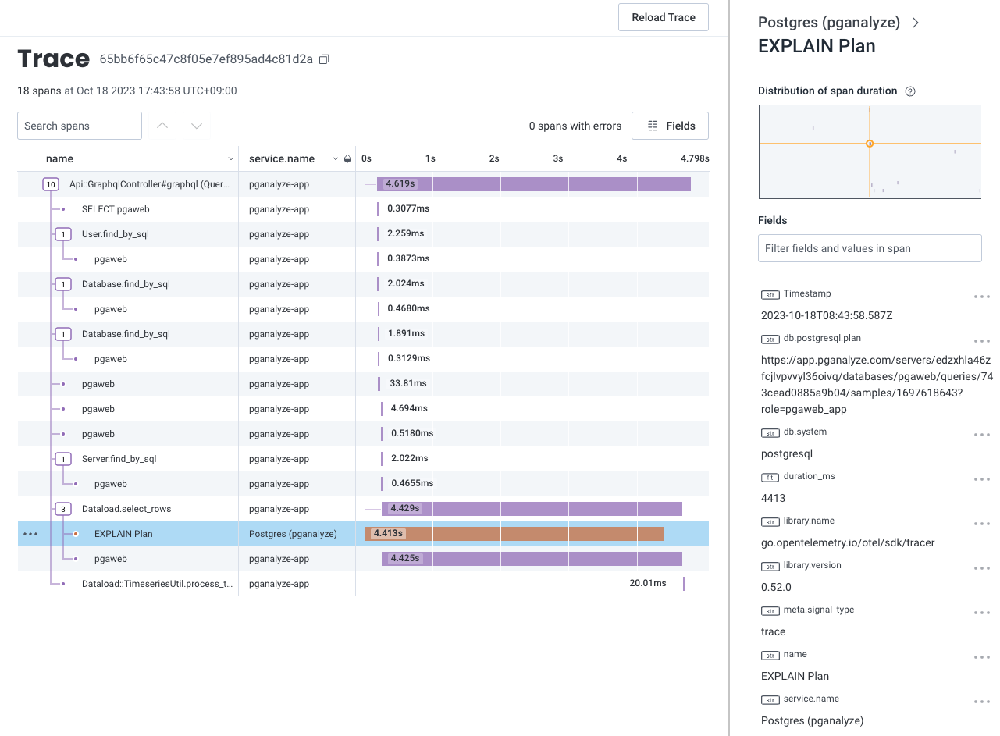

You can set up the pganalyze collector OpenTelemetry exporter with Honeycomb to
capture spans for query EXPLAIN plans inside your traces.
The span contains the link to the EXPLAIN plan in the pganalyze app, so that you
can easily visit the pganalyze page to find out why the query is slow.

As Honeycomb aligns with and recommends the use of OpenTelemetry, the setup is
straightforward.
To send EXPLAIN plan spans to Honeycomb:

1. Start sending tracing data from your application to Honeycomb
2. Add traceparent query tag to the query (see [Set up traceparent query tag within your application](/docs/opentelemetry/traceparent) section for details)
3. Create a Honeycomb API key
4. Set up a Honeycomb API key and an endpoint in the pganalyze collector

If you have already started sending tracing data from your application to
Honeycomb and you are fine using the existing API key for the pganalyze
collector, you can skip step 3 and use that key.
If you wish to create a new API key instead of using the existing API key of the
environment, it will require ["Send Events" permissions](https://docs.honeycomb.io/working-with-your-data/settings/api-keys/#api-key-permissions).

Once you obtain an API key, update the following collector settings to start
sending out tracing spans to Honeycomb:

* `otel_exporter_otlp_endpoint` (`OTEL_EXPORTER_OTLP_ENDPOINT`):
  * `https://api.honeycomb.io`
* `otel_exporter_otlp_headers` (`OTEL_EXPORTER_OTLP_HEADERS`):
  * `x-honeycomb-team=<API key from step 3>`

Optionally, you can also set `otel_service_name` (`OTEL_SERVICE_NAME`) to update
the service name reported to Honeycomb from the pganalyze collector. It defaults
to `Postgres (pganalyze)`.

Make sure to restart the collector after updating the settings.
