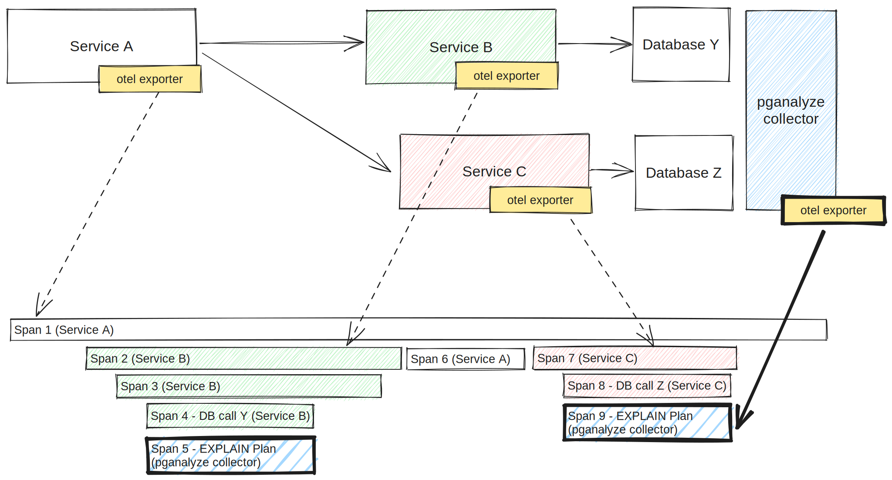

To integrate with application performance monitoring (APM) tools, the pganalyze
collector can optionally act as an [OpenTelemetry tracing](https://opentelemetry.io/docs/concepts/signals/traces/)
exporter.
This adds data from pganalyze into existing application traces, and allows
application engineers to have a quick way to find out if slow database queries
are causing performance problems in the app.

The exporter will send a tracing span for each [collected EXPLAIN plan](/docs/explain/setup)
to the configured OpenTelemetry endpoint, with a link back to the full plan in
pganalyze via the `db.postgresql.plan` span attribute.
The span will be recorded with the service name "Postgres (pganalyze)" and the
span name "EXPLAIN Plan" by default.



## Set up the pganalyze collector with third-party services

By configuring [`otel_exporter_otlp_endpoint`](/docs/collector/settings#opentelemetry-exporter-settings)
(or `OTEL_EXPORTER_OTLP_ENDPOINT`), the pganalyze collector will start sending
out tracing spans to the specified endpoint.

To set up pganalyze collectors with third party services, see the following
instructions.

* [Integrating pganalyze with Honeycomb](/docs/opentelemetry/honeycomb)
* [Integrating pganalyze with New Relic](/docs/opentelemetry/newrelic)

### Test setting up locally with the OpenTelemetry collector

You can test the setup by pointing this endpoint to an [OpenTelemetry collector](https://opentelemetry.io/docs/collector/)
instance running locally too. The OpenTelemetry collector provides a receiver,
which can be an OTLP endpoint to receive tracing data.
For example, you can use the [OpenTelemetry collector Docker image](https://hub.docker.com/r/otel/opentelemetry-collector-contrib)
to run a container of the OpenTelemetry collector. By default, you can use
`http://localhost:4318` for the `otel_exporter_otlp_endpoint`
(`OTEL_EXPORTER_OTLP_ENDPOINT`).

You can use the OpenTelemetry collector in an [agent pattern](https://opentelemetry.io/docs/collector/deployment/agent/),
receiving the tracing data from your application and the pganalyze collector,
using `receivers: [otlp]`.
For the exporter, you can use `exporters: [logging]` to simply output whatever
received as a logging. In this way, you can test if the OTLP endpoint is
successfully specified, as well as if the endpoint is properly receiving tracing
data.

## Limitations

* Tracing spans are only created when EXPLAIN plans are collected for queries
  * [Automatic EXPLAIN plan collection](/docs/explain/setup) must be set up to
    allow the pganalyze collector to collect EXPLAIN plans
  * If a query doesn't have an EXPLAIN plan, such as a query that completes in
    less time than `auto_explain.log_min_duration`, a tracing span will not be
    created
* Queries must contain the `traceparent` query tag, by
  [configuring the application to add it as a SQL comment](/docs/opentelemetry/traceparent).
  Queries without the tag will not create nor send a tracing span
* Timing data of spans exported by pganalyze may not line up with other spans
  exported by the application when the Postgres database has limited precision
  in its `log_line_prefix` timestamp
    * Using `%m` in the `log_line_prefix` instead of `%t` is recommended
    * This issue will typically occur with Amazon RDS and Amazon Aurora, which
      currently do not allow changing the timestamp precision of the
      `log_line_prefix` (it's always set to`%t:%r:%u@%d:[%p]:t`)

## Troubleshooting

You can check if the collector is successfully reading the OTLP endpoint by
running the collector with a verbose option (`pganalyze-collector --test -v`).
You should be able to see the following log and no error after that.

```
2023/10/20 14:42:18 V Initializing OpenTelemetry tracing provider with endpoint: http://localhost:4318
```
