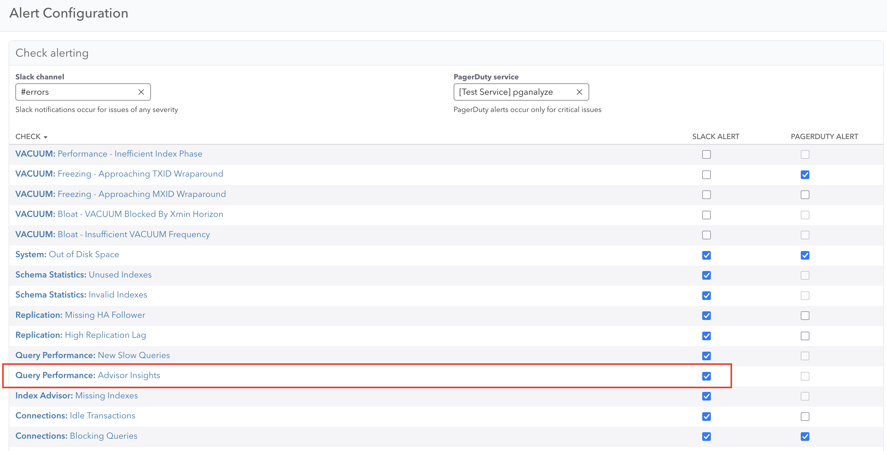

Query Advisor automatically detects optimization opportunities, but you need to configure alerts
to get notified when new insights are discovered. This guide covers setting up alerts for
Query Advisor insights and integrating with your notification workflows.

## Alert configuration overview

Query Advisor checks are enabled by default for all databases in your pganalyze organization
on Scale (v4) and Enterprise plans, but **alerts must be explicitly configured** to receive notifications
about newly detected optimization opportunities for new customers.

Currently Query Advisor alerts are only supported for Slack, or if implemented through a custom API
integration with the [getIssues](/docs/api/queries/getIssues) API.

### Enabling Slack Alerts

To enable Slack alerts, first configure the pganalyze [Slack integration](/docs/checks/#alerting), and then
navigate to a specific servers alert configuration page.

After selecting "Configure alerts for this server" you can see the "Query Performance: Advisor Insights" option.

This will notify you of new Query Advisor insights for a query in a Slack channel of your choice.

## Troubleshooting alerts

### No alerts despite slow queries

- **Check auto_explain configuration**: Ensure EXPLAIN plans are being collected and all settings are correctly set: `log_analyze` is enabled, `log_format` is set to `json`.
- **Verify alert configuration**: Ensure you have enabled Slack notifications per the above instructions.

## Next steps

- **[Query Advisor workflow](/docs/query-advisor/from-insight-to-conclusion)** - Learn the complete optimization process
- **[Workbooks integration](/docs/workbooks)** - Set up testing environment for validating insights
- **[Check-Up configuration](/docs/checks)** - Configure other pganalyze automated checks and alerts