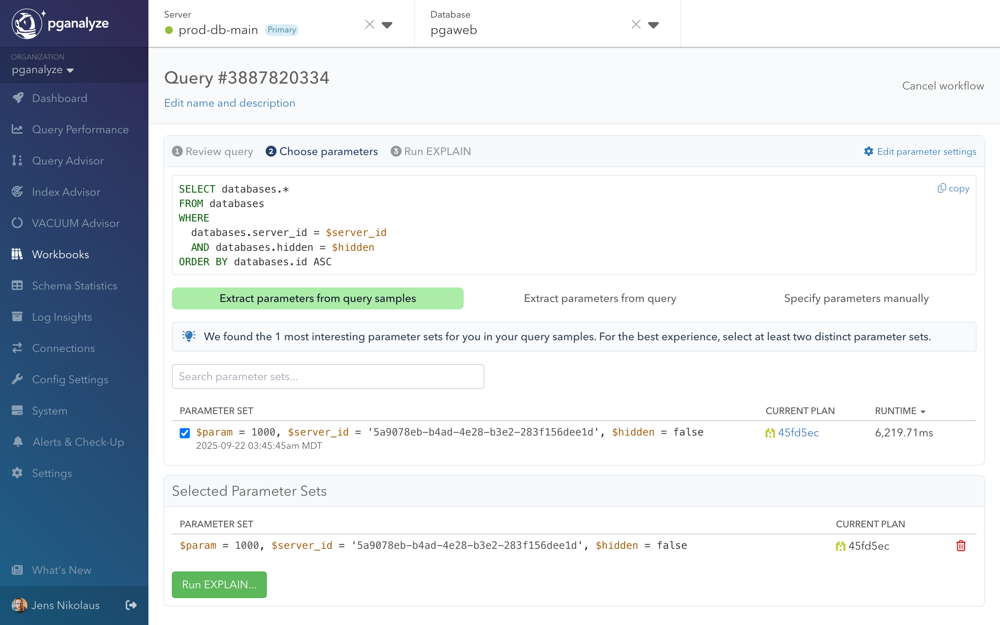
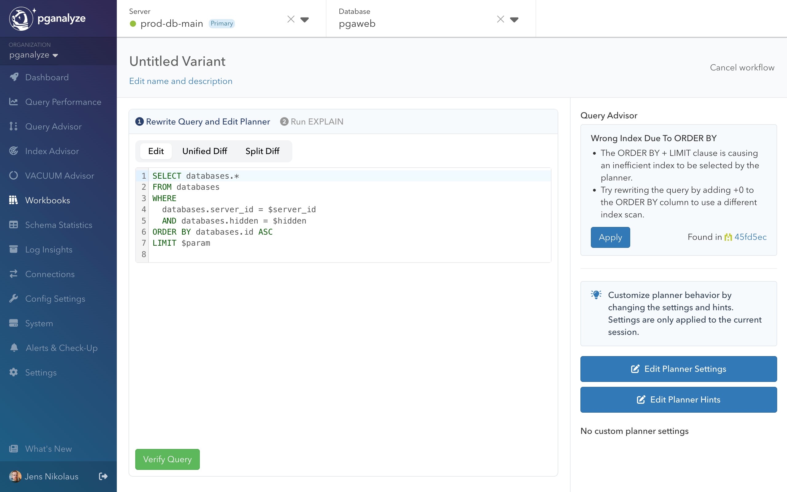

This guide walks through a complete Query Advisor workflow, from detecting a performance issue to applying the optimization in production. We'll use a real example of an ORDER BY + LIMIT query that Postgres optimizes poorly due to incorrect index selection.

## The performance problem

Query Advisor automatically detected this problematic query pattern in production:

<CodeBlock language="sql">
{`SELECT databases.*
FROM databases
WHERE databases.server_id = $server_id
  AND databases.hidden = $hidden
ORDER BY databases.id ASC
LIMIT $3;`}
</CodeBlock>

The query appeared to run fast initially but degraded significantly under certain conditions, taking over **6 seconds** to complete. The EXPLAIN plan (shown below) revealed the issue:

- **Parallel Index Scan (Forward)** on the databases_pkey index for sorting
- **`Filter` condition** applied after index scan, with no `Index Cond` on the index scan itself
- **949,508 rows removed by filter** showing many rows discarded that were fetched unnecessarily
- **6,219.71ms runtime** with 1/4th of it being I/O read time

Postgres chose the wrong optimization strategy - it prioritized the ORDER BY over the WHERE clause filtering.

## Step 1: Query Advisor detection

Query Advisor automatically analyzed the EXPLAIN plan and identified the **ORDER BY + LIMIT index problem** pattern:

### Detection criteria
- Index scan with no Index Condition (only Filter)
- High "Rows Removed by Filter" count
- Index benefits sort order but not filtering
- Alternative indexes available for WHERE conditions

The insight appeared on the Query Advisor overview page with sample runtime data and affected query details.

## Step 2: Create workbook for testing

From the Query Advisor insight, we clicked **"Create Workbook"** to begin systematic testing.

Workbooks are automatically set up from the source query, and parameters get names assigned for easy
rewriting. To test query performance, we need to choose parameter values.

### Choosing parameters

We chose a representative test case to validate the optimization based on the actual query parameters. The shown
**Parameter Set 1** has `param` (LIMIT), `server_id` and `hidden` values that correspond with the query plan we saw earlier.

For some queries multiple parameter values will be shown (we recommend choosing 2-3 if possible),
or additional parameters can be added manually. To keep it simple we will continue with 1 parameter set in this example.

Testing with real parameter values ensures the optimization reflects actual production conditions.

## Step 3: Record baseline performance

Before applying any changes to the query, we record baseline performance using the **collector workflow**. The baseline
supports a like-for-like comparison of rewrites using warm cache runs. Without the baseline, we may see a performance improvement
simply because the data used by the query is now in cache.

In this example, the query performance changed from 6,219.71ms (original plan sample) to **495.51ms** in the baseline. Any
rewrites will aim to improve this baseline performance. We can also see based on the I/O Read Time being 0.00ms that
this is indeed a warm cache result.

## Step 4: Apply Query Advisor insight

We can see that Query Advisor confirms the baseline still has the same query plan problem using the wrong index. We now
create a variant to rewrite the query into a more efficient form.

In the workbook variant editor, Query Advisor provided an **"Apply"** button for the detected insight:

### Automatic rewrite
Query Advisor automatically modified the query to force better index selection:

<CodeBlock language="sql">
{`SELECT databases.*
FROM databases
WHERE databases.server_id = $1
  AND databases.hidden = $2
ORDER BY databases.id + $zero ASC  -- Added +0 to prevent index sort usage
LIMIT $3;`}
</CodeBlock>

The `$zero` here is identical with `0`. This is common workaround for this kind of Postgres query planner problem,
as it forces the planner to not use an index on the `id` column in the `ORDER BY`. Instead, the planner will prefer
indexes supporting the `WHERE` condition.

## Step 5: Benchmark the optimization

We executed the modified query using the collector workflow. We can see that the **Baseline runtime** went
from 495.51ms to **58.11ms** (8.5x improvement).

What might be surprising is that the **Total Est. Cost** actually increased from 39,259 to 60,680. Cost
represents the "currency" the planner uses during planning, and also explains why the planner originally chose
the inefficient plan - it assessed (incorrectly) that its cost was lower.

When we review the details with the **Compare Plans** feature in Workbooks, we can also see that
the used index changed, based on the Index usage section on the bottom right, and corresponding index numbers
in the plan.

Because Postgres can no longer use the index sort order to fulfill the `ORDER BY` we also see an
additional `Sort` node in Plan B (the rewritten query).

## Step 6: Conclusion

The dramatic 8.5x improvement confirmed Query Advisor's analysis was correct.

Postgres's cost-based planner estimated it could find the limited rows quickly by scanning the primary key index in sort order. This
failed because significant filtering happened after sorting, requiring examination of many irrelevant rows.

By preventing this optimization with the rewrite, Postgres instead used an index supporting the `WHERE` clause (`server_id` column)
for efficient filtering, and did not use the sort order of the index to fulfill the `ORDER BY`.

The Postgres planner estimated higher cost for the optimized version (60,680 vs 39,259 cost units), but actual runtime
was 8.5x faster. This demonstrates why testing real performance is critical for validating planner estimates.

## Step 7: Apply to production

With the collected evidence showing a clear performance improvement, the final step is implementing the optimization in the
application through code changes, ORM adjustments, or database functions to complete the optimization workflow.

For certain situations this may be the same as the rewritten version, in other cases you may choose to implement another
improvement based on the knowledge that a better plan is possible.

In this specific example, we may choose to either add the `+0` in the application query, or we could alternatively create
a different index that both fulfills the `WHERE` and the `ORDER BY` conditions.

## Understanding when insights may not reproduce

Query Advisor occasionally detects optimization opportunities that don't reproduce during testing in workbooks:

- **Table data changes**: The data used in the query may have changed since the initial detection
- **Statistics updates**: An automatic or manual `ANALYZE` updated Postgres statistics, and resolved estimation issues
- **Parameter changes**: The parameters that encountered the problematic query plan are different than the ones in the workbook.

You will also often see query runtime be lower in workbooks than in the Automated EXPLAIN data. This could be due to concurrent
workloads (contention on system resources or locks), or cold vs. warm cache differences.

When insights don't reproduce its recommended to:

1. **Check recent EXPLAIN plans**: Verify the issue still occurs with current data
2. **Review ANALYZE runs on referenced tables**: Check if table statistics were updated 
3. **Test different parameters**: Try multiple parameter sets from query samples
4. **Monitor over time**: Some issues are intermittent based on data patterns

This is normal behavior, not a bug: Query Advisor detects real issues but database conditions can change.

## Next steps

- **[Learn about all supported insights](/docs/query-advisor/insights)** - Understand the full range of optimization patterns
- **[Set up alerts](/docs/query-advisor/alerts)** - Get notified when new opportunities are detected
- **[Explore Workbooks features](/docs/workbooks)** - Master the testing and benchmarking platform
- **[Configure auto_explain](/docs/explain/setup)** - Ensure optimal data collection for Query Advisor