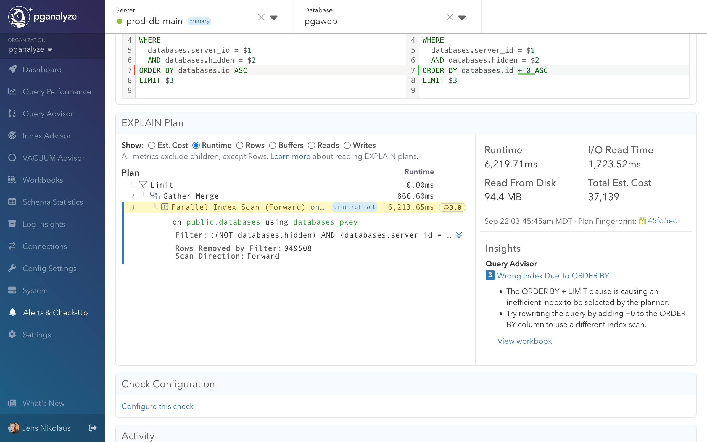

This guide walks through a complete Query Advisor workflow, from detecting a performance issue to applying the optimization in production. We'll use a real example of an ORDER BY + LIMIT query that Postgres optimizes poorly due to incorrect index selection.

## The performance problem

Query Advisor automatically detected this problematic query pattern in production:

<CodeBlock language="sql">
{`SELECT databases.*
FROM databases
WHERE databases.server_id = $1
  AND databases.hidden = $2
ORDER BY databases.id ASC
LIMIT $3;`}
</CodeBlock>

The query appeared to run fast initially but degraded significantly under certain conditions, taking over **6 seconds** to complete. The EXPLAIN plan revealed the issue:

- **Parallel Index Scan (Forward)** on the databases_pkey index for sorting
- **Filter condition** applied after index scan (inefficient filtering)
- **949,508 rows removed by filter** indicating massive wasted work
- **6,213.65ms runtime** with high I/O read time

Postgres chose the wrong optimization strategy - it prioritized the ORDER BY over the WHERE clause filtering.

## Step 1: Query Advisor detection

Query Advisor automatically analyzed the EXPLAIN plan and identified the **ORDER BY + LIMIT index problem** pattern:

### Detection criteria
- Index scan with no Index Condition (only Filter)
- High "Rows Removed by Filter" count
- Index benefits sort order but not filtering
- Alternative indexes available for WHERE conditions

### Insight details
Query Advisor flagged this as a **high-severity optimization opportunity** because:
- Runtime exceeded threshold for optimization (>1 second)
- Clear alternative index strategy available
- Pattern matches known Postgres planner inefficiency

The insight appeared on the Query Advisor landing page with sample runtime data and affected query details.

## Step 2: Create workbook for testing

From the Query Advisor insight, we clicked **"Create Workbook"** to begin systematic testing:

### Workbook setup
1. **Query import**: Automatically populated with the problematic query
2. **Parameter detection**: Identified `database_id` parameter from query samples
3. **Sample data**: Selected representative parameter values from historical executions

### Parameter set selection
We chose a representative test case to validate the optimization based on the actual query parameters:
- **Parameter Set 1**: `server_id` and `hidden` values from production workload
- **Historical performance**: Query #3887820334 showing 495.51ms baseline runtime

Testing with real parameter values ensures the optimization reflects actual production conditions.

## Step 3: Record baseline performance

Before applying any changes, we recorded baseline performance using the **collector workflow**:

### Workbooks testing workflow
Query Advisor integrates with pganalyze Workbooks to provide systematic optimization testing:

### Baseline results
- **Runtime**: 495.51ms execution time
- **Total Est. Cost**: 39,259 cost units
- **I/O Read Time**: 0.00ms (warm cache scenario)
- **Plan Fingerprint**: 45fd5ec indicating specific execution path

The baseline confirmed the issue was reproducible and not just a one-time occurrence due to cold caches or concurrent load.

### Complete testing workflow
The systematic approach to testing Query Advisor optimizations includes:

1. **Baseline recording** - Capture current performance as reference point
2. **Apply insights** - Use suggested rewrites to create variants
3. **Benchmark results** - Compare performance improvements systematically
4. **Validate changes** - Ensure optimizations work across parameter sets
5. **Apply to production** - Implement verified improvements with confidence

## Step 4: Apply Query Advisor insight

In the workbook variant editor, Query Advisor provided an **"Apply"** button for the detected insight:

### Automatic rewrite
Query Advisor automatically modified the query to force better index selection:

<CodeBlock language="sql">
{`SELECT databases.*
FROM databases
WHERE databases.server_id = $1
  AND databases.hidden = $2
ORDER BY databases.id + $zero ASC  -- Added +0 to prevent index sort usage
LIMIT $3;`}
</CodeBlock>

### The `+ $zero` technique
This Postgres optimization technique:
- **Prevents sort optimization**: Postgres can't use the primary key index for sorting
- **Forces filter-first strategy**: Must use a better index for efficient filtering of server_id and hidden columns
- **Maintains correctness**: Adding zero doesn't change sort order
- **Triggers replanning**: Forces Postgres to reconsider index selection strategy

This is a well-known Postgres expert technique that Query Advisor automates for you.

## Step 5: Benchmark the optimization

We executed the modified query using the collector workflow:

### Performance improvement
- **Baseline runtime**: 495.51ms → **58.11ms** (8.5x improvement)
- **Cost estimate**: 39,259 → 60,680 (higher estimated cost)
- **Plan strategy**: Changed from Index Scan to Sort + Bitmap Heap Scan approach
- **Index usage**: Switched to index_databases_on_server_id_and_datname

### Plan comparison
The workbook's compare view highlighted the key changes:
- **Plan A (Baseline)**: Gather Merge → Index Scan on databases_pkey
- **Plan B (Variant 1)**: Limit → Sort → Bitmap Heap Scan → Bitmap Index Scan
- **Runtime improvement**: 495.51ms → 58.11ms
- **Index strategy**: Primary key scan → server_id + datname index

## Step 6: Validate the results

The dramatic improvement confirmed Query Advisor's analysis was correct:

### Why Postgres chose poorly
Postgres's cost-based planner estimated it could find the limited rows quickly by scanning the primary key index in sort order. This failed because filtering happened after sorting, requiring examination of many irrelevant rows.

### Why the rewrite works
By preventing sort-order optimization, Postgres had to:
1. Use the index_databases_on_server_id_and_datname index for efficient filtering
2. Apply bitmap heap scan to gather only relevant rows
3. Sort only the filtered results instead of scanning the entire table sequentially

### Cost vs. reality
The Postgres planner estimated higher cost for the optimized version (60,680 vs 39,259 cost units), but actual runtime was 8.5x faster. This demonstrates why testing real performance trumps planner estimates.

## Step 7: Apply to production

With verified performance improvements, we applied the optimization to production:

### Implementation options
1. **Query rewrite**: Update application code to use the `+0` technique
2. **ORM modification**: Adjust ORM query generation if applicable
3. **Stored procedure**: Implement optimized version as a database function

### Monitoring results
After production deployment:
- **Query runtime**: Consistently fast across all parameter values
- **Query Advisor**: No longer flags this query as problematic
- **Overall impact**: Reduced database load and improved user experience

## Understanding when insights may not reproduce

Query Advisor occasionally detects optimization opportunities that don't reproduce during testing:

### Common scenarios
- **Data distribution changes**: Query characteristics may have shifted since detection
- **Statistics updates**: Fresh Postgres statistics may resolve estimation issues
- **Concurrent workload**: Original slowness may have been due to lock contention
- **Cache state**: Cold vs. warm cache differences

### Troubleshooting approach
When insights don't reproduce:
1. **Check recent execution**: Verify the issue still occurs with current data
2. **Review statistics**: Consider if ANALYZE has updated table statistics
3. **Test different parameters**: Try multiple parameter sets from query samples
4. **Monitor over time**: Some issues are intermittent based on data patterns

This is normal behavior, not a bug - Query Advisor detects real issues but database conditions can change.

## Key takeaways

This workflow demonstrates Query Advisor's systematic approach to query optimization:

1. **Automated detection**: Continuously monitors for optimization opportunities
2. **Expert knowledge**: Applies Postgres optimization techniques automatically
3. **Systematic testing**: Integrates with Workbooks for thorough validation
4. **Risk mitigation**: Tests multiple scenarios before production changes
5. **Measurable results**: Provides clear before/after performance metrics

Query Advisor makes Postgres query optimization accessible to teams without deep database expertise while maintaining the rigor needed for production systems.

## Next steps

- **[Learn about all supported insights](/docs/query-advisor/insights)** - Understand the full range of optimization patterns
- **[Set up alerts](/docs/query-advisor/alerts)** - Get notified when new opportunities are detected
- **[Explore Workbooks features](/docs/workbooks)** - Master the testing and benchmarking platform
- **[Configure auto_explain](/docs/explain/setup)** - Ensure optimal data collection for Query Advisor