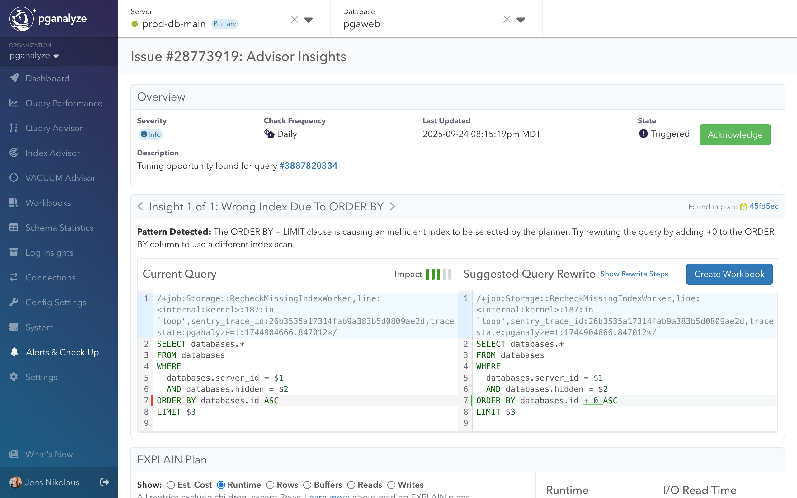

Query Advisor automatically analyzes Postgres query plans to detect optimization opportunities. This guide covers the requirements and setup needed to start using Query Advisor effectively.

## What you get with Query Advisor

Query Advisor provides **continuous, automated query optimization insights** for your Postgres databases:

- **Automated analysis**: Continuously examines EXPLAIN plans to identify performance anti-patterns
- **Single query focus**: Optimizes individual queries through rewrites and planner hints, complementing Index Advisor's schema-level recommendations
- **Deterministic approach**: Uses purpose-built algorithms based on Postgres planner behavior
- **Workbooks integration**: Seamlessly integrates with pganalyze Workbooks for systematic testing and benchmarking
- **Confidence building**: Provides suggested parameter sets and systematic validation workflows

Query Advisor identifies the optimization opportunities - you maintain control over applying changes to production.

## Supported optimization insights

Query Advisor detects common Postgres performance issues including inefficient nested loops and suboptimal index usage due to ORDER BY clauses. More optimization patterns are continuously being added.

See the complete list and detailed explanations in [Supported Insights](/docs/query-advisor/insights).

## Collector requirements

Query Advisor requires the [pganalyze collector](/docs/install) to be properly configured for query monitoring.

### EXPLAIN Plan Collection
Query Advisor analyzes Postgres EXPLAIN plans, which can be collected through:

**Automated analysis of slow queries with auto_explain (recommended):**
- **auto_explain** extension enabled
- **auto_explain.log_analyze** enabled to capture row mis-estimates
- **auto_explain.log_format** set to `json`

To enable continuous Query Advisor analysis, configure Postgres's auto_explain extension. Refer to the [EXPLAIN setup guides](/docs/explain/setup) for detailed platform-specific instructions.

**Manual collection:**
- EXPLAIN plans uploaded directly through pganalyze Workbooks
- On-demand analysis when creating new workbooks

### Enhanced Experience
For the best Query Advisor experience:
- [Enable the collector workflow](/docs/workbooks/collector-workflow) for seamless workbook testing
- Configure auto_explain with appropriate thresholds to capture slow queries
- Enable log_analyze to provide accurate row count data for misestimation detection

## Testing and validation

Query Advisor integrates with pganalyze Workbooks for systematic optimization testing. The recommended workflow is:

1. **Record baseline** performance to establish reference metrics
2. **Apply insights** using suggested query rewrites to create variants
3. **Benchmark results** to measure performance improvements
4. **Validate across different parameter sets** to ensure consistent optimization
5. **Deploy to production** with confidence based on systematic testing

## How to navigate Query Advisor

Once Query Advisor is configured and collecting EXPLAIN plans, optimization insights appear in several locations throughout pganalyze:

### Query Advisor Landing Page

Access the dedicated Query Advisor page to view all detected optimization opportunities across your databases, organized by potential impact.

As pganalyze collects EXPLAIN plans through auto_explain, Query Advisor automatically analyzes them and flags problematic patterns daily.

### Issue Detail Page

Each optimization opportunity detected by Query Advisor has a dedicated detail page that provides comprehensive analysis and actionable solutions.

The Issue Detail Page features:

- **Query Rewrite Preview**: Side-by-side comparison of original and optimized queries with highlighted changes
- **EXPLAIN Plan Panel**: Visual representation of query execution plans with optimization opportunities clearly highlighted
- **Detailed Recommendations**: Step-by-step guidance for implementing the suggested optimizations

### Workbooks Integration

When creating workbooks or analyzing queries, Query Advisor automatically assesses plans and provides optimization suggestions you can apply directly in the workbook editor.

### Query Detail Views

Individual query performance pages display Query Advisor insights alongside other metrics.

This integrated approach ensures that optimization opportunities are visible wherever you're working with query performance data.

## Next steps

- [Follow the complete optimization workflow](/docs/query-advisor/from-insight-to-conclusion) - See Query Advisor in action from detection to resolution
- [Learn about specific insights](/docs/query-advisor/insights) - Understand the optimization patterns Query Advisor detects
- [Configure alerts](/docs/query-advisor/alerts) - Get notified when new optimization opportunities are discovered
- [Explore pganalyze Workbooks](/docs/workbooks) - Learn about the testing and benchmarking platform