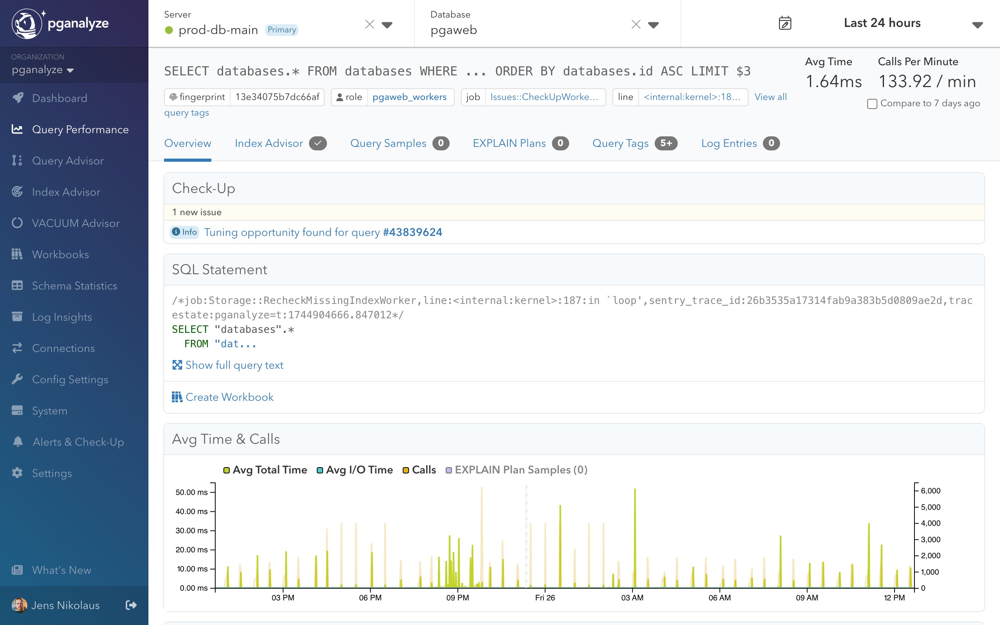

Once Query Advisor is configured and collecting EXPLAIN plans, optimization insights appear in several locations throughout pganalyze:

## Query Advisor Landing Page

Access the dedicated Query Advisor page to view all detected optimization opportunities across your databases, organized by potential impact.

As pganalyze collects EXPLAIN plans through auto_explain, Query Advisor automatically analyzes them and flags problematic patterns in near real-time.

## Issue Detail Page

Each optimization opportunity detected by Query Advisor has a dedicated detail page that provides comprehensive analysis and actionable solutions.

The Issue Detail Page features:

- **Query Rewrite Preview**: Side-by-side comparison of original and optimized queries with highlighted changes
- **EXPLAIN Plan Panel**: Visual representation of query execution plans with optimization opportunities clearly highlighted
- **Detailed Recommendations**: Step-by-step guidance for implementing the suggested optimizations

## Workbooks Integration

When creating workbooks or analyzing queries, Query Advisor automatically assesses plans and provides optimization suggestions you can apply directly in the workbook editor.

## Query Detail Views

Individual query performance pages display Query Advisor insights alongside other metrics.

## Navigation and Access

### From the main navigation
- Navigate to **Query Advisor** in the left sidebar to access the main landing page
- View all current optimization opportunities across your databases
- Sort queries by impact, insight type, or max runtime

### From query performance pages
- Query Advisor insights appear automatically on individual query detail pages
- Look for the "Check-Up" panel which displays tuning opportunities
- Click on the issue to view detailed analysis and suggested optimizations

### From workbooks
- Query Advisor automatically analyzes plans when you create new workbooks
- Insights appear in the sidebar with "Apply" buttons for easy testing
- Use the suggested optimizations to create query variants for benchmarking

This integrated approach ensures that optimization opportunities are visible wherever you're working with query performance data.