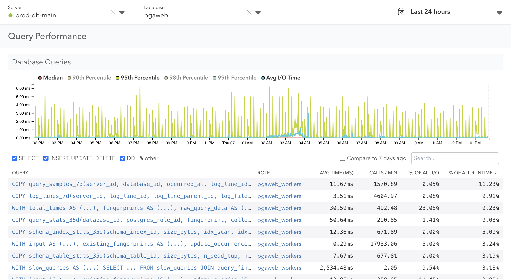

The Query Performance page in pganalyze contains information about query
statistics, using the data from the `pg_stat_statements` view.

The query statistic data is collected every one minute, and send to pganalyze
every 10 minutes.

## Database Queries

Once you specify the database of the server, you can see the statistic of
database queries. The chart helps you to find out the overall query latency.

TODO: clarify how we calculate percentile

In the table below the chart, you can find the list of all queries of the
database, default sorted by the percent of all runtime.

TODO: add more things
