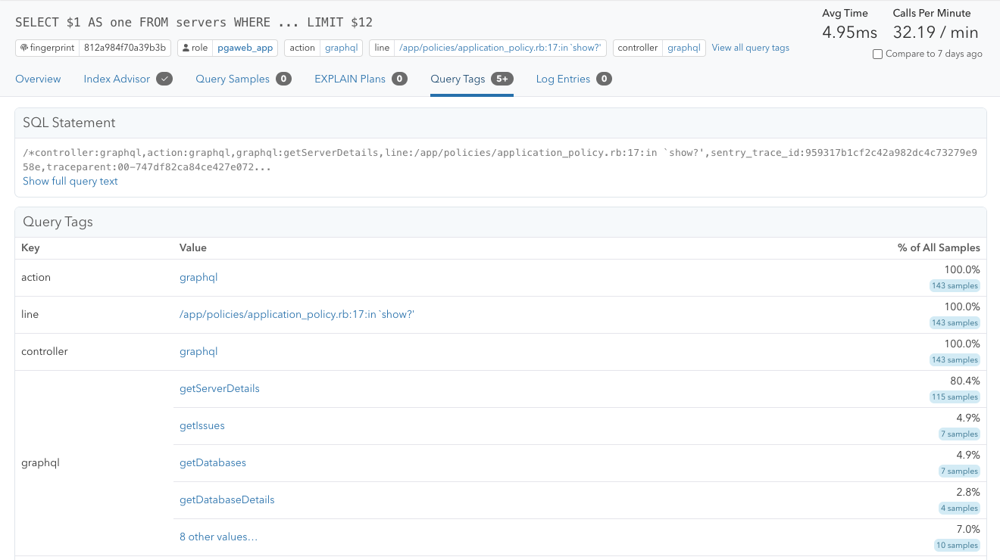

Query tags are key-value pairs of runtime context for a query.
You can add them to SQL statements as a query comment. The runtime context can be a
name of the background job that is running the query, the id of a user the query is associated with, or a trace ID.

Query tags can help determine where a query is coming from, support [tracing](https://pganalyze.com/docs/opentelemetry), or help track down the specific background job corresponding to a slow query.

There are several tools to help you add query tags to your query. For instance,
you can use the [sqlcommenter](https://google.github.io/sqlcommenter/) to
augment SQL statements before execution, with comments containing information
about the code that caused its execution. Rails 7+ has a built-in feature called
[Query Logs](https://api.rubyonrails.org/classes/ActiveRecord/QueryLogs.html)
that allows you to add tags like `controller` and `action` to the query so that
you can identify which controller and action the query was called from.

In pganalyze, you can see a query's tags in the "Query Tags" tab in the
individual query details page.

Query tags are also used in the OpenTelemetry integration to specify the
traceparent and tracestate. You can learn more in the
[traceparent section of the OpenTelemetry integration docs](/docs/opentelemetry/traceparent).

## Supported formats

Currently, the pganalyze collector supports the following Query Tags formats:

* [sqlcommenter](https://google.github.io/sqlcommenter/) format: `key='value'`
  * `SELECT 1 /* key1='value1',key2='value2' */`
* [sqlcommenter](https://google.github.io/sqlcommenter/) format without single quotes: `key=value`
  * `SELECT 1 /* key1=value1, key2=value2 */`
* [marginalia](https://github.com/basecamp/marginalia) format: `key:value`
  * `SELECT 1 /* key1:value1, key2:value2 */`

The query comments can be appended either before or after the query.

## Query Tags tab

In the query detail page, you can find query tags in the header of the page, as
well as in the "Query Tags" tab.

Query tags are parsed from queries from the following sources:

* Query samples
  * When Log Insights is integrated, queries with execution
    time exceeding either of the following settings will appear in the logs and
    their query tags will be parsed
    * `log_min_duration_statement`
    * `auto_explain.log_min_duration`, if using `auto_explain`
* Queries appearing in the Connections page
  * The pganalyze collector collects the currently running queries using
    `pg_stat_activity`, every 10 seconds
  * These queries will be shown in the Connections page and their query tags will be parsed
    will be parsed

Even if all queries contain query tags, it
is possible that it's not shown in the query detail page if there are no query
samples for that query, or that query is not running frequently enough or long enough to
appear in the Connections page.

All queries matching the above condition are counted as "samples", and you
can see their details, including the frequency of different values for each tag key, in the Query
Tags tab.
