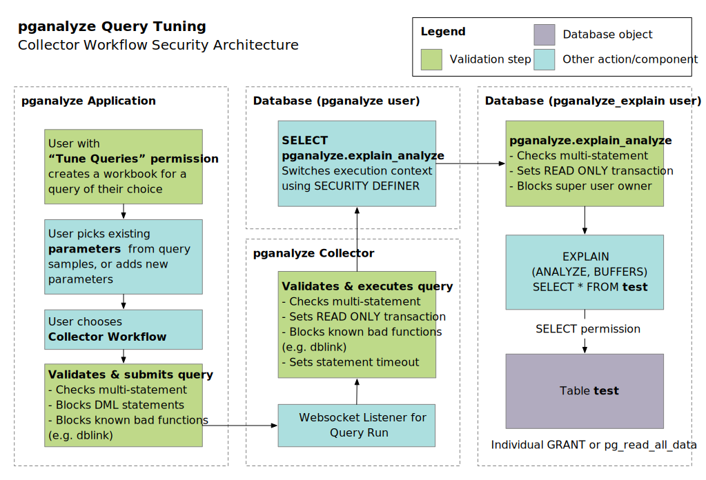

import DocsBetaFeature from '../components/DocsBetaFeature'

<DocsBetaFeature feature="Query Tuning" />

Query Tuning workbooks are designed to allow running [EXPLAIN ANALYZE](https://www.postgresql.org/docs/current/sql-explain.html) on a production Postgres
server (either manually or via the collector workflow) and sharing the resulting query plan
and execution statistics information with your whole team.

The [collector workflow](collector-setup) utilizes the [pganalyze-collector](https://github.com/pganalyze/collector)
to execute arbitrary `EXPLAIN ANALYZE` statements on demand, which allows query tuning on production
systems without requiring giving full read permissions to team members.

**Enablement of the Collector Workflow needs to be carefully considered**, and is not recommended for database servers
that store highly sensitive data, e.g. payment or healthcare information. Note you can grant limited read access
to only certain tables [by using individual GRANT statements](collector-workflow#individual-grant-statements-instead-of-pg_read_all_data).

## Security architecture of the Collector Workflow

The Collector Workflow is designed to:

- Protect against execution of DML statements that modify the database
- Protect against multi-statement queries that could sidestep validations
- Prevent displaying of the underlying table data, with the exception of data shown via `IMMUTABLE` functions [pre-evaluated during planning](https://www.postgresql.org/docs/current/xfunc-volatility.html)
- Limit statements to run for a maximum of 60 seconds (this may be configurable in the future)

The Collector Workflow does not protect against:

- Locks taken by the queries being executed (e.g. via `SELECT ... FOR UPDATE`)
- Execution of functions that could have side effects or allow copying data to external systems

## Permissions in pganalyze that control access to workbooks

Query Tuning workbook data, including parameter values, is viewable by anyone with [View permission](/docs/accounts/permissions#view) on the server / database.

In order to create new workbooks, create query variants, and utilize the Collector Workflow, the user must have the [Tune Queries permission](/docs/accounts/permissions#tune-queries) on the server / database.

## Data privacy considerations

Due to the required use of parameter values, Query Tuning workbooks may contain additional data
beyond what pganalyze typically collects from your database. Query Tuning workbooks have the option
to either copy existing parameter values from query samples (collected automatically by pganalyze),
or to manually enter new parameter values.

In some cases Query Tuning workbooks may contain data beyond the parameters provided, specifically
the recorded plans in a workbook will also:

* Show selectivity data about the query result, e.g. indicating how many rows match a condition
* Show values output from `IMMUTABLE` functions that were [pre-evaluated during planning](https://www.postgresql.org/docs/current/xfunc-volatility.html)

Note that all data in Query Tuning workbooks is retained until the workbook is explicitly
deleted, there is no time-based expiry.

## Your responsibilities when using Query Tuning

As a user of the Query Tuning functionality, you are required to:

* Only enter parameter values that are safe to share and store in pganalyze
* Use additional `REVOKE` statements as needed to avoid the collector calling problematic
  functions (e.g. [dblink](https://www.postgresql.org/docs/current/dblink.html), or custom functions used by your application)
* Ensure no functions are marked as `IMMUTABLE` that may expose data in the EXPLAIN output
* Restrict access to the "Tune Queries" permission in pganalyze to authorized users
* Delete workbooks when required by your data retention policies

## Reporting security vulnerabilities in Query Tuning

The Query Tuning functionality is included in our [Security Bug Bounty program](https://pganalyze.com/security/bug-bounty-program).

If you find a security vulnerability in the Query Tuning functionality, we ask for [responsible disclosure](https://pganalyze.com/security/bug-bounty-program) and will consider payment of a bug bounty per our guidelines.
