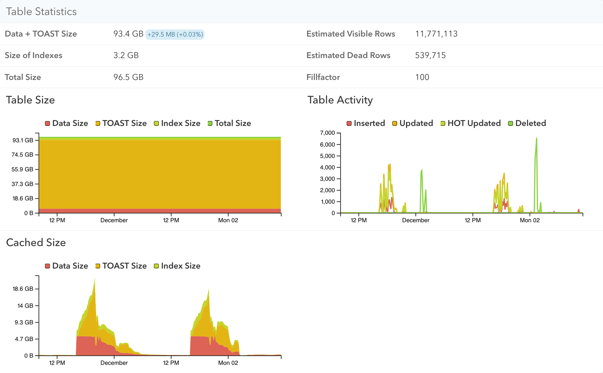
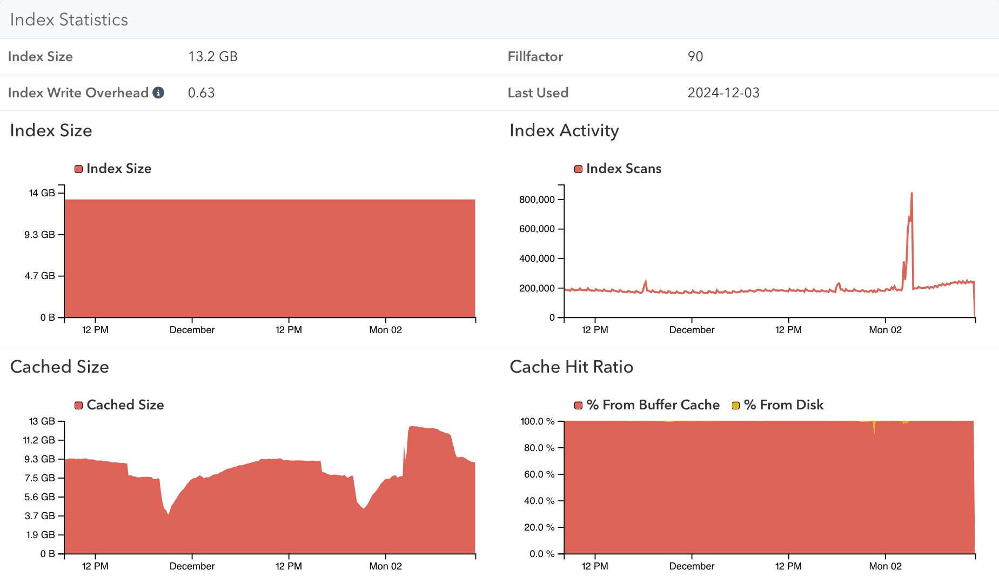
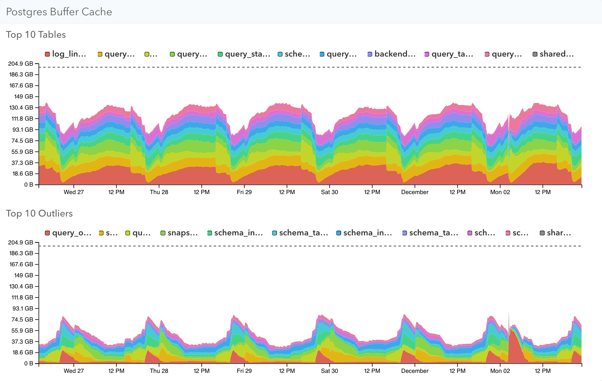

Postgres caches recently-used table and index data in its buffer cache, whose size is configured by the `shared_buffers` setting. pganalyze can track buffer cache usage with the [pg_buffercache](https://www.postgresql.org/docs/current/pgbuffercache.html) extension, helping you to understand database access patterns over time and identify tables that may need to be optimized.

## Setup

Using collector version [0.63.0 or later](/docs/collector/upgrading), enable the extension:

```sql
CREATE EXTENSION IF NOT EXISTS pg_buffercache WITH SCHEMA public;
```

If you don't see stats after 20 minutes, check the collector logs for error messages.

If the collector runs into permissions issues when querying pg_buffercache, you may need to upgrade the extension:

```sql
ALTER EXTENSION pg_buffercache UPDATE;
```

Or on older Postgres versions, you can grant the permissions manually:

```sql
GRANT USAGE ON SCHEMA public TO pganalyze;
GRANT SELECT ON pg_buffercache TO pganalyze;
GRANT EXECUTE ON FUNCTION pg_buffercache_pages TO pganalyze;
```

## Performance implications of collecting shared buffer statistics

Since Postgres 10, the pg_buffercache view uses reduced locking and as such is generally safe to query on production systems without impacting the regular workload. pganalyze queries the buffer cache data every 10 minutes.

By default this feature is only turned on for servers with `shared_buffers` configured for 200 GB of RAM or less. You can change the threshold by setting the `max_buffer_cache_monitoring_gb` setting, e.g. to `300` in the collector config.

This threshold exists because pg_buffercache incurs a fixed CPU cost for each buffer page (more buffer pages = more CPU used by querying it), as well as the fact that it temporarily writes its data to a temporary file, which has a size of roughly 0.5% of the `shared_buffers` value, or about 1GB at 200 GB `shared_buffers`.

## Table Statistics

When viewing a specific table, you can see a breakdown of buffer cache usage for the table, TOAST, and index data over time. Here you can see an example of one table that's always in memory, while the other table is only in memory while its query workload requires it.




## Index Statistics

You can similarly see the buffer cache usage of a specific index:



## System Memory

The System Memory page has two graphs showing buffer cache usage across your Postgres server. Top 10 Tables shows the tables that usually take the most memory, while Top 10 Outliers shows the tables that use the most memory for a shorter period of time.


