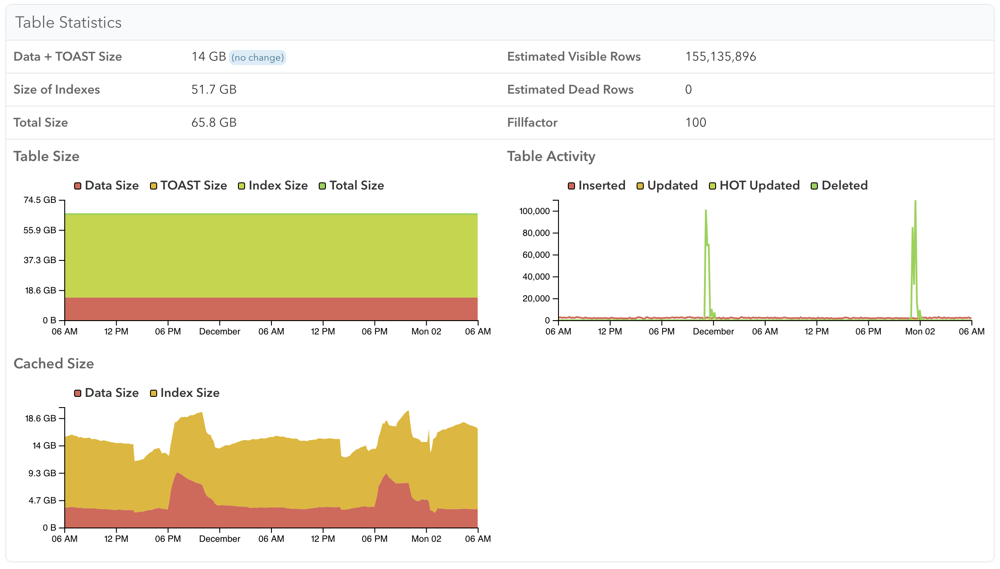
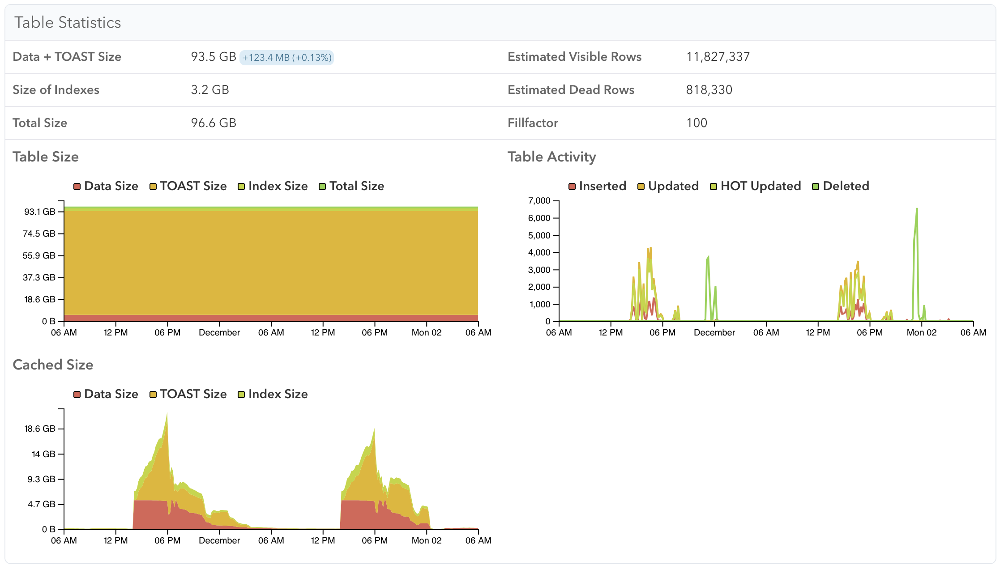
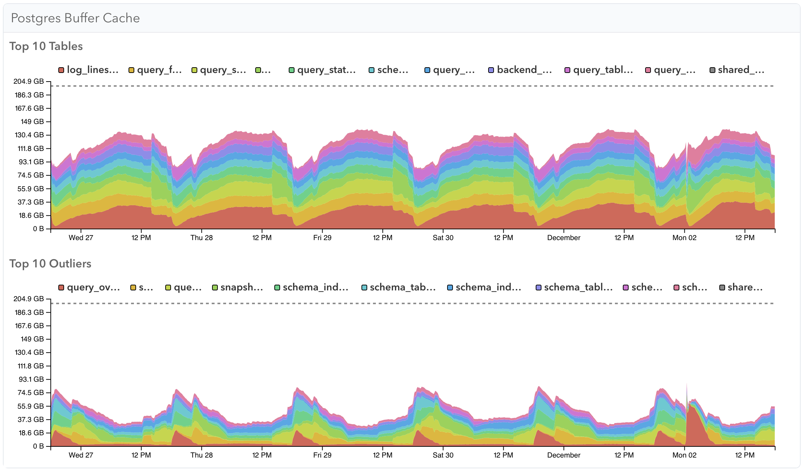

Postgres caches recently-used table and index data in its buffer cache, whose size is configured by the `shared_buffers` setting. pganalyze can track buffer cache usage with the [pg_buffercache](https://www.postgresql.org/docs/current/pgbuffercache.html) extension, helping you to understand database access patterns over time and identify tables that may need to be optimized.

## Setup

Using collector version 0.63.0 or later, enable the extension:

```sql
CREATE EXTENSION IF NOT EXISTS pg_buffercache WITH SCHEMA public;
```

If you don't see stats after 20 minutes, check the collector logs for error messages.

If the collector runs into permissions issues when querying pg_buffercache, run:

```sql
GRANT USAGE ON SCHEMA public TO pganalyze;
GRANT SELECT ON pg_buffercache TO pganalyze;
GRANT EXECUTE ON FUNCTION pg_buffercache_pages TO pganalyze;
```

Note that by default this is not monitored for servers with a buffer cache larger than 200 GB. To change this, set `max_buffer_cache_monitoring_gb = 300` in the collector config.

## Table Statistics

When viewing a specific table, you can see a breakdown of buffer cache usage for the table, TOAST, and index data over time. Here you can see an example of one table that's always in memory, while the other table is only in memory while its query workload requires it.




## Index Statistics

You can similarly see the buffer cache usage of a specific index:


## System Memory

The System Memory page has two graphs showing buffer cache usage across your Postgres server. Top 10 Tables shows the tables that usually take the most memory, while Top 10 Outliers shows the tables that use the most memory for a shorter period of time.


