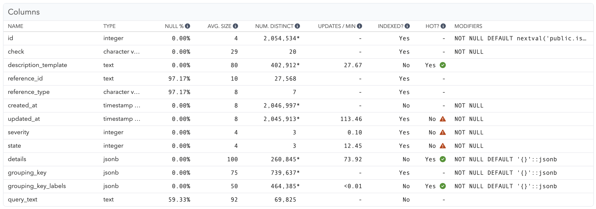

On the "Columns" tab of each table you can find all columns that are defined on the table, as well as the planner statistics associated with the column (collected by ANALYZE):

* **Null %**: Fraction of the rows in this table that have a NULL value in this column.
* **Avg. Size**: Average size, in bytes, of the values in this column across all the rows in this table (excluding NULLs).
* **Num. Distinct**: Estimated number of distinct values in this column. If followed by an asterisk (*), the number of distinct values is expected to grow as the table grows (e.g., for a unique value like a primary key).

In case of partitioned tables you will additionally see "Full NULL %", "Full Avg Size" and a second "Num. Distinct" data point. This represents the data that Postgres collects as an aggregate information across all partitions, as compared to just the partitioned table itself (in case of inheritance-based partitioning).

Note that planner statistics are only available when the [get_column_stats](/docs/install/troubleshooting/column_stats_helper) helper is set up on your database.

## Heap-Only Tuples (HOT) optimization

On the "Columns" tab you can also see pganalyze's assessment whether updates on a given column can use the [Heap-Only Tuples (HOT)](https://www.postgresql.org/docs/current/storage-hot.html) optimization:

* **Updates / Min**: How often this column is updated per minute on average (over the selected time period), based on UPDATE statements and CTEs containing updates on this table. If multiple statements update this column, this is the sum of the average number of calls. Excludes any queries for which query analysis failed (see "Status" tab in the Index Advisor).
* **Indexed?**: Indicates whether there are any indexes that include this column. This also considers indexes that have expressions referencing the column, as well as partial and covering indexes.
* **HOT?**: Indicates whether updates on this column (if any) can create Heap-Only Tuples (HOT). Generally, updates are not HOT capable when the column is indexed. For best performance and to reduce VACUUM overhead, avoid creating indexes on columns that are updated frequently.

HOT updates generally have a significantly lower overhead, since they do not require any index updates. They also enable on-access HOT pruning, which reduces the effort that a future autovacuum will have to do to clean up dead rows.

The HOT information is also utilized for calculating "Update Overhead" in the [constraint-programming model](/docs/indexing-engine/cp-model) for pganalyze Index Advisor, to avoid indexing columns that are being updated.

To see how updates on a table are utilizing HOT, you can check the table's overall statistics:

Note that "Updated" includes all HOT updates. In this specific example, about half the updates were HOT updates and had less overhead.
