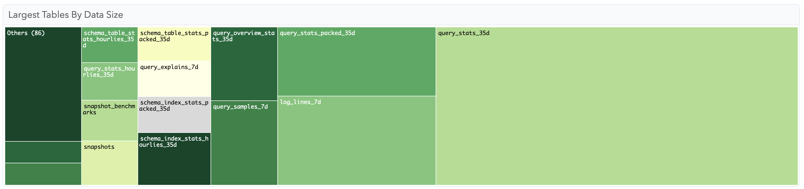
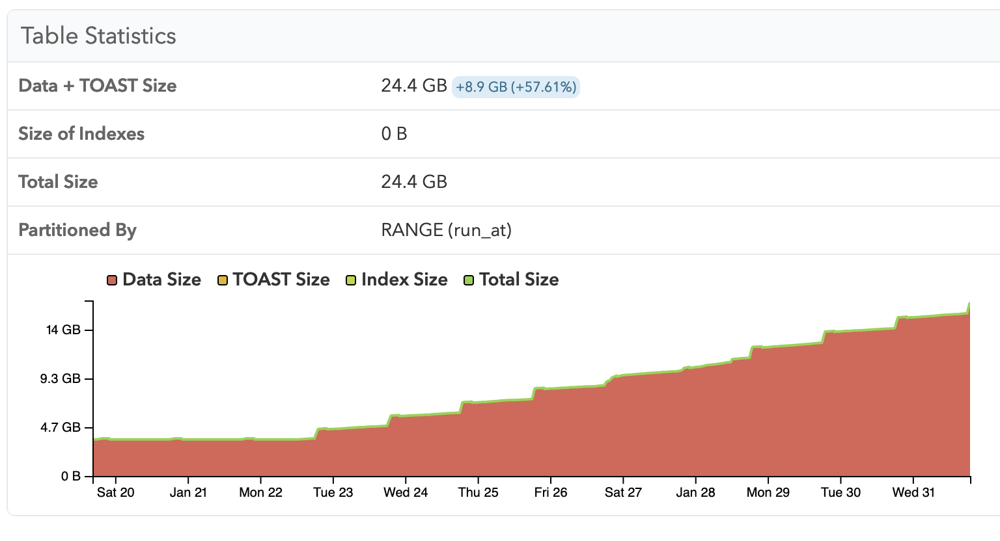
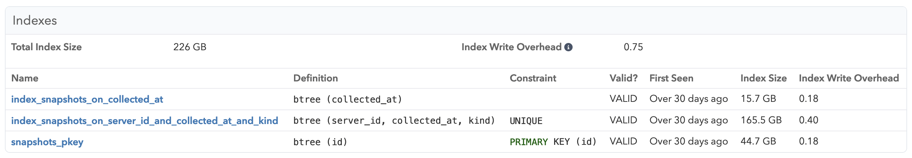
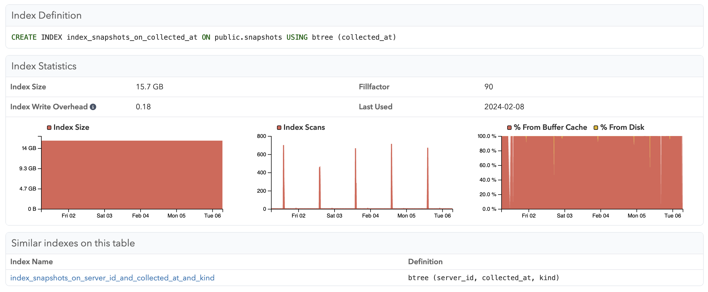
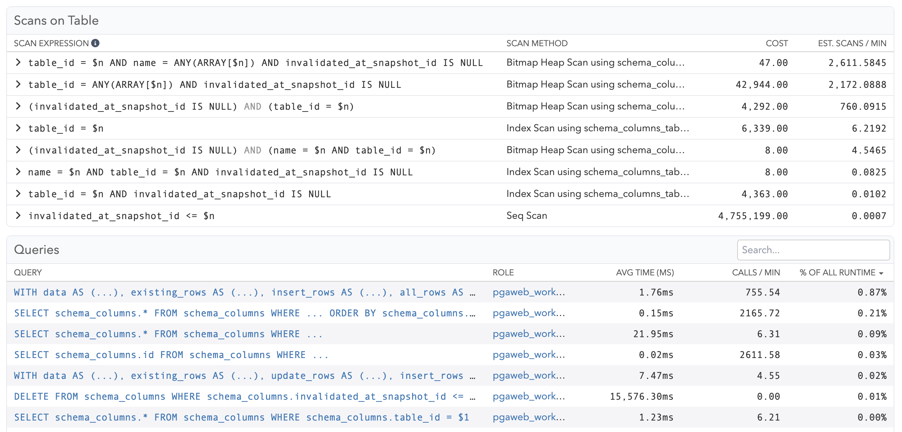
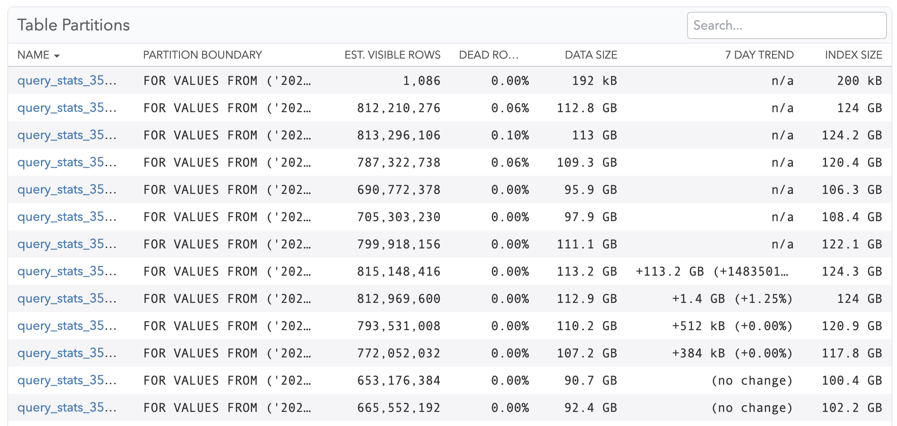

As part of the "Schema Statistics" functionality, pganalyze allows tracking workload patterns, schema and data model design, as well as changes over time.

## Breakdown of table and index sizes

In the schema statistics "Tables" and "Indexes" tabs you can find a treemap that breaks down the total size into individual objects, as well as full lists of all the tables and indexes on a given database.

## Table growth over time

For each table, you can track growth over time, understand how a table utilizes TOAST ([The Oversized-Attribute Storage Technique](https://www.postgresql.org/docs/current/storage-toast.html)) for storing large values, and see the aggregate size for all indexes on the table.

## Indexes

On the "Indexes" tab of each table you can find a list of all the currently existing indexes on the table, their size, when they were first seen by pganalyze, as well as the [Index Write Overhead](/docs/indexing-engine/index-write-overhead).

For each individual index you can track usage patterns over time, whether the index scans were able to use the Postgres shared buffer cache, as well as the date the index was last scanned. You can receive alerts for unused indexes using the [Unused Indexes check](/docs/checks/schema/index_unused).

## Queries and scans per table

As queries are received by pganalyze, they are parsed, and an internal association is stored that allows looking up query activity by table. Additionally, each query is broken down into [individual scans](/docs/indexing-engine/query-to-scan-breakdown).

The "Queries" tab allows seeing all query activity relating to the table, as well as the scans, allowing easy analysis of the WHERE and JOIN clauses. This data also forms the input to the [pganalyze Index Advisor](/docs/index-advisor/getting-started).

## Table partitions

For partitioned tables, the "Partitions" tab shows a breakdown into the individual partitions of the table, and their respective sizes.

## Table columns

See [Column statistics and HOT updates](/docs/schema-statistics/columns-hot-updates).

## VACUUM/ANALYZE activity, bloat and VACUUM Simulator

Read more details in the [VACUUM Advisor documentation](/docs/vacuum-advisor/per-table-activity).
